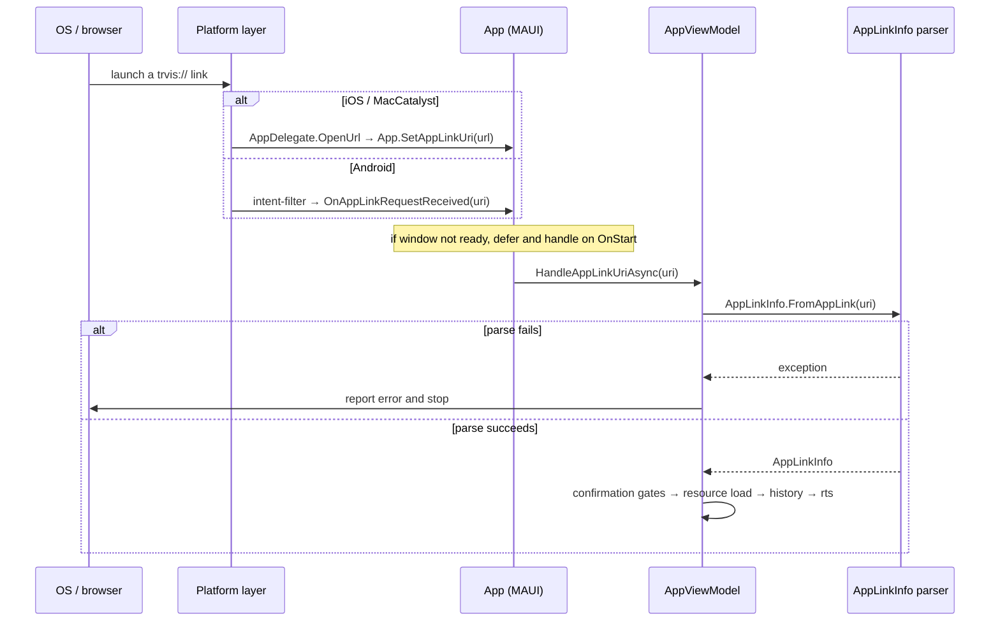

# AppLink Platform Registration & Invocation Pipeline (English)

> [← Back to index](README.md) / Prerequisite: [uri-format.md](uri-format.md)
> 日本語: [../ja/platform-registration.md](../ja/platform-registration.md)

Covers `trvis://` scheme registration on each OS and the path from an OS
deep link to in-app processing.

---

## 1. Custom scheme only (important)

TRViS's AppLink is **only the custom URL scheme `trvis://`**.

- iOS/macOS **Universal Links** (`https://` via associated-domains) are
  **not supported** (no `com.apple.developer.associated-domains` /
  `applinks` registration).
- Android **App Links** (`https` + `autoVerify` + host verification) are
  **not supported** (the intent-filter is the `trvis` scheme only, no
  host, no `autoVerify`).

So even when triggering from a web page, use a `trvis://...` link (or a
button/QR that opens it), not `https://`.

## 2. iOS / MacCatalyst registration

The `trvis` scheme is registered in `CFBundleURLTypes` of `Info.plist`.

```xml
<key>CFBundleURLTypes</key>
<array>
  <dict>
    <key>CFBundleURLName</key>
    <string>$(PRODUCT_BUNDLE_IDENTIFIER)</string>
    <key>CFBundleURLSchemes</key>
    <array>
      <string>trvis</string>
    </array>
  </dict>
</array>
```

- iOS: `TRViS/Platforms/iOS/Info.plist`
- MacCatalyst: `TRViS/Platforms/MacCatalyst/Info.plist` (same content)

When the OS receives the link, `AppDelegate.OpenUrl(...)` is invoked and
the URL string is passed to the app.

## 3. Android registration

The `trvis` scheme is registered on `MainActivity` via an intent-filter
attribute.

```csharp
[IntentFilter([Intent.ActionView],
  Categories = [Intent.CategoryDefault, Intent.CategoryBrowsable],
  DataScheme = "trvis")]
public class MainActivity : MauiAppCompatActivity
```

- File: `TRViS/Platforms/Android/MainActivity.cs`
- **Only `DataScheme = "trvis"`, with no host.** That is, the
  `host = app` check is done **in the parser** (`AppLinkInfo`), **not in
  the manifest**. At the intent-filter stage anything with the `trvis`
  scheme is accepted; host/path/query are validated afterward in-app.

## 4. OS-to-in-app pipeline



Key points:

- **iOS/MacCatalyst**: `AppDelegate.OpenUrl` calls
  `App.SetAppLinkUri(string)`. If the window is not ready, the URI is
  retained and processed on `OnStart`.
- **Android**: the MAUI framework calls `OnAppLinkRequestReceived(Uri)`.
- Both ultimately funnel into `AppViewModel.HandleAppLinkUriAsync`, which
  after `AppLinkInfo.FromAppLink` parsing processes confirmation gates →
  loading → history → `rts` connection in order
  ([resource-loading.md](resource-loading.md)).
- If parsing fails an error is reported and processing is aborted.

## 5. How to invoke (reference)

- Web page: an `<a href="trvis://app/open/json?path=...">` link, or a
  button setting `location.href`.
- QR code: embed `trvis://...` as a string.
- Other apps/OS: pass `trvis://...` to the OS's URL-open API.

> Because Universal Links / App Links are not supported, an `https://`
> link will not open TRViS directly. Always use the `trvis://` scheme.

> Note: `_test` hosts such as `trvis://_test/seed-url-history` /
> `trvis://_test/set-gps-location` are exclusively for UI_TEST-build test
> infrastructure and are not part of the public spec (they are branched
> before parsing and do not exist in normal builds).
