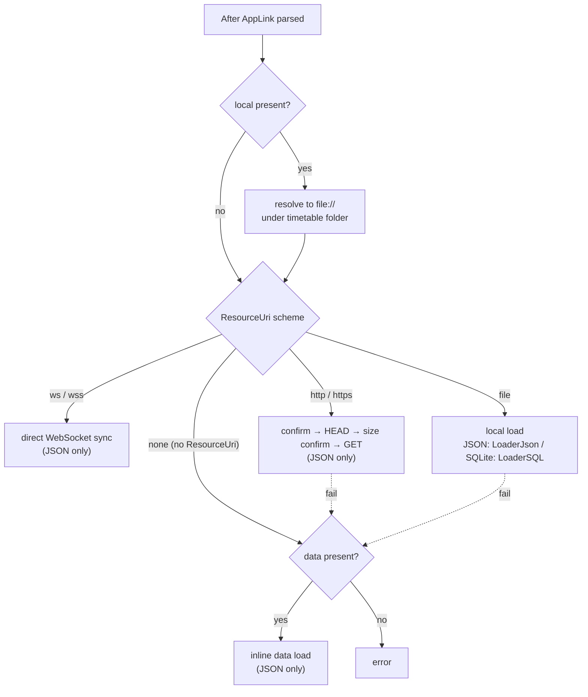
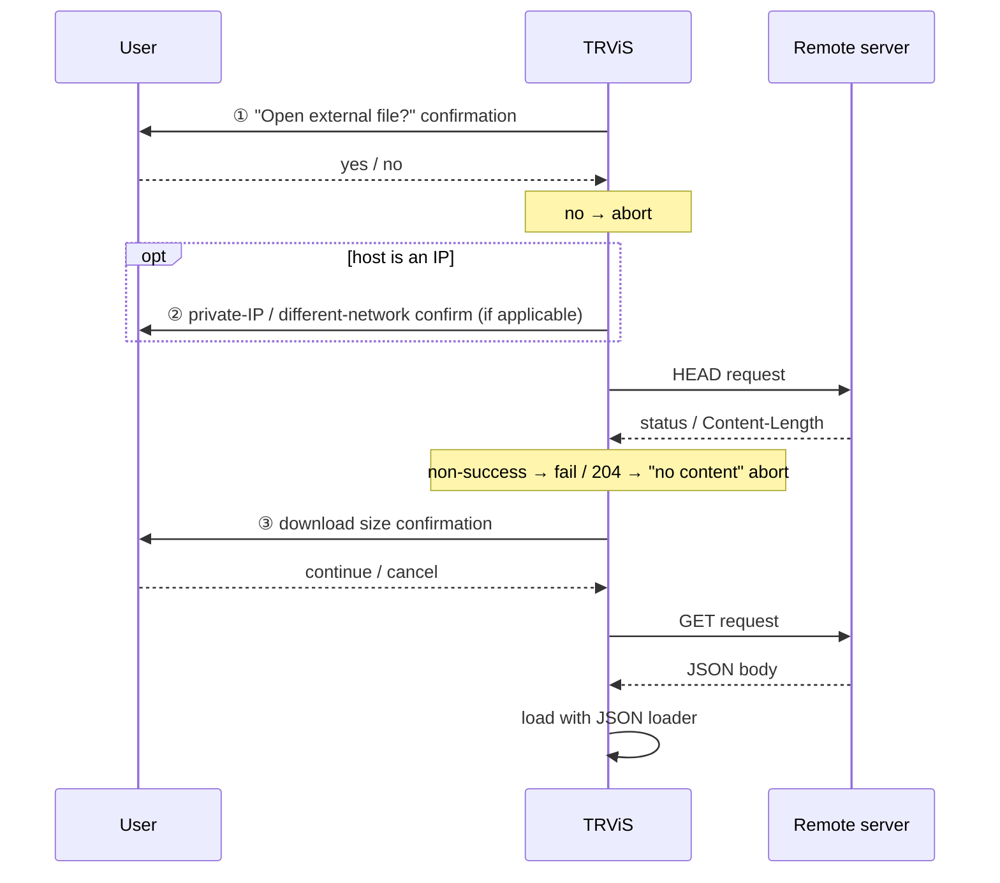

# AppLink Resource Loading & Confirmation Gates (English)

> [← Back to index](README.md) / Prerequisite: [uri-format.md](uri-format.md)
> 日本語: [../ja/resource-loading.md](../ja/resource-loading.md)

After an AppLink is parsed, this covers how the resource is loaded (per
scheme), where user confirmation (confirmation gates) is inserted, and
the history and realtime-integration behavior.

---

## 1. Resource dispatch

The loading method is decided by the parsed `ResourceUri` (`local` is
already resolved to `file://`) or the inline `data`.

## 2. Per-scheme behavior

### 2.1 `ws://` / `wss://` (direct WebSocket sync)

- For `path=ws(s)://...`, TRViS connects directly to the
  **NetworkSyncService (WebSocket)** rather than a file loader.
- **JSON kind (`/open/json`) only.** SQLite not allowed.
- When the host is an IP address it passes through the private-IP /
  different-network check ([§3.2](#32-private-ip--different-network-confirmation)).
- After connecting, that service becomes both the timetable loader and
  the location-sync provider. The subsequent message spec is under
  [../../network-sync-service/en/websocket.md](../../network-sync-service/en/websocket.md).
- On success the AppLink (original URL string) is added to history ([§5](#5-history)).

### 2.2 `file://` (local file)

- JSON → JSON loader, SQLite → SQLite loader.
- No user confirmation (it is an on-device file).

### 2.3 `http://` / `https://` (remote file)

- **JSON kind only.** SQLite not allowed.
- Loading steps (confirmation gates at several points):

### 2.4 `data=` (inline data)

- Used when there is no `ResourceUri`, or when its load fails.
- **JSON kind only.** The URL-safe Base64 is decoded and loaded.

### 2.5 `local=` (on-device file)

- Made absolute relative to the timetable folder and verified to stay
  within it (syntactic checks: [uri-format.md §6.4](uri-format.md#64-local-on-device-relative-path)).
- Aborts with "file not found" if it does not exist.
- After resolution it is treated as `file://`; no confirmation dialog.

## 3. Confirmation gates (user confirmation)

Because an AppLink can be injected arbitrarily, TRViS inserts user
confirmation before potentially dangerous operations. The **trigger and
effect** of each gate (the exact UI copy is per the implementation and
not specified here):

| # | Trigger | Effect |
|---|---|---|
| 1 | `ResourceUri` is `http`/`https` | Confirm before opening the file. Decline → abort. |
| 2 | Host is IPv4, judged a private IP on a different network from the device | Confirm whether to continue. Decline → abort. Same network / global IP → continue without prompt. |
| 3 | HEAD response succeeded and `Content-Length` is known | Show the download size and confirm. Also confirms (size unknown) if `Content-Length` is absent. |
| 3' | HEAD response is `204 No Content` | Abort as "no content". |
| 4 | `rts` host differs from the timetable resource host | Confirm before connecting to the realtime sync server ([§4](#4-realtime-integration-rts--rtk--rtv)). |

### 3.2 Private IP / different-network confirmation

- Applies when the host is IPv4.
- A global IP continues without a prompt.
- For a private IP (`10.0.0.0/8` / `172.16.0.0/12` / `192.168.0.0/16`),
  it is compared against each NIC's subnet on the device; **same network
  → continue without a prompt**. Only when judged a different network
  does it confirm whether to continue.
- This gate applies to both `http(s)` and `ws(s)`.

## 4. Realtime integration (`rts` / `rtk` / `rtv`)

An optional spec to connect to a realtime sync server **after** loading
the timetable via `path`/`data`/`local`.

| Key | Role | Current |
|---|---|---|
| `rts` | URI of the realtime sync service | **Used.** Applied as the connection target. |
| `rtk` | Token for the service | **Parsed only. Currently unused** (future). |
| `rtv` | Version of the service | **Parsed only. Currently unused** (future). |

Behavior:

- After the timetable loads successfully, if `rts` is specified, TRViS
  connects to that URI as a NetworkSyncService.
- If `rts`'s host **differs** from the timetable resource's (`path`,
  etc.) host, a user confirmation (gate #4) is inserted before
  connecting. If the host is the same, it connects without a prompt.
- If the connection fails the app continues and reports the error (the
  timetable itself is already loaded).
- **Important**: `rtk` (token) and `rtv` (version) are parsed into
  `AppLinkInfo` but are **not applied** to the connection in the current
  implementation (reserved for forward compatibility). For a sync server
  requiring authentication, currently include the token in the URI
  (`rts`) itself rather than in `rtk`.

> "Direct WebSocket" via `path=ws(s)://...`
> ([§2.1](#21-ws--wss-direct-websocket-sync)) and "connect to a separate
> sync after loading the timetable" via `rts=...` are different paths.
> The former obtains the timetable itself from WebSocket; the latter
> reads the timetable from another source and then connects to the sync
> server.

## 5. History

- The URL / AppLink of a successfully loaded external resource is added
  to the **external resource URL history** (max 32) and persisted.
- Duplicate entries are not added twice; the latest is reordered to the
  end.
- When over the limit, the oldest entries are removed.
- There are paths that do not add to history (e.g. unticking "save the
  destination" in the in-app "Connect to Server" dialog) — depends on
  the host app.

## 6. Link-generator checklist

- [ ] Start with `trvis://app/open/json` or `trvis://app/open/sqlite`
- [ ] Specify **only one** of `path` / `data` / `local`
- [ ] SQLite only via `file://` or `local` (not remote/inline)
- [ ] URL-encode the `path`/`rts` URI values
- [ ] `data`/`key` are URL-safe Base64 (`+→-`, `/→_`, padding removed)
- [ ] `local` is a relative path inside the timetable folder only (no `..` etc.)
- [ ] Design UX assuming a confirmation dialog appears for remote fetch
- [ ] For an authenticated sync server, include the token in the URI
      (since `rtk` is not yet applied)
- [ ] Keep `ver` ≤ `1.0`
