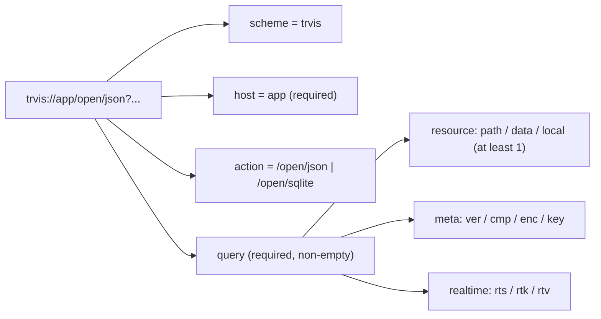
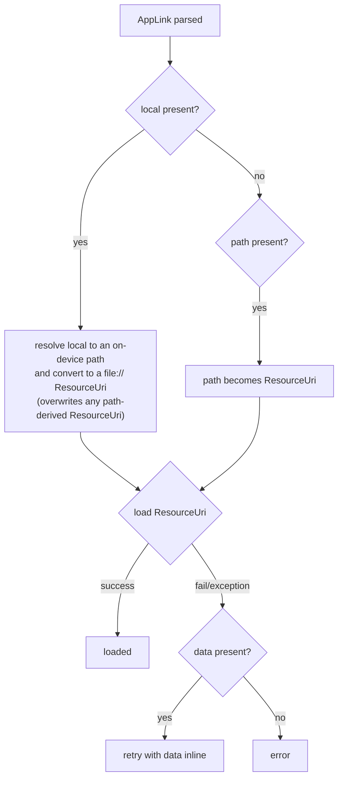

# AppLink URI Grammar & Query Parameters (English)

> [← Back to index](README.md) / 日本語: [../ja/uri-format.md](../ja/uri-format.md)

The complete AppLink URI specification. **Read this document first.**

---

## 1. URI structure

```
trvis://app/open/json?path=https%3A%2F%2Fexample.com%2Ftt.json&ver=1.0
└─┬─┘   └┬┘└───┬───┘ └──────────────────┬───────────────────────┘
scheme  host  action            query string
```



| Element | Value | Required | Description |
|---|---|:---:|---|
| scheme | `trvis` | ※ | Only `trvis://` is registered with the OS. However the **parser itself does not validate the scheme** (see §7). |
| host | `app` | ✅ | Anything other than `app` is rejected (`ArgumentException`). |
| action (path) | `/open/json` ｜ `/open/sqlite` | ✅ | The file kind to load. Anything else is rejected. |
| query | `key=value` pairs | ✅ | An empty query is rejected. At least one resource spec is required. |

> The path is matched exactly. `/open/json/` or `/open/JSON` etc. are
> invalid.

## 2. Action and file kind

| Action | File kind |
|---|---|
| `/open/json` | JSON timetable |
| `/open/sqlite` | SQLite timetable DB |

There are **constraints** between the file kind and the resource scheme
below ([§4 matrix](#4-file-kind--resource-scheme-matrix)).

## 3. Query parameter list

| Key | Role | Value form | Default | Notes |
|---|---|---|---|---|
| `path` | Resource URI | URI string | — | `file`/`http`/`https`/`ws`/`wss`. A scheme-less absolute path becomes `file://` (§6.3). |
| `data` | Inline data | URL-safe Base64 | — | Embeds the timetable body. **JSON only.** |
| `local` | On-device relative path | relative path string | — | Relative to the device's timetable folder. Traversal rejected (§6.4). |
| `ver` | AppLink version | version string | `1.0` | Max supported `1.0`. Exceeding → rejected. |
| `cmp` | Compression | `none` ｜ `gzip` | `none` | Unknown value rejected. |
| `enc` | Encryption | `none` | `none` | Currently `none` only. Unknown value rejected. |
| `key` | Decryption key | URL-safe Base64 | — | Required when `enc` is not `none` (currently `enc` is `none` only). |
| `rts` | Realtime sync URI | URI string | — | Optional. See [resource-loading.md](resource-loading.md#4-realtime-integration-rts--rtk--rtv). |
| `rtk` | Sync server token | string | — | Optional. **Currently parsed only, unused** (future). |
| `rtv` | Sync server version | version string | — | Optional. **Currently parsed only, unused** (future). |

- The query is standard `key=value&key=value`. URL-encode values
  (especially `:` `/` `?` `&` `=` inside the `path`/`rts` URIs).
- **At least one** of `path` / `data` / `local` is required. All empty →
  rejected.

### 3.1 Resource precedence (important)

`path` / `data` / `local` are **not mutually exclusive**. The parser
only requires "at least one"; combining them does not error at parse
time. However, the actual loading honors this precedence:



- If `local` is present, the resolved `file://` URI **overwrites** any
  `path`-derived ResourceUri (`local` wins).
- `data` is used as a **fallback when ResourceUri loading fails** (also
  used if there is no ResourceUri at all).
- **Recommended**: to avoid confusion, specify **only one** of `path` /
  `data` / `local`. The above is the actual behavior if they are
  combined by mistake.

## 4. File kind × resource scheme matrix

There are constraints between the resource scheme (or `data`) and the
file kind. An unsupported combination fails at load time with
`This file type is not supported`.

| Resource | JSON (`/open/json`) | SQLite (`/open/sqlite`) |
|---|:---:|:---:|
| `path=file://...` | ✅ | ✅ |
| `path=http(s)://...` | ✅ | ❌ |
| `path=ws(s)://...` | ✅ | ❌ |
| `data=...` (inline) | ✅ | ❌ |
| `local=...` (→ `file://`) | ✅ | ✅ |

> In short, **only `file://` (and `local`) can open SQLite**. Remote
> (http/https/ws/wss) and inline data are JSON-only.

## 5. Version (`ver`)

- `ver` is the AppLink **format** version (distinct from the sync
  protocol version).
- Omitted/empty → `1.0`.
- The value is parsed as a .NET `Version` (e.g. `1.0`, `0.1`, `2.0`).
- **Max supported is `1.0`.** If `ver` exceeds it (e.g. `2.0`) the link
  is rejected with `Unsupported version`. Smaller values like `0.1` are
  allowed.

## 6. Resource specification detail

### 6.1 `path` (resource URI)

- The value is a full URI string (URL-encode it).
- Accepted schemes: `file` / `http` / `https` / `ws` / `wss`. Any other
  scheme fails at load with `Unknown scheme`.
- Per-scheme behavior and confirmation dialogs: see
  [resource-loading.md](resource-loading.md).

### 6.2 `data` (inline data)

- Embeds the timetable body (JSON) as **URL-safe Base64**.
- URL-safe Base64 convention:
  - Standard Base64 with `+` → `-`, `/` → `_`.
  - Trailing `=` padding is **removed** (the decoder restores it from
    the length).
- `data` supports **JSON only** (no SQLite).
- Beware URL-length limits for large data (limits vary by OS/relays).

### 6.3 Scheme-less absolute `path`

If `path` has no scheme and is an absolute path (leading `/`), it is
interpreted as a `file://` URI.

| Input | Resolved ResourceUri |
|---|---|
| `path=/abc/def` | `file:///abc/def` |

(Behavior confirmed by the `Path_WithoutScheme` test.)

### 6.4 `local` (on-device relative path)

Specifies a file under the device's **timetable folder** by relative
path. Validated in two stages: syntactic (parser) and semantic
(resolution time).

**Syntactic checks (rejected at parse):**

- Empty / whitespace only
- Contains a backslash `\`
- Begins with `/` (absolute)
- Second char is `:` (drive letter like `C:`)
- A segment is `..`
- A segment is `.` (current)
- Empty segment (doubled slash `//`)
- Contains characters invalid in a filename

**Semantic checks (at resolution):**

- Made absolute relative to the timetable folder; the result must stay
  within that folder (escaping → rejected).
- Rejected if the file does not exist.

`local` supports both JSON and SQLite. No confirmation dialog appears
(the user explicitly opened a file already on their device). Detail in
[resource-loading.md](resource-loading.md#25-local-on-device-file).

Examples:

| Input | LocalPath | Allowed |
|---|---|---|
| `local=foo.json` | `foo.json` | ✅ |
| `local=sub/dir/db.sqlite` | `sub/dir/db.sqlite` | ✅ |
| `local=../escape.json` | — | ❌ (`..`) |
| `local=sub/../escape.json` | — | ❌ (`..`) |
| `local=/abs.json` | — | ❌ (absolute) |
| `local=C:/win.json` | — | ❌ (drive) |
| `local=sub\file.json` | — | ❌ (`\`) |
| `local=sub//file.json` | — | ❌ (empty segment) |
| `local=./file.json` | — | ❌ (`.`) |

## 7. Note on scheme validation

The `AppLinkInfo` parser **does not validate the URI scheme**
(implementation comment: "the scheme part is not checked"). Limiting to
`trvis://` is done only by **OS registration**
([platform-registration.md](platform-registration.md)). Therefore, via a
path other than an OS deep link (e.g. in-app code), even
`something://app/open/json?...` parses successfully. As an external link,
always use `trvis://`.

## 8. Full examples

```text
# Open a web JSON (http/https triggers a confirmation dialog)
trvis://app/open/json?path=https%3A%2F%2Fexample.com%2Ftt.json

# Open a SQLite from a local file
trvis://app/open/sqlite?path=file%3A%2F%2F%2Fpath%2Fto%2Ftrvis.db

# Open a file in the device's timetable folder
trvis://app/open/sqlite?local=sub/dir/db.sqlite

# Embed JSON in the link (URL-safe Base64)
trvis://app/open/json?ver=1.0&data=eyJ...(URL-safe Base64)

# Timetable + sync over WebSocket
trvis://app/open/json?path=wss%3A%2F%2Fsync.example.com%2Fws

# Timetable over HTTPS, location sync via a different WebSocket server
trvis://app/open/json?path=https%3A%2F%2Fa.example.com%2Ftt.json&rts=wss%3A%2F%2Fb.example.com%2Fws
```
