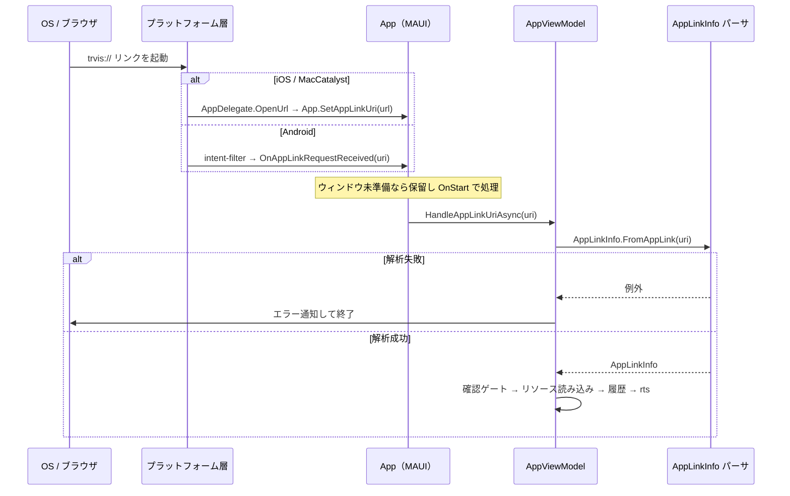

# AppLink プラットフォーム登録と起動経路（日本語）

> [← 目次に戻る](README.md) ／ 前提: [uri-format.md](uri-format.md)
> English: [../en/platform-registration.md](../en/platform-registration.md)

各 OS での `trvis://` スキーム登録と、OS のディープリンクから
アプリ内処理に至るまでの経路を扱います。

---

## 1. カスタムスキーム限定（重要）

TRViS の AppLink は **カスタム URL スキーム `trvis://` のみ**です。

- iOS/macOS の **Universal Links**（`https://` の associated-domains）は
  **未対応**（`com.apple.developer.associated-domains` / `applinks` の
  登録なし）。
- Android の **App Links**（`https` + `autoVerify` + host 検証）は
  **未対応**（intent-filter は `trvis` スキームのみ、host 指定なし、
  `autoVerify` なし）。

したがって、Web ページから踏ませる場合も `https://` ではなく
`trvis://...` のリンク（またはそれを開くボタン/QR）を使います。

## 2. iOS / MacCatalyst 登録

`Info.plist` の `CFBundleURLTypes` に `trvis` スキームを登録しています。

```xml
<key>CFBundleURLTypes</key>
<array>
  <dict>
    <key>CFBundleURLName</key>
    <string>$(PRODUCT_BUNDLE_IDENTIFIER)</string>
    <key>CFBundleURLSchemes</key>
    <array>
      <string>trvis</string>
    </array>
  </dict>
</array>
```

- iOS: `TRViS/Platforms/iOS/Info.plist`
- MacCatalyst: `TRViS/Platforms/MacCatalyst/Info.plist`（同内容）

OS がリンクを受けると `AppDelegate.OpenUrl(...)` が呼ばれ、URL 文字列が
アプリへ渡されます。

## 3. Android 登録

`MainActivity` に intent-filter 属性で `trvis` スキームを登録しています。

```csharp
[IntentFilter([Intent.ActionView],
  Categories = [Intent.CategoryDefault, Intent.CategoryBrowsable],
  DataScheme = "trvis")]
public class MainActivity : MauiAppCompatActivity
```

- ファイル: `TRViS/Platforms/Android/MainActivity.cs`
- **`DataScheme = "trvis"` のみで host 指定がありません。** すなわち
  `host = app` の検証は **マニフェストではなくパーサ側**（`AppLinkInfo`）で
  行われます。intent-filter 段階ではスキームが `trvis` でありさえ
  すれば受理され、その後アプリ内で host/path/クエリが検証されます。

## 4. OS からアプリ内処理までの経路



要点:

- **iOS/MacCatalyst**: `AppDelegate.OpenUrl` が
  `App.SetAppLinkUri(string)` を呼ぶ。ウィンドウ未準備時は URI を
  保持し、`OnStart` で処理する。
- **Android**: MAUI フレームワークが `OnAppLinkRequestReceived(Uri)` を
  呼ぶ。
- いずれも最終的に `AppViewModel.HandleAppLinkUriAsync` に集約され、
  `AppLinkInfo.FromAppLink` で解析後、確認ゲート→読み込み→履歴→
  `rts` 接続の順に処理されます（[resource-loading.md](resource-loading.md)）。
- 解析に失敗するとエラーが通知され、処理は中断されます。

## 5. 投げ込み方法（参考）

- Web ページ: `<a href="trvis://app/open/json?path=...">` リンク、
  またはボタンの `location.href` 設定。
- QR コード: `trvis://...` を文字列として埋め込む。
- 他アプリ/OS: 各 OS の URL オープン API に `trvis://...` を渡す。

> Universal Links / App Links 非対応のため、`https://` のリンクからは
> 直接 TRViS は開きません。必ず `trvis://` スキームを使用してください。

> 注: `trvis://_test/seed-url-history` / `trvis://_test/set-gps-location`
> といった `_test` ホストは UI_TEST ビルド限定のテスト基盤専用で、
> 公開仕様には含まれません（解析前に分岐され、通常ビルドには存在
> しません）。
