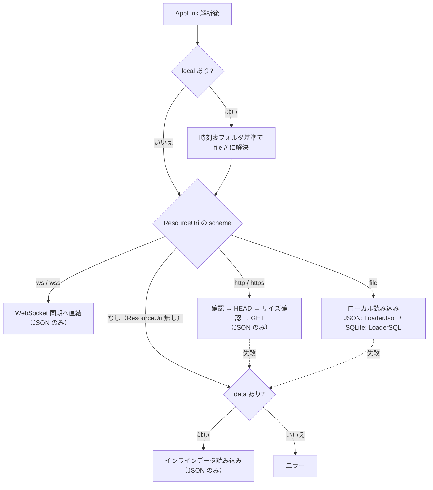
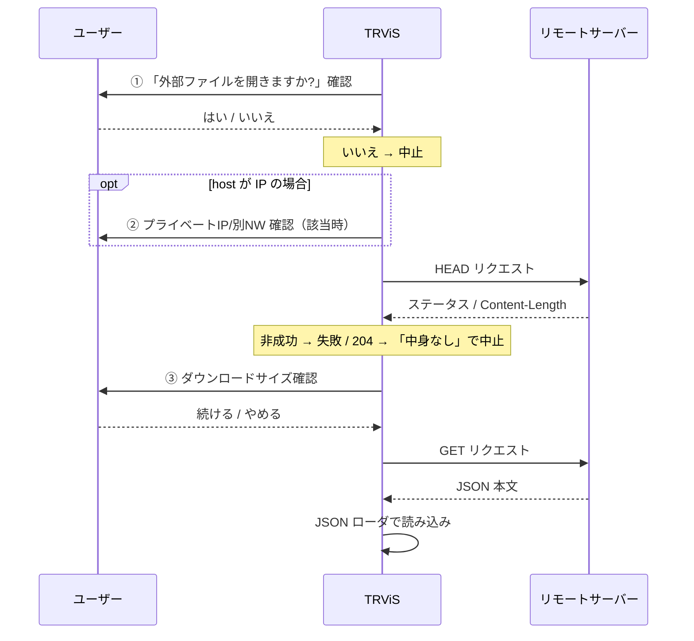

# AppLink リソース読み込みと確認ゲート（日本語）

> [← 目次に戻る](README.md) ／ 前提: [uri-format.md](uri-format.md)
> English: [../en/resource-loading.md](../en/resource-loading.md)

AppLink の解析後、リソースをどのスキームで・どう読み込むか、どの場面で
ユーザー確認（確認ゲート）が入るか、履歴とリアルタイム連携の挙動を
扱います。

---

## 1. リソース振り分け

解析で得た `ResourceUri`（`local` は `file://` に解決済み）か、または
インライン `data` に応じて読み込み方法が決まります。

## 2. スキーム別の挙動

### 2.1 `ws://` / `wss://`（WebSocket 同期へ直結）

- `path=ws(s)://...` の場合、ファイルローダではなく
  **NetworkSyncService（WebSocket）** へ直接接続します。
- **JSON 種別（`/open/json`）専用**。SQLite は不可。
- 接続先 host が IP アドレスのときは、プライベート IP／別ネットワーク
  判定（[§3.2](#32-プライベート-ip--別ネットワーク確認)）を経ます。
- 接続後はそのサービスが時刻表ローダ兼位置同期プロバイダになります。
  以降のメッセージ仕様は
  [../../network-sync-service/ja/websocket.md](../../network-sync-service/ja/websocket.md)
  以下を参照。
- 成功すると AppLink（元の URL 文字列）が履歴に追加されます（[§5](#5-履歴)）。

### 2.2 `file://`（ローカルファイル）

- JSON → JSON ローダ、SQLite → SQLite ローダで読み込みます。
- ユーザー確認は入りません（端末内ファイルのため）。

### 2.3 `http://` / `https://`（リモートファイル）

- **JSON 種別専用**。SQLite は不可。
- 読み込み手順（各所に確認ゲート）:

### 2.4 `data=`（インラインデータ）

- `ResourceUri` が無い／読み込み失敗のとき、インライン `data` を
  使用します。
- **JSON 種別専用**。URL 安全 Base64 をデコードして読み込みます。

### 2.5 `local=`（端末内ファイル）

- 時刻表フォルダ基準で絶対パス化し、フォルダ配下に収まることを検証
  （構文チェックは [uri-format.md §6.4](uri-format.md#64-local端末内相対パス)）。
- 存在しなければ「ファイルが見つかりません」で中止。
- 解決後は `file://` として扱われ、確認ダイアログは出ません。

## 3. 確認ゲート（ユーザー確認）

AppLink は外部から任意に投げ込めるため、危険になり得る操作の前に
ユーザー確認を挟みます。各ゲートの**発火条件と効果**は次の通りです
（UI 文言そのものは実装に準じ、本書では規定しません）。

| # | 発火条件 | 効果 |
|---|---|---|
| 1 | `ResourceUri` が `http`/`https` | ファイルを開く前に開く可否を確認。拒否で中止。 |
| 2 | 接続先 host が IPv4 で、プライベート IP かつ自端末と別ネットワークと判定 | 続行可否を確認。拒否で中止。同一ネットワーク／グローバル IP なら確認なしで続行。 |
| 3 | HEAD 応答が成功で `Content-Length` が判明 | ダウンロードサイズを提示し続行可否を確認。`Content-Length` 不明時もサイズ不明として確認。 |
| 3' | HEAD 応答が `204 No Content` | 「中身なし」として中止。 |
| 4 | `rts` の host が時刻表リソースの host と異なる | リアルタイム同期サーバーへの接続可否を確認（[§4](#4-リアルタイム連携-rts--rtk--rtv)）。 |

### 3.2 プライベート IP / 別ネットワーク確認

- 対象は host が IPv4 の場合。
- グローバル IP は確認なしで続行。
- プライベート IP（`10.0.0.0/8` / `172.16.0.0/12` / `192.168.0.0/16`）の
  とき、自端末の各 NIC のサブネットと比較し、**同一ネットワークなら
  確認なしで続行**。別ネットワークと判定された場合のみ続行可否を確認。
- `http(s)` と `ws(s)` の両方でこのゲートが適用されます。

## 4. リアルタイム連携 (`rts` / `rtk` / `rtv`)

`path`/`data`/`local` で時刻表を読み込んだ**後**に、別途リアルタイム
同期サーバーへ接続させるための任意指定です。

| キー | 役割 | 現状 |
|---|---|---|
| `rts` | リアルタイム同期サービスの URI | **使用される**。接続先として適用。 |
| `rtk` | 同サービスのトークン | **パースのみ。現状未使用**（将来用）。 |
| `rtv` | 同サービスのバージョン | **パースのみ。現状未使用**（将来用）。 |

挙動:

- 時刻表読み込み成功後、`rts` が指定されていれば、その URI へ
  NetworkSyncService として接続します。
- `rts` の host が時刻表リソース（`path` 等）の host と **異なる**
  場合、接続前にユーザー確認（ゲート #4）が入ります。host が同じ
  場合は確認なしで接続します。
- 接続に失敗してもアプリは継続し、エラーを通知します（時刻表自体は
  読み込み済み）。
- **重要**: `rtk`（トークン）と `rtv`（バージョン）は `AppLinkInfo` に
  解析されますが、現状の実装では接続に**適用されません**（前方互換の
  ための予約）。認証が必要な同期サーバーへは、現状この `rtk` では
  なく URI（`rts`）自体にトークンを含める運用が必要です。

> `path=ws(s)://...` による「WebSocket 直結」（[§2.1](#21-ws--wss-websocket-同期へ直結)）と、
> `rts=...` による「時刻表読み込み後に別途同期接続」は別経路です。
> 前者は時刻表自体を WebSocket から取得し、後者は時刻表を別ソースから
> 読んだ上で同期サーバーに繋ぎます。

## 5. 履歴

- 読み込みに成功した外部リソースの URL／AppLink は
  **外部リソース URL 履歴**（最大 32 件）に追加され、永続化されます。
- 同一エントリは重複追加されず、最新が末尾に来るよう並べ替えられます。
- 上限超過時は古いものから削除されます。
- アプリ内の「サーバーに接続」ダイアログで「接続先を保存する」を
  外した場合など、履歴に追加しない経路もあります（ホストアプリの
  実装による）。

## 6. リンク生成側チェックリスト

- [ ] `trvis://app/open/json` または `trvis://app/open/sqlite` で始める
- [ ] `path` / `data` / `local` の **いずれか 1 つだけ**を指定する
- [ ] SQLite は `file://` または `local` のみ（リモート/インライン不可）
- [ ] `path`/`rts` の URI 値を URL エンコードする
- [ ] `data`/`key` は URL 安全 Base64（`+→-`, `/→_`, パディング除去）
- [ ] `local` は時刻表フォルダ内の相対パスのみ（`..` 等は不可）
- [ ] リモート取得は確認ダイアログが出る前提で UX を設計する
- [ ] 認証付き同期サーバーは（`rtk` 未対応のため）URI 側にトークンを含める
- [ ] `ver` は `1.0` 以下にする
