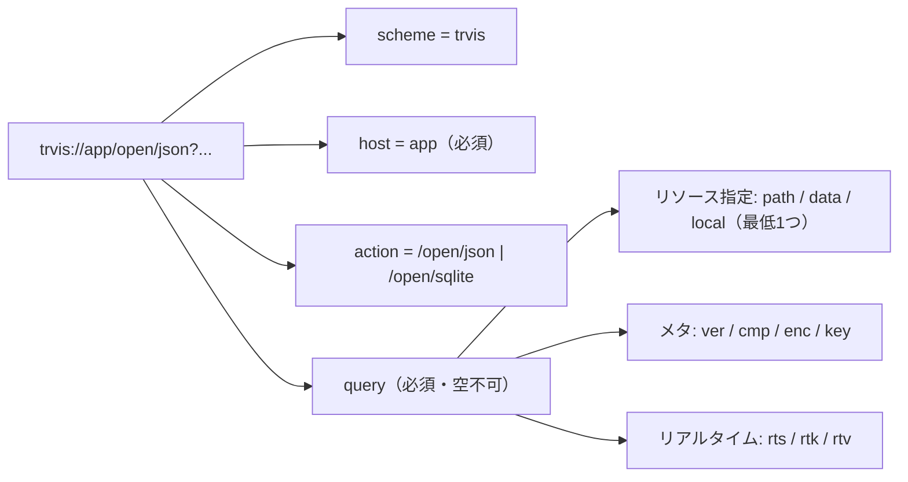
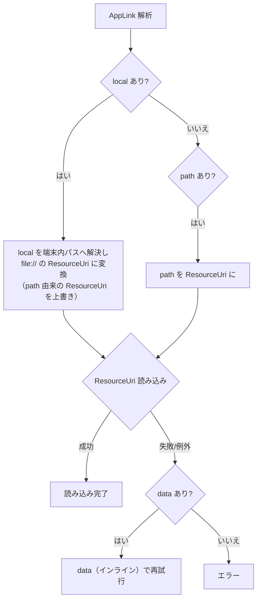

# AppLink URI 文法とクエリパラメータ（日本語）

> [← 目次に戻る](README.md) ／ English: [../en/uri-format.md](../en/uri-format.md)

AppLink URI の完全仕様です。**最初にこの文書を読んでください。**

---

## 1. URI の構造

```
trvis://app/open/json?path=https%3A%2F%2Fexample.com%2Ftt.json&ver=1.0
└─┬─┘   └┬┘└───┬───┘ └──────────────────┬───────────────────────┘
scheme  host  action          query (クエリ文字列)
```



| 要素 | 値 | 必須 | 説明 |
|---|---|:---:|---|
| scheme | `trvis` | ※ | OS へ登録されているのは `trvis://` のみ。ただし**パーサ自体はスキームを検証しません**（§7 参照）。 |
| host | `app` | ✅ | `app` 以外は拒否（`ArgumentException`）。 |
| action（パス） | `/open/json` ｜ `/open/sqlite` | ✅ | 読み込むファイル種別を表す。これ以外は拒否。 |
| query | キー=値 の連結 | ✅ | 空クエリは拒否。最低 1 つのリソース指定が必要。 |

> パスは厳密一致です。`/open/json/` や `/open/JSON` 等は不可。

## 2. アクションとファイル種別

| アクション | ファイル種別 |
|---|---|
| `/open/json` | JSON 時刻表 |
| `/open/sqlite` | SQLite 時刻表 DB |

ファイル種別と、後述のリソーススキームの **対応には制約**があります
（[§4 対応表](#4-ファイル種別--リソーススキーム対応表)）。

## 3. クエリパラメータ一覧

| キー | 役割 | 値の形式 | 既定 | 備考 |
|---|---|---|---|---|
| `path` | リソース URI | URI 文字列 | — | `file`/`http`/`https`/`ws`/`wss`。スキームなしの絶対パスは `file://` 化（§6.3）。 |
| `data` | インラインデータ | URL 安全 Base64 | — | 時刻表本体を埋め込む。**JSON のみ**。 |
| `local` | 端末内相対パス | 相対パス文字列 | — | 端末の時刻表フォルダ基準。トラバーサルは拒否（§6.4）。 |
| `ver` | AppLink 版 | バージョン文字列 | `1.0` | 対応最大 `1.0`。超過で拒否。 |
| `cmp` | 圧縮方式 | `none` ｜ `gzip` | `none` | 未知値は拒否。 |
| `enc` | 暗号方式 | `none` | `none` | 現状 `none` のみ。未知値は拒否。 |
| `key` | 復号鍵 | URL 安全 Base64 | — | `enc` が `none` 以外のとき必須（現状 `enc` は `none` のみ）。 |
| `rts` | リアルタイム同期 URI | URI 文字列 | — | 任意。詳細は [resource-loading.md](resource-loading.md#4-リアルタイム連携-rts--rtk--rtv)。 |
| `rtk` | 同期サーバートークン | 文字列 | — | 任意。**現状パースのみで未使用**（将来用）。 |
| `rtv` | 同期サーバー版 | バージョン文字列 | — | 任意。**現状パースのみで未使用**（将来用）。 |

- クエリは標準的な `key=value&key=value` 形式。値は URL エンコード
  してください（特に `path`/`rts` の URI に含まれる `:` `/` `?` `&` `=`）。
- `path` / `data` / `local` のうち **最低 1 つ**が必須。すべて空だと拒否。

### 3.1 リソース指定の優先順位（重要）

`path` / `data` / `local` は**排他ではありません**。パーサは
「最低 1 つ」だけを要求し、併用しても解析段階ではエラーになりません。
ただし実際の読み込みでは次の優先順位で扱われます。



- `local` があると、解決後の `file://` URI が `path` 由来の ResourceUri を
  **上書き**します（`local` 優先）。
- `data` は ResourceUri の読み込みが**失敗したときのフォールバック**として
  使われます（ResourceUri 自体が無い場合も `data` を使用）。
- **推奨**: 混乱を避けるため、`path` / `data` / `local` は
  **どれか 1 つだけ**を指定してください。上記は誤って併用された場合の
  実挙動です。

## 4. ファイル種別 × リソーススキーム対応表

リソースのスキーム（または `data`）とファイル種別の対応には制約が
あります。非対応の組み合わせは読み込み時に
`This file type is not supported` で失敗します。

| リソース | JSON (`/open/json`) | SQLite (`/open/sqlite`) |
|---|:---:|:---:|
| `path=file://...` | ✅ | ✅ |
| `path=http(s)://...` | ✅ | ❌ |
| `path=ws(s)://...` | ✅ | ❌ |
| `data=...`（インライン） | ✅ | ❌ |
| `local=...`（→ `file://` 解決） | ✅ | ✅ |

> 要するに **SQLite を開けるのは `file://`（および `local`）のみ**。
> リモート（http/https/ws/wss）とインラインデータは JSON 専用です。

## 5. バージョン (`ver`)

- `ver` は AppLink **フォーマット**のバージョン（同期プロトコル
  バージョンとは別物）。
- 省略時・空文字時は `1.0`。
- 値は .NET の `Version`（例 `1.0`, `0.1`, `2.0`）として解釈されます。
- **対応最大は `1.0`**。`ver` がこれを超えると（例 `2.0`）リンクは
  `Unsupported version` で拒否されます。`0.1` のような小さい値は許容。

## 6. 各リソース指定の詳細

### 6.1 `path`（リソース URI）

- 値は完全な URI 文字列（URL エンコード必須）。
- 受理スキーム: `file` / `http` / `https` / `ws` / `wss`。
  それ以外のスキームは読み込み時に `Unknown scheme` で失敗します。
- スキーム別の挙動・確認ダイアログは
  [resource-loading.md](resource-loading.md) を参照。

### 6.2 `data`（インラインデータ）

- 時刻表本体（JSON）を **URL 安全 Base64** で埋め込みます。
- URL 安全 Base64 の規約:
  - 標準 Base64 の `+` → `-`、`/` → `_` に置換。
  - 末尾の `=` パディングは**除去**（デコード側で長さから補完）。
- `data` は **JSON のみ**対応（SQLite 不可）。
- 大きなデータは URL 長制限に注意（OS/中継により上限が異なる）。

### 6.3 `path` のスキームなし絶対パス

`path` がスキームを持たない絶対パス（先頭 `/`）の場合、`file://` URI
として解釈されます。

| 入力 | 解釈される ResourceUri |
|---|---|
| `path=/abc/def` | `file:///abc/def` |

（テスト `Path_WithoutScheme` で確認済みの挙動。）

### 6.4 `local`（端末内相対パス）

端末内の **時刻表フォルダ** 配下のファイルを相対パスで指定します。
構文チェック（パーサ）と意味チェック（解決時）の二段で検証されます。

**構文チェック（解析時に拒否されるもの）:**

- 空・空白のみ
- バックスラッシュ `\` を含む
- 先頭が `/`（絶対パス）
- 2 文字目が `:`（`C:` などドライブレター）
- セグメントに `..` を含む
- セグメントに `.`（カレント）を含む
- 空セグメント（`//` による二重スラッシュ）
- ファイル名に使えない文字を含む

**意味チェック（解決時）:**

- 時刻表フォルダ基準で絶対パス化し、結果がそのフォルダ配下に
  収まることを検証（外に出ると拒否）。
- ファイルが存在しないと拒否。

`local` は JSON / SQLite いずれも可。確認ダイアログは出ません
（ユーザーが自端末のファイルを明示的に開いているため）。詳細は
[resource-loading.md](resource-loading.md#25-local-端末内ファイル)。

例:

| 入力 | LocalPath | 可否 |
|---|---|---|
| `local=foo.json` | `foo.json` | ✅ |
| `local=sub/dir/db.sqlite` | `sub/dir/db.sqlite` | ✅ |
| `local=../escape.json` | — | ❌（`..`） |
| `local=sub/../escape.json` | — | ❌（`..`） |
| `local=/abs.json` | — | ❌（絶対） |
| `local=C:/win.json` | — | ❌（ドライブ） |
| `local=sub\file.json` | — | ❌（`\`） |
| `local=sub//file.json` | — | ❌（空セグメント） |
| `local=./file.json` | — | ❌（`.`） |

## 7. スキーム検証に関する注意

`AppLinkInfo` のパーサは **URI のスキーム部分を検証しません**
（実装コメント「Scheme部分はチェックしない」）。`trvis://` に限定して
いるのは **OS への登録**（[platform-registration.md](platform-registration.md)）
だけです。したがって、OS のディープリンク以外の経路（アプリ内部
コード等）から `something://app/open/json?...` を渡した場合でも
解析自体は成功します。外部リンクとしては常に `trvis://` を使用して
ください。

## 8. 完全な例

```text
# Web 上の JSON を開く（http/https は確認ダイアログあり）
trvis://app/open/json?path=https%3A%2F%2Fexample.com%2Ftt.json

# SQLite をローカルファイルから開く
trvis://app/open/sqlite?path=file%3A%2F%2F%2Fpath%2Fto%2Ftrvis.db

# 端末内時刻表フォルダのファイルを開く
trvis://app/open/sqlite?local=sub/dir/db.sqlite

# JSON をリンクに埋め込む（URL 安全 Base64）
trvis://app/open/json?ver=1.0&data=eyJ...（URL安全Base64）

# WebSocket で時刻表＋同期
trvis://app/open/json?path=wss%3A%2F%2Fsync.example.com%2Fws

# 時刻表は HTTPS、位置同期は別の WebSocket サーバー
trvis://app/open/json?path=https%3A%2F%2Fa.example.com%2Ftt.json&rts=wss%3A%2F%2Fb.example.com%2Fws
```
