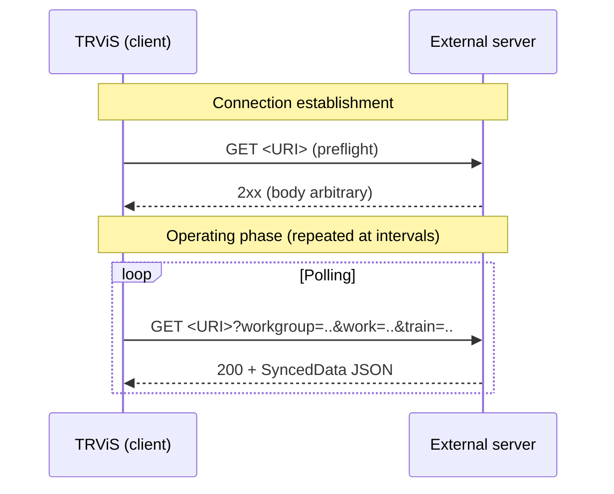
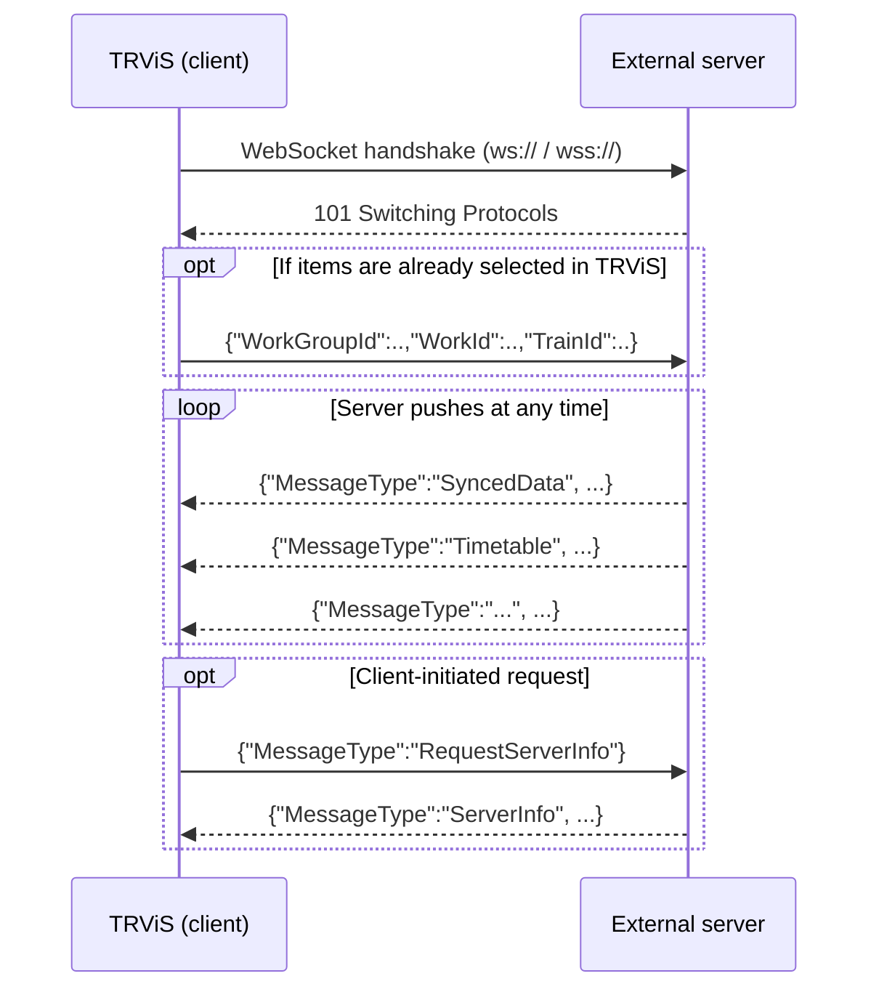
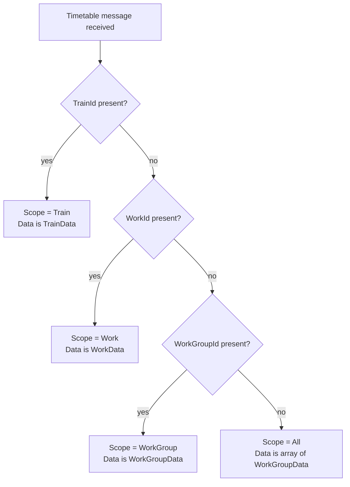
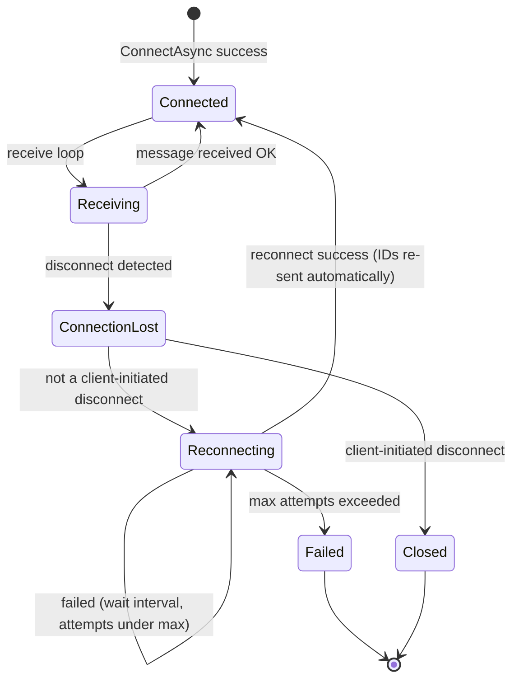
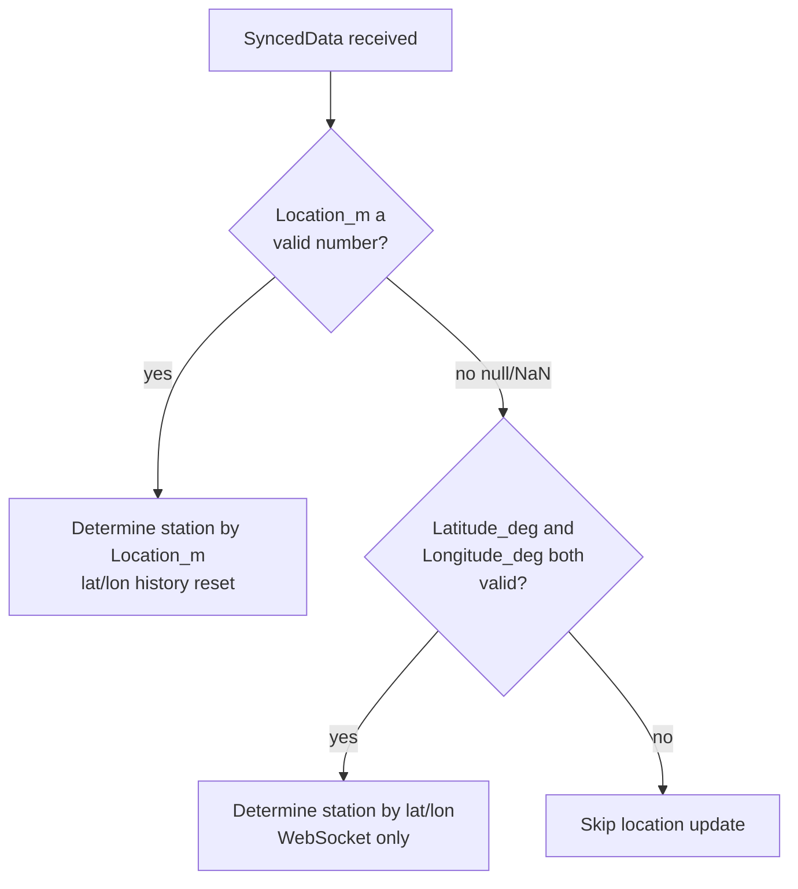

# NetworkSyncService — External System Integration Specification (English)

> Supported protocol version: **1.0**
> Audience: developers implementing an external server that integrates with TRViS

日本語版: [ja.md](ja.md)

---

## 1. Overview

`NetworkSyncService` is the mechanism by which TRViS (the client) receives
**operation-sync data, timetables, and various remote commands** from an
external system (the server). Two transports are supported:

| Transport | Scheme | Communication model | Typical use |
|---|---|---|---|
| **HTTP** | `http://` / `https://` | Client polling | Minimal integration: location, time, start-permission only |
| **WebSocket** | `ws://` / `wss://` | Server push (event driven) | Full integration including timetable delivery and remote control |

TRViS automatically selects the transport from the URI scheme
(`ws`/`wss` → WebSocket, otherwise HTTP).

### 1.1 Capability matrix

HTTP is a **strict subset** of WebSocket. Over HTTP only sync data
(location, time, start-permission) is available. If you need timetable
delivery or remote commands, you must implement WebSocket.

| Capability | HTTP | WebSocket |
|---|:---:|:---:|
| Location sync (`Location_m`) | ✅ | ✅ |
| Time sync (`Time_ms`) | ✅ | ✅ |
| Start permission (`CanStart`) | ✅ | ✅ |
| Lat/Lon fallback (`Latitude_deg`/`Longitude_deg`/`Accuracy_m`) | ❌ ※1 | ✅ |
| Timetable delivery (Timetable) | ❌ | ✅ |
| Server info (ServerInfo) | ❌ | ✅ |
| Diagram info (DiagramInfo) | ❌ | ✅ |
| Select-train command (SelectTrain) | ❌ | ✅ |
| Operation command (OperationCommand) | ❌ | ✅ |
| Header color change (HeaderColor) | ❌ | ✅ |
| Notification (Notification) | ❌ | ✅ |
| Time display format (TimeFormat) | ❌ | ✅ |
| Client → server ID notification | ✅ ※2 | ✅ |

- ※1: The HTTP client **ignores** latitude/longitude even if present in
  the response JSON (it parses only `Location_m` / `Time_ms` / `CanStart`).
- ※2: HTTP uses query parameters; WebSocket uses a JSON message (see below).

### 1.2 Security (important)

**The protocol itself has no authentication or authorization.** Messages on
the wire are anonymous and anyone can connect. In production you must
provide the following separately on the implementation side:

- Transport encryption via TLS (`https://` / `wss://`)
- Access control via a reverse proxy or WAF
- Authorization via URI query/path, TLS client certificates, etc.
  (TRViS uses the configured URI verbatim, so embedding a token in the
  URI is a viable approach)

---

## 2. HTTP protocol

### 2.1 Communication model



- **Preflight**: when a connection starts, TRViS issues a single
  `GET <URI>`. Anything other than `2xx` (including connection failure)
  is treated as a failed connection. The body content is not inspected.
- **Polling**: after the connection is established, TRViS issues `GET`
  to the same URI at an arbitrary interval. The server returns the
  latest state as JSON each time. The polling interval is controlled by
  the TRViS host implementation (the server is not involved).

### 2.2 Endpoint path

The endpoint path is **implementation-defined**. TRViS uses the configured
URI verbatim and does not require any specific path (such as `/sync`).
The original query string is preserved, and the ID parameters described
below are appended to it.

### 2.3 Request (client → server)

- Method: `GET`
- Query parameters (all optional; added only when the corresponding item
  is selected in TRViS):

| Key | Meaning |
|---|---|
| `workgroup` | Currently selected WorkGroup ID |
| `work` | Currently selected Work ID |
| `train` | Currently selected Train ID |

Any query already present in the URI is preserved; the keys above are
overwritten or appended.

### 2.4 Response (server → client)

- Status: `2xx` (anything else is treated as "no data, cannot start")
- `Content-Type`: arbitrary (TRViS parses the body as JSON)
- Body: a SyncedData object (see [4. Common data model](#4-common-data-model))

```jsonc
{
  "Location_m": 1234.5,   // nullable; null means "distance undetermined"
  "Time_ms": 43200000,    // ms elapsed since 00:00:00 today (= 12:00:00)
  "CanStart": true
}
```

> The HTTP client ignores `Latitude_deg` / `Longitude_deg` / `Accuracy_m`
> even if sent. Use WebSocket if you need lat/lon-based station detection.

If an HTTP request fails (non-`2xx`, connection failure, JSON parse
failure), TRViS treats it as `Location_m = null (NaN)`,
`Time_ms = device's current time`, `CanStart = false`.

---

## 3. WebSocket protocol

### 3.1 Connection

- Scheme is `ws://` or `wss://`.
- After the connection is established the server may push messages at
  any time.
- All messages are **UTF-8 text frames** whose body is a **JSON object**.
- No subprotocol needs to be specified.



### 3.2 Message discrimination

- **Server → client** messages always carry a `MessageType` field.
  Messages with an unknown `MessageType`, or with no `MessageType`, are
  ignored by TRViS.
- **Client → server** messages are of two kinds:
  1. Request messages that **have** a `MessageType` (`RequestServerInfo` /
     `RequestDiagramInfo`).
  2. ID-update messages that **do not have** a `MessageType` (a
     backward-compatibility contract). Treat any JSON containing
     `WorkGroupId` / `WorkId` / `TrainId` as an ID update.

### 3.3 Server → client messages

#### 3.3.1 `SyncedData` — operation sync data

The most fundamental message. Pushes location, time, and
start-permission. Over WebSocket it is processed immediately on each
receipt (event driven).

```jsonc
{
  "MessageType": "SyncedData",
  "Location_m": 1234.5,       // nullable; null → lat/lon fallback
  "Time_ms": 43200000,
  "CanStart": true,
  "Latitude_deg": 35.681236,  // optional
  "Longitude_deg": 139.767125,// optional
  "Accuracy_m": 5.0           // optional
}
```

#### 3.3.2 `Timetable` — timetable delivery

Delivers timetable data. The `Data` field embeds the timetable body in
[TRViS JSON format](https://github.com/TetsuOtter/TRViS/wiki/JSON%E5%BD%A2%E5%BC%8F%E3%81%AE%E3%83%87%E3%83%BC%E3%82%BF%E3%83%99%E3%83%BC%E3%82%B9)
as **raw JSON (an object/array, not a string)**.

```jsonc
{
  "MessageType": "Timetable",
  "WorkGroupId": "wg-1",   // optional
  "WorkId": "w-1",         // optional
  "TrainId": "t-1",        // optional
  "Data": { /* or [...] : timetable in TRViS JSON format */ }
}
```

##### Scope resolution (important)

There is no field on the wire that states the "scope". TRViS infers the
scope from **which IDs are present** (the most specific ID wins).



| Scope | IDs to include | `Data` type (TRViS JSON format) |
|---|---|---|
| All | (none) | `WorkGroupData[]` (array) |
| WorkGroup | `WorkGroupId` | `WorkGroupData` (single) |
| Work | `WorkGroupId` + `WorkId` | `WorkData` (single) |
| Train | `WorkGroupId` + `WorkId` + `TrainId` | `TrainData` (single) |

- The **All scope** has a wide impact, so receiving it resets the
  location state in TRViS. For WorkGroup / Work / Train scopes the
  location state is preserved (to support real-time editing).
- Each scope **completely rebuilds** the cache below it from the payload
  content (replacement, not a delta).
- The contents of `Data` (the structure of the timetable body) are out
  of scope for this document. See the TRViS JSON format wiki above.

#### 3.3.3 `ServerInfo` — server information

```jsonc
{
  "MessageType": "ServerInfo",
  "Name": "My Sync Server",    // server name
  "Admin": "admin@example.com",// admin / contact
  "Version": "1.2.3",          // server implementation version
  "ProtocolVersion": "1.0"     // supported protocol version
}
```

`ProtocolVersion` is the only handshake-level signal of protocol
compatibility. The current protocol is **`"1.0"`**.

#### 3.3.4 `DiagramInfo` — diagram information

Information about a "diagram", the concept above WorkGroup.

```jsonc
{
  "MessageType": "DiagramInfo",
  "DiagramId": "d-1",
  "Name": "Weekday diagram",
  "Description": "March 2024 revision",  // optional
  "WorkGroupIds": ["wg-1", "wg-2"]       // optional array
}
```

#### 3.3.5 `SelectTrain` — select-train command

Makes TRViS select a specific train. A `null` level is left unchanged.

```jsonc
{
  "MessageType": "SelectTrain",
  "WorkGroupId": "wg-1",  // optional
  "WorkId": "w-1",        // optional
  "TrainId": "t-1"        // optional
}
```

#### 3.3.6 `OperationCommand` — operation command

```jsonc
{
  "MessageType": "OperationCommand",
  "Action": "StartOperation"
}
```

Values for `Action` (case-insensitive):

| Value | Meaning |
|---|---|
| `StartOperation` | Start operation (enable location service, enter operating mode) |
| `EndOperation` | End operation |
| `EnableLocationService` | Enable the location service |
| `DisableLocationService` | Disable the location service |

An unknown `Action` is ignored.

#### 3.3.7 `HeaderColor` — header color change

Changes the title-bar color.

```jsonc
{
  "MessageType": "HeaderColor",
  "ResetToDefault": false,  // true → revert to the device default color
  "Color_RGB": 16711680     // integer in 0xRRGGBB form (here red 0xFF0000)
}
```

When `ResetToDefault` is `true`, `Color_RGB` is ignored.

#### 3.3.8 `Notification` — notification

```jsonc
{
  "MessageType": "Notification",
  "Id": "n-001",                          // optional
  "Title": "Service suspended",           // optional
  "Body": "Due to strong winds...",       // optional
  "Priority": 1,                          // optional; 0=normal, 1=important, etc. (server-defined)
  "IssuedAt": "2024-03-01T09:00:00+09:00" // optional; ISO 8601
}
```

#### 3.3.9 `TimeFormat` — time display format

Specifies the title-bar time display format.

```jsonc
{
  "MessageType": "TimeFormat",
  "Format": "HH:mm:ss"   // null / omitted → reset to the device default
}
```

Examples: `"HH:mm:ss"` / `"HH:mm"`.

### 3.4 Client → server messages

#### 3.4.1 ID-update message (no `MessageType`)

Sent whenever the WorkGroup / Work / Train selection changes in TRViS.
**For backward compatibility it has no `MessageType`.** The server should
interpret "JSON without a `MessageType` that contains
`WorkGroupId`/`WorkId`/`TrainId`" as an ID update. Keys for levels that
are not selected are omitted.

```jsonc
{
  "WorkGroupId": "wg-1",
  "WorkId": "w-1",
  "TrainId": "t-1"
}
```

The server can use this to deliver appropriately scoped timetables and
sync data to that client. It is also re-sent automatically after a
reconnection.

#### 3.4.2 `RequestServerInfo` — request server info

```json
{ "MessageType": "RequestServerInfo" }
```

The server should respond with a `ServerInfo` message.

#### 3.4.3 `RequestDiagramInfo` — request diagram info

```jsonc
{
  "MessageType": "RequestDiagramInfo",
  "DiagramId": "d-1"   // optional; omitted → request the current diagram
}
```

The server should respond with the corresponding `DiagramInfo` message.

### 3.5 Keep-alive and reconnection

#### Keep-alive

TRViS uses the standard WebSocket Ping/Pong (KeepAlive).

| Item | Value |
|---|---|
| Ping interval | 10 seconds |
| Pong response timeout | 15 seconds |

The server must be able to respond to WebSocket control frames
(Ping/Pong) per the standard.

#### Reconnection

When the connection drops, TRViS attempts automatic reconnection.

| Item | Default |
|---|---|
| Reconnect interval | 5000 ms |
| Max reconnect attempts | 3 |

(These are defaults and may be changed by the TRViS host implementation.)



Notes for server implementers:

- The client may attempt to reconnect immediately after a disconnect.
  Make the implementation tolerant of rapid reconnections.
- On a successful reconnect, the client **automatically re-sends** the
  currently selected IDs (see [3.4.1](#341-id-update-message-no-messagetype)).
  The server can resume delivery to the reconnected client using the
  scope implied by the received IDs.
- Once the max attempts is exceeded, TRViS gives up reconnecting and
  treats it as a connection failure.

---

## 4. Common data model

### 4.1 SyncedData fields

| Field | Type | Required | Description |
|---|---|:---:|---|
| `Location_m` | number \| null | optional | Distance from the start [m]. `null` = "distance undetermined". Common to HTTP/WS. |
| `Time_ms` | integer | optional | **Milliseconds elapsed since 00:00:00 of that day**. `43200000` = 12:00:00. |
| `CanStart` | boolean | optional | Whether departure is permitted. See below. |
| `Latitude_deg` | number \| null | optional | Latitude [deg]. WebSocket only. |
| `Longitude_deg` | number \| null | optional | Longitude [deg]. WebSocket only. |
| `Accuracy_m` | number \| null | optional | Accuracy of the lat/lon [m]. WebSocket only. |

#### Defaults when a field is missing

Each field is optional; when missing it is treated as follows:

| Field | Default when missing |
|---|---|
| `Location_m` | `null` (= distance undetermined) |
| `Time_ms` | `0` |
| `CanStart` | **`true`** (cannot-start is a special state, so the default is can-start) |

> Note that the default for `CanStart` is `true`. To forbid departure
> you must explicitly send `false`.

### 4.2 `Location_m` and lat/lon fallback

TRViS determines "current station / running toward next station" from
the received location.



- If `Location_m` is a valid number, the station is determined from it.
- If `Location_m` is `null` (internally `NaN` in the client) and both
  latitude and longitude are present, TRViS falls back to a lat/lon-based
  station-detection algorithm (a moving-average heuristic)
  (**WebSocket only**).
- If neither is available, no location update is performed.

> **JSON representation**: send JSON `null` to indicate "distance
> undetermined". `NaN` is invalid JSON and cannot be used. When the
> server sends `null`, TRViS converts it internally to `NaN`.

### 4.3 Meaning of `CanStart`

`CanStart` indicates whether the client may perform the departure
operation. In TRViS this value is also tied to "service availability"
(operation cannot start while `CanStart` is `false`).

### 4.4 Meaning of `Time_ms`

`Time_ms` is **not a UNIX epoch**; it is the **milliseconds elapsed
since midnight of that day**. For example, `43_200_000` represents
12:00:00. TRViS rounds to second precision (`Time_ms / 1000`) and uses
it for time synchronization.

---

## 5. Implementation checklist

### When implementing an HTTP server

- [ ] Accept `GET` on any path and return `2xx` + SyncedData JSON
- [ ] Return `2xx` to the preflight (the first `GET` without queries)
- [ ] Interpret the `workgroup` / `work` / `train` query params (if needed)
- [ ] Return JSON `null` when `Location_m` is undetermined (do not use `NaN`)
- [ ] Return `Time_ms` as milliseconds since midnight of that day
- [ ] Explicitly return `CanStart: false` when you want to forbid departure

### When implementing a WebSocket server

- [ ] Accept connections over `ws://` / `wss://`
- [ ] Attach `MessageType` to every server → client message
- [ ] Treat received messages without a `MessageType` as ID updates
- [ ] Respond to `RequestServerInfo` / `RequestDiagramInfo` requests
- [ ] Deliver timetables understanding that the included IDs determine the scope
- [ ] Respond to WebSocket Ping/Pong (control frames) per the standard
- [ ] Tolerate immediate reconnection right after a disconnect
- [ ] Handle the ID update re-sent by a reconnecting client and resume delivery

---

## Appendix: message quick reference

### Server → client (WebSocket)

| `MessageType` | Purpose |
|---|---|
| `SyncedData` | Sync of location / time / start-permission |
| `Timetable` | Timetable delivery (scope determined by IDs) |
| `ServerInfo` | Server information |
| `DiagramInfo` | Diagram information |
| `SelectTrain` | Instruct train selection |
| `OperationCommand` | Instruct operation actions |
| `HeaderColor` | Change header color |
| `Notification` | Notification |
| `TimeFormat` | Specify time display format |

### Client → server (WebSocket)

| Message | Discriminator | Purpose |
|---|---|---|
| ID update | no `MessageType` | Notify selected WorkGroup/Work/Train |
| `RequestServerInfo` | has `MessageType` | Request server info |
| `RequestDiagramInfo` | has `MessageType` | Request diagram info |

### Client → server (HTTP)

| Means | Purpose |
|---|---|
| `workgroup`/`work`/`train` query | Notify selected WorkGroup/Work/Train |
