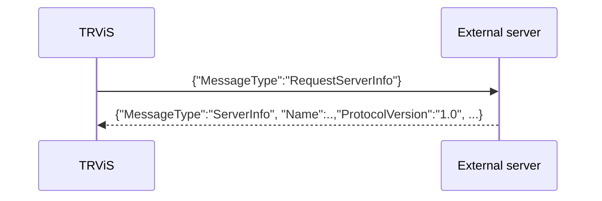
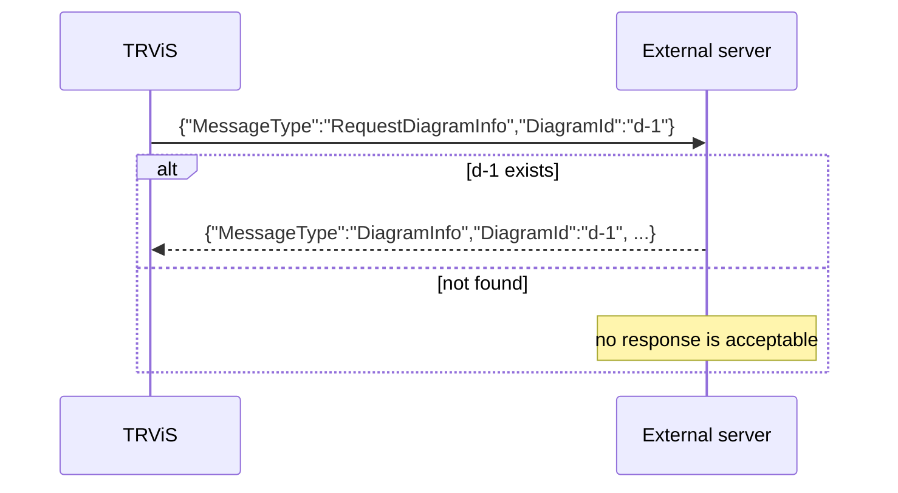

# Client → Server Message Catalog (English)

> [← Back to index](README.md) / Prerequisite: [websocket.md](websocket.md)
> 日本語: [../ja/client-to-server-messages.md](../ja/client-to-server-messages.md)

**WebSocket only.** Spec of messages sent from the client (TRViS) to the
server. Over HTTP, only ID notification is done, via query parameters
(see [http.md](http.md)).

Client-sent messages fall into two families:

| Kind | Discriminator | Section |
|---|---|---|
| ID-update message | **no** `MessageType` | [§1](#1-id-update-message) |
| Request message | **has** `MessageType` | [§2](#2-requestserverinfo) / [§3](#3-requestdiagraminfo) |

---

## 1. ID-update message

Sent whenever the WorkGroup / Work / Train selection changes in TRViS.

```jsonc
{
  "WorkGroupId": "wg-1",   // present only when selected
  "WorkId": "w-1",         // present only when selected
  "TrainId": "t-1"         // present only when selected
}
```

### 1.1 Discrimination (important — backward-compat contract)

This message **has no `MessageType` field**. This is a
backward-compatibility contract. The server should interpret it by the
following rule:

> If a received JSON has **no** `MessageType` and contains **any of**
> `WorkGroupId` / `WorkId` / `TrainId`, treat it as an ID update.

A message that has a `MessageType` should be processed as a request
message (§2, §3) and must not be interpreted as an ID update.

### 1.2 Included fields

- Keys for levels that are not selected are **omitted** (the key itself
  is absent rather than sending `null`). For example, if only WorkGroup
  and Work are selected, `TrainId` is absent:
  `{"WorkGroupId":"wg-1","WorkId":"w-1"}`.
- If nothing is selected, it can be effectively an empty object `{}`.

| Field | Type | Description |
|---|---|---|
| `WorkGroupId` | string | Selected WorkGroup ID |
| `WorkId` | string | Selected Work ID |
| `TrainId` | string | Selected Train ID |

### 1.3 Send timing

- When the WorkGroup / Work / Train selection changes (each ID change
  fires independently, so it may be sent multiple times while the three
  are set in sequence; the server should handle it idempotently).
- **Immediately after a successful reconnect**, the currently selected
  IDs are automatically re-sent (see
  [reconnection in websocket.md](websocket.md#5-reconnection)). It is
  safest to assume no prior subscription state remains on the server at
  reconnect and resume scope delivery based on the received IDs.

### 1.4 Server-side use

The server can use this to deliver appropriately scoped timetables
([timetable.md](timetable.md)) and sync data to that client. ID
interpretation and subscription management are up to the server; no
response message to an ID update is defined (the server may begin
delivery at its discretion).

---

## 2. RequestServerInfo

Requests server information.

```json
{ "MessageType": "RequestServerInfo" }
```

- The server should respond with a
  [`ServerInfo`](server-to-client-messages.md#3-serverinfo) message
  (a reply to the requesting client suffices).
- There are no additional fields.



---

## 3. RequestDiagramInfo

Requests diagram information.

```jsonc
{
  "MessageType": "RequestDiagramInfo",
  "DiagramId": "d-1"   // optional. omitted → request the "current" diagram
}
```

| Field | Type | Description |
|---|---|---|
| `DiagramId` | string | Optional. Identifier of the diagram to fetch. Omitted → the server's "current" diagram. |

- The server should respond with the corresponding
  [`DiagramInfo`](server-to-client-messages.md#4-diagraminfo) message.
- If no diagram corresponds to the given `DiagramId`, an implementation
  that returns no response (the reference server's behavior) is
  acceptable. The client tolerates no response arriving.



---

## Appendix: recommended server-side dispatch

```text
parse received JSON
├─ has "MessageType"?
│   ├─ "RequestServerInfo"  → reply ServerInfo
│   ├─ "RequestDiagramInfo" → reply DiagramInfo (DiagramId optional)
│   └─ otherwise            → ignore as unknown request, or handle as an extension
└─ no "MessageType"
    └─ read WorkGroupId/WorkId/TrainId and update subscription state (ID update)
```
