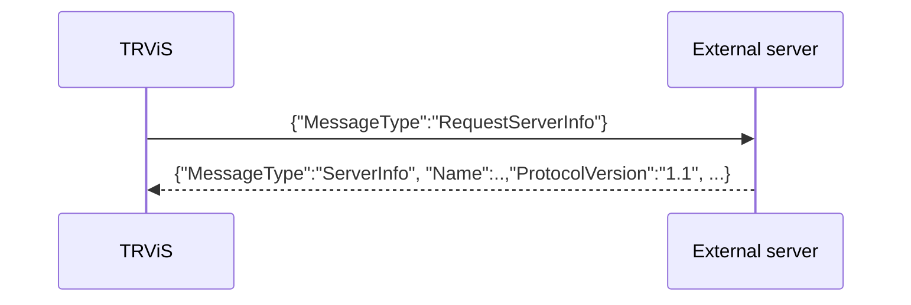
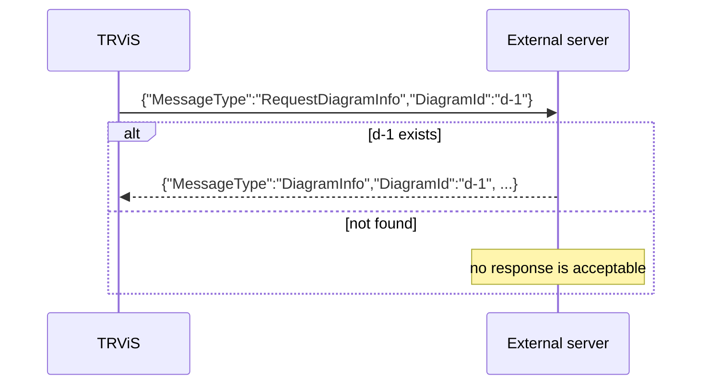
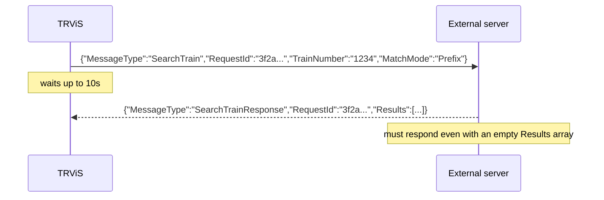
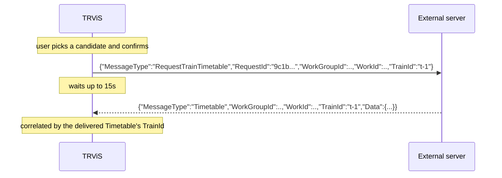
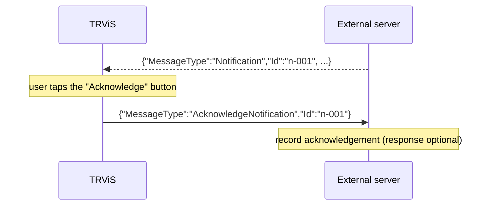

# Client → Server Message Catalog (English)

> [← Back to index](README.md) / Prerequisite: [websocket.md](websocket.md)
> 日本語: [../ja/client-to-server-messages.md](../ja/client-to-server-messages.md)

**WebSocket only.** Spec of messages sent from the client (TRViS) to the
server. Over HTTP, only ID notification is done, via query parameters
(see [http.md](http.md)).

Client-sent messages fall into two families:

| Kind | Discriminator | Section |
|---|---|---|
| ID-update message | **no** `MessageType` | [§1](#1-id-update-message) |
| Request message | **has** `MessageType` | [§2](#2-requestserverinfo) / [§3](#3-requestdiagraminfo) / [§4](#4-searchtrain) / [§5](#5-requesttraintimetable) / [§6](#6-acknowledgenotification) |

### Request/response correlation (`RequestId`)

Protocol v1.0 defined no correlation between a request and its response
— responses were matched only by `MessageType`. The v1.1 train-search
requests ([`SearchTrain`](#4-searchtrain),
[`RequestTrainTimetable`](#5-requesttraintimetable)) add an explicit
**`RequestId`**: a client-generated string the client uses to correlate
the reply with the request it sent. How each request uses it differs:

- [`SearchTrain`](#4-searchtrain): the server **must echo the same
  `RequestId`** in its [`SearchTrainResponse`](server-to-client-messages.md#12-searchtrainresponse).
- [`RequestTrainTimetable`](#5-requesttraintimetable): the response is a
  **normal [`Timetable`](server-to-client-messages.md#2-timetable)** (no
  new response type, no echoed `RequestId`); the client correlates by
  the delivered Timetable's `TrainId`. The `RequestId` here is present
  primarily for logging.

These requests are only meaningful against a server that advertises the
`TrainSearch` [feature](server-to-client-messages.md#3-serverinfo).

[`AcknowledgeNotification`](#6-acknowledgenotification) does not use
`RequestId` and is unrelated to the train-search feature negotiation.

---

## 1. ID-update message

Sent whenever the WorkGroup / Work / Train selection changes in TRViS.

```jsonc
{
  "WorkGroupId": "wg-1",   // present only when selected
  "WorkId": "w-1",         // present only when selected
  "TrainId": "t-1"         // present only when selected
}
```

### 1.1 Discrimination (important — backward-compat contract)

This message **has no `MessageType` field**. This is a
backward-compatibility contract. The server should interpret it by the
following rule:

> If a received JSON has **no** `MessageType` and contains **any of**
> `WorkGroupId` / `WorkId` / `TrainId`, treat it as an ID update.

A message that has a `MessageType` should be processed as a request
message (§2, §3) and must not be interpreted as an ID update.

### 1.2 Included fields

- Keys for levels that are not selected are **omitted** (the key itself
  is absent rather than sending `null`). For example, if only WorkGroup
  and Work are selected, `TrainId` is absent:
  `{"WorkGroupId":"wg-1","WorkId":"w-1"}`.
- If nothing is selected, it can be effectively an empty object `{}`.

| Field | Type | Description |
|---|---|---|
| `WorkGroupId` | string | Selected WorkGroup ID |
| `WorkId` | string | Selected Work ID |
| `TrainId` | string | Selected Train ID |

### 1.3 Send timing

- When the WorkGroup / Work / Train selection changes (each ID change
  fires independently, so it may be sent multiple times while the three
  are set in sequence; the server should handle it idempotently).
- **Immediately after a successful reconnect**, the currently selected
  IDs are automatically re-sent (see
  [reconnection in websocket.md](websocket.md#5-reconnection)). It is
  safest to assume no prior subscription state remains on the server at
  reconnect and resume scope delivery based on the received IDs.

### 1.4 Server-side use

The server can use this to deliver appropriately scoped timetables
([timetable.md](timetable.md)) and sync data to that client. ID
interpretation and subscription management are up to the server; no
response message to an ID update is defined (the server may begin
delivery at its discretion).

---

## 2. RequestServerInfo

Requests server information.

```json
{ "MessageType": "RequestServerInfo" }
```

- The server should respond with a
  [`ServerInfo`](server-to-client-messages.md#3-serverinfo) message
  (a reply to the requesting client suffices).
- There are no additional fields.


```mermaid
sequenceDiagram
    participant C as TRViS
    participant S as External server
    C->>S: {"MessageType":"RequestServerInfo"}
    S-->>C: {"MessageType":"ServerInfo", "Name":..,"ProtocolVersion":"1.1", ...}
```

---

## 3. RequestDiagramInfo

Requests diagram information.

```jsonc
{
  "MessageType": "RequestDiagramInfo",
  "DiagramId": "d-1"   // optional. omitted → request the "current" diagram
}
```

| Field | Type | Description |
|---|---|---|
| `DiagramId` | string | Optional. Identifier of the diagram to fetch. Omitted → the server's "current" diagram. |

- The server should respond with the corresponding
  [`DiagramInfo`](server-to-client-messages.md#4-diagraminfo) message.
- If no diagram corresponds to the given `DiagramId`, an implementation
  that returns no response (the reference server's behavior) is
  acceptable. The client tolerates no response arriving.


```mermaid
sequenceDiagram
    participant C as TRViS
    participant S as External server
    C->>S: {"MessageType":"RequestDiagramInfo","DiagramId":"d-1"}
    alt d-1 exists
        S-->>C: {"MessageType":"DiagramInfo","DiagramId":"d-1", ...}
    else not found
        Note over S: no response is acceptable
    end
```

---

## 4. SearchTrain

Requests a train search by train number. This is the first step of the
train-search flow (v1.1). Only meaningful against a server that
advertises the `TrainSearch`
[feature](server-to-client-messages.md#3-serverinfo); the client shows
its search UI only when that feature is present.

```jsonc
{
  "MessageType": "SearchTrain",
  "RequestId": "3f2a...unique...",   // client-generated correlation id (required)
  "TrainNumber": "1234",             // the train number to search for
  "MatchMode": "Prefix"              // optional; "Prefix" | "Contains" | "Exact" (default "Prefix")
}
```

| Field | Type | Description |
|---|---|---|
| `RequestId` | string | Client-generated correlation id. Required — the server echoes it in the response. |
| `TrainNumber` | string | The train number to search for. |
| `MatchMode` | string | Optional. How `TrainNumber` should be matched against a candidate's train number: `"Prefix"` (candidate starts with `TrainNumber`), `"Contains"` (candidate contains `TrainNumber` as a substring), or `"Exact"` (candidate equals `TrainNumber`). Omitted or an unrecognized value **must** be treated as `"Prefix"`. |

- The server **must** reply with a
  [`SearchTrainResponse`](server-to-client-messages.md#12-searchtrainresponse)
  echoing the same `RequestId`.
- Match comparisons are case-insensitive; beyond that, servers are free to
  apply additional normalization, but `MatchMode` semantics themselves are
  not server-defined — a compliant server implements all three modes.
- A server that supports the feature **must always respond — even with
  zero results** (an empty `Results` array) — so the client can
  distinguish "no results" from "no/failed response".
- If the server does **not** support train search (does not advertise
  `TrainSearch`), it simply does not respond; the client times out
  (**default 10s**) and reports an error.


```mermaid
sequenceDiagram
    participant C as TRViS
    participant S as External server
    C->>S: {"MessageType":"SearchTrain","RequestId":"3f2a...","TrainNumber":"1234","MatchMode":"Prefix"}
    Note over C: waits up to 10s
    S-->>C: {"MessageType":"SearchTrainResponse","RequestId":"3f2a...","Results":[...]}
    Note over S: must respond even with an empty Results array
```

---

## 5. RequestTrainTimetable

Second step of the train-search flow: after the user picks a candidate
from the [`SearchTrainResponse`](server-to-client-messages.md#12-searchtrainresponse)
list and confirms, the client fetches that train's **full timetable**.

```jsonc
{
  "MessageType": "RequestTrainTimetable",
  "RequestId": "9c1b...unique...",  // correlation id (present; primarily for logging)
  "WorkGroupId": "wg-1",
  "WorkId": "w-1",
  "TrainId": "t-1"
}
```

| Field | Type | Description |
|---|---|---|
| `RequestId` | string | Correlation id. Present, but primarily for logging (the response is not correlated by it — see below). |
| `WorkGroupId` | string | WorkGroup id of the picked candidate. |
| `WorkId` | string | Work id of the picked candidate. |
| `TrainId` | string | Train id of the picked candidate. |

- The server responds by sending a normal
  [`Timetable`](server-to-client-messages.md#2-timetable) message at
  **Train scope** (i.e. containing `WorkGroupId` + `WorkId` + `TrainId` +
  `Data`, where `Data` is the `TrainData` in TRViS JSON format) — exactly
  as documented in [server-to-client §2](server-to-client-messages.md#2-timetable)
  and [timetable.md](timetable.md). **No new response message type is
  introduced**; it reuses the existing Timetable delivery/caching
  pipeline.
- The client correlates the response by matching the delivered
  `Timetable`'s `TrainId`, with a timeout (**default 15s**). If the
  server has no such train it sends nothing and the client times out.
- The [Train-scope parent inheritance guidance in timetable.md](timetable.md#21-parent-inheritance-train-scope-caveat)
  still applies: include `WorkGroupId` / `WorkId` so the cache
  parent-child relationship is built correctly.


```mermaid
sequenceDiagram
    participant C as TRViS
    participant S as External server
    Note over C: user picks a candidate and confirms
    C->>S: {"MessageType":"RequestTrainTimetable","RequestId":"9c1b...","WorkGroupId":..,"WorkId":..,"TrainId":"t-1"}
    Note over C: waits up to 15s
    S-->>C: {"MessageType":"Timetable","WorkGroupId":..,"WorkId":..,"TrainId":"t-1","Data":{...}}
    Note over C: correlated by the delivered Timetable's TrainId
```

---

## 6. AcknowledgeNotification

Acknowledges receipt of a [`Notification`](server-to-client-messages.md#8-notification).
This is how the crew reports back to the server that they have received
(acknowledged) a notification. In TRViS it is sent when the user taps the
"Acknowledge" button on the notification popup.

```jsonc
{
  "MessageType": "AcknowledgeNotification",
  "Id": "n-001"   // Id of the notification to acknowledge (required)
}
```

| Field | Type | Description |
|---|---|---|
| `Id` | string | The [`Notification.Id`](server-to-client-messages.md#8-notification) to acknowledge. Required. |

- The client only sends this for notifications that have an `Id`
  (a notification with a `null` `Id` cannot be acknowledged).
- The server should record the acknowledgement state for that client, and
  when it later re-delivers notifications it is recommended to set
  [`Notification.Acknowledged`](server-to-client-messages.md#8-notification)
  to `true` (to stay consistent with the client's read management).
- **No response message is specified** (server-defined).
- Sending is best-effort. The client may update its local read state
  regardless of whether the send succeeded (while disconnected the message
  does not reach the server, so the server may treat it as unacknowledged on
  the next delivery).


```mermaid
sequenceDiagram
    participant C as TRViS
    participant S as External server
    S-->>C: {"MessageType":"Notification","Id":"n-001", ...}
    Note over C: user taps the "Acknowledge" button
    C->>S: {"MessageType":"AcknowledgeNotification","Id":"n-001"}
    Note over S: record acknowledgement (response optional)
```

### 6.1 Backward compatibility

`AcknowledgeNotification` is a new request message, but unknown
`MessageType` values are "silently ignored" per the
[server-to-client appendix](server-to-client-messages.md#appendix-parsing-behavior-summary),
so servers that do not support it are unaffected. Therefore no
`ProtocolVersion` bump is required.

---

## Appendix: recommended server-side dispatch

```text
parse received JSON
├─ has "MessageType"?
│   ├─ "RequestServerInfo"       → reply ServerInfo (advertise Features, e.g. ["TrainSearch"])
│   ├─ "RequestDiagramInfo"      → reply DiagramInfo (DiagramId optional)
│   ├─ "SearchTrain"             → reply SearchTrainResponse echoing RequestId (always, even 0 results)
│   ├─ "RequestTrainTimetable"   → reply Timetable at Train scope (WorkGroupId+WorkId+TrainId+Data)
│   ├─ "AcknowledgeNotification" → record acknowledgement (Id required; response optional)
│   └─ otherwise                 → ignore as unknown request, or handle as an extension
└─ no "MessageType"
    └─ read WorkGroupId/WorkId/TrainId and update subscription state (ID update)
```
