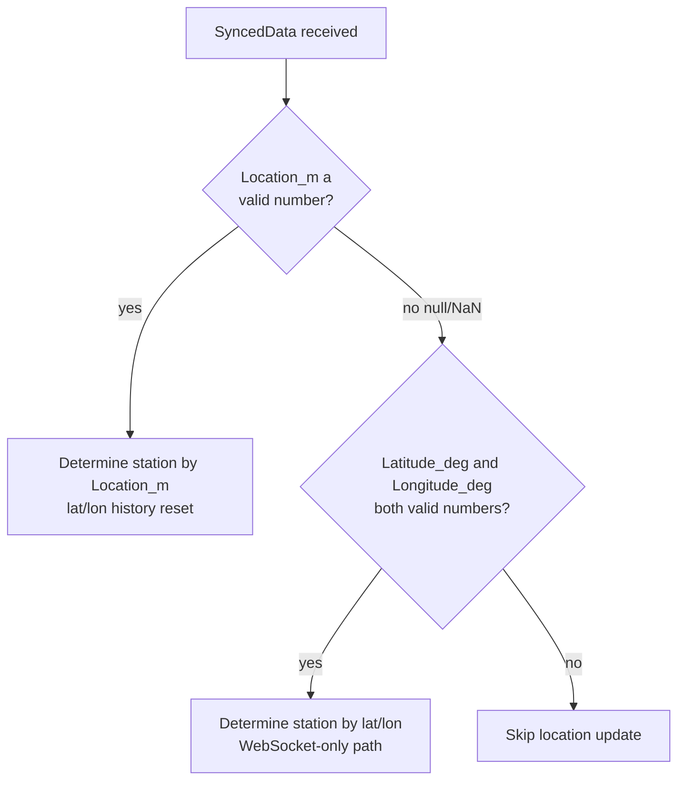

# Common Data Model (English)

> [← Back to index](README.md) / 日本語: [../ja/common-data-model.md](../ja/common-data-model.md)

The core data structures shared by both HTTP and WebSocket.
**Read this before any other document.**

---

## 1. SyncedData

The core operation-sync object: location, time, and start-permission.
Over HTTP it is the body of the polling response; over WebSocket it is
the body of a `SyncedData` message.

### 1.1 Field definitions

| Field | JSON type | Required | Transport | Description |
|---|---|:---:|---|---|
| `Location_m` | number \| null | optional | HTTP / WS | Train position (distance from start) [m]. `null` = "distance undetermined". |
| `Time_ms` | integer | optional | HTTP / WS | **Milliseconds elapsed since 00:00:00 of that day.** Not a UNIX epoch. |
| `CanStart` | boolean | optional | HTTP / WS | Whether departure (start of operation) is permitted. |
| `Latitude_deg` | number \| null | optional | **WS only** | Latitude [deg]. |
| `Longitude_deg` | number \| null | optional | **WS only** | Longitude [deg]. |
| `Accuracy_m` | number \| null | optional | **WS only** | Positioning accuracy of the lat/lon [m]. |

> The HTTP client **does not parse** `Latitude_deg` / `Longitude_deg` /
> `Accuracy_m`. If you need station detection using lat/lon, use WebSocket.

### 1.2 Defaults on missing / type-mismatched fields

Every field is optional. The client parsing behavior is as follows; it
**never throws** — if a field is missing or of the wrong type it falls
back to a safe default.

| Field | Key missing | Explicit `null` | Wrong number/type |
|---|---|---|---|
| `Location_m` | `null` (NaN, undetermined) | `null` (NaN) | `null` (NaN) |
| `Time_ms` | `0` | `0` | `0` |
| `CanStart` | **`true`** | **`true`** | **`true`** |
| `Latitude_deg` | `null` | `null` | `null` (invalid unless number type) |
| `Longitude_deg` | `null` | `null` | `null` (invalid unless number type) |
| `Accuracy_m` | `null` | `null` | `null` (invalid unless number type) |

> **Important — `CanStart` defaults to `true`**
> "Cannot start" is treated as a special state, so omitting `CanStart`
> means **can start (`true`)**. To suppress departure you must
> explicitly send `false`.

> **Important — `Latitude_deg` etc. must be JSON number type**
> A value like the string `"35.0"` is invalid (treated as `null`).
> Always send a numeric literal `35.0`.

### 1.3 Representing "distance undetermined" in JSON

The "distance not yet determined" state is represented by **JSON `null`**.

- `NaN` is invalid JSON and must not be used.
- When the server sends `Location_m: null`, TRViS converts it internally
  to `NaN` and treats it as "distance undetermined".
- The reference server likewise outputs `null` in JSON when its internal
  state is undetermined (NaN).

---

## 2. Station detection: `Location_m` and lat/lon fallback

TRViS determines "which station am I at / running toward the next
station" from the received location and updates the display. The
branching is:

### 2.1 `Location_m`-based detection

When `Location_m` is a valid number, the current station or "running to
next station" is determined using each station's configured position and
detection radius (derived from the timetable data). On this path the
lat/lon moving-average history is reset.

### 2.2 Lat/lon fallback (WebSocket only)

When `Location_m` is `null` (internally `NaN`) and both `Latitude_deg`
and `Longitude_deg` are valid numbers, TRViS falls back to a lat/lon
station-detection algorithm (a heuristic using a moving average of the
last few distances).

- The HTTP client does not parse lat/lon, so it **never reaches** this path.
- The fallback assumes continuous positioning and keeps an internal
  distance history. A single isolated lat/lon fix may not trigger a
  station transition (by design it defers until the moving average fills).
- `Accuracy_m` is propagated to the receiving-side event as ancillary
  info but is not used as a threshold by the detection algorithm itself.

### 2.3 When neither is available

If `Location_m` is invalid and lat/lon are not both present, no
location-state update is performed (the previous station state is kept).
`Time_ms` and `CanStart` processing happens every time regardless of
this branch.

---

## 3. Meaning of `Time_ms`

`Time_ms` is the **milliseconds elapsed since midnight (00:00:00) of
that day**. It is **not** UNIX epoch seconds/milliseconds.

| Example (`Time_ms`) | Time represented |
|---|---|
| `0` | 00:00:00 |
| `43200000` | 12:00:00 |
| `86399000` | 23:59:59 |

- The client rounds to second precision (integer part of
  `Time_ms / 1000`) for time sync. Sub-second precision is effectively
  ignored.
- A time change is propagated downstream only when the value differs
  from the previous one (repeating the same value is idempotent).
- There is no date (year/month/day) concept. The protocol has no way to
  represent crossing midnight; it stays within the time-of-day domain.

---

## 4. Meaning of `CanStart`

`CanStart` is a boolean indicating whether the client may perform the
departure (start-of-operation) action.

- In TRViS this value is also tied to "service availability": operation
  cannot start while `CanStart` is `false`.
- A corresponding state change is propagated downstream when the value
  transitions `false` → `true` or `true` → `false`.
- As noted above, the default when the field is missing is **`true`**.
