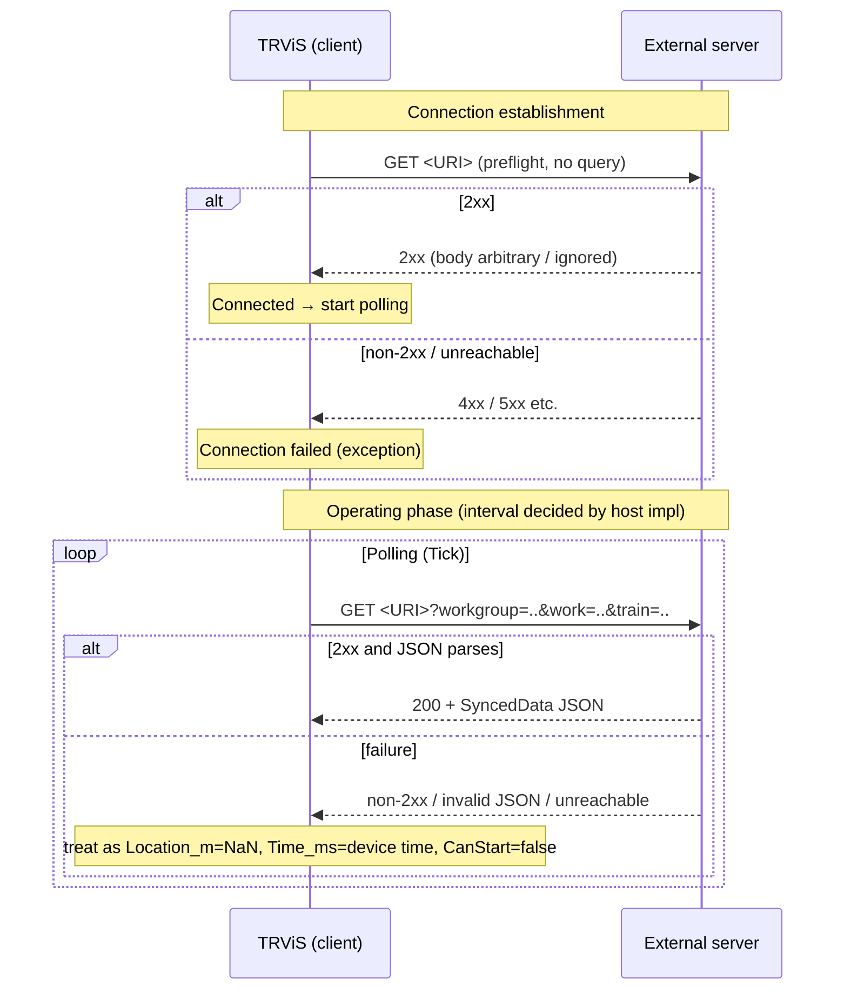

# HTTP Protocol Detail (English)

> [← Back to index](README.md) / Prerequisite: [common-data-model.md](common-data-model.md)
> 日本語: [../ja/http.md](../ja/http.md)

The HTTP transport is a **client-polling** model: TRViS issues `GET` to
the same URI at intervals, and the server returns the latest
[`SyncedData`](common-data-model.md#1-synceddata). Over HTTP only sync
data is available (timetable delivery / remote commands are
WebSocket-only).

---

## 1. Communication model



## 2. Preflight

When the connection is created (via `NetworkSyncServiceUtil`), a
**single** `GET <URI>` is issued.

- Method `GET`; this request carries no ID query.
- **Success if the server returns `2xx`.** The body is not inspected and
  is ignored.
- On non-`2xx` or unreachable, connection creation fails (exception) and
  no polling follows.
- The preflight only verifies that the endpoint is reachable. It may be
  extended in the future to fetch version info.

## 3. Endpoint path

The endpoint path is **entirely implementation-defined**.

- TRViS uses the configured URI **verbatim** and does not require a
  specific path such as `/sync`. The reference server reserves
  `/control` and `/health` and treats every other path as the sync
  endpoint.
- The query string originally present in the URI is preserved; the ID
  parameters below are overwritten/appended onto it. Hence an auth token
  may be embedded in the URI path or query.

## 4. Request (client → server)

- Method: `GET`
- Body: none
- Query parameters (all optional; added only when the corresponding item
  is selected in TRViS, and dropped when the selection is cleared):

| Key | Value | Description |
|---|---|---|
| `workgroup` | string | Selected WorkGroup ID |
| `work` | string | Selected Work ID |
| `train` | string | Selected Train ID |

- A query already present in the URI is preserved. If the original URI
  has a query with the same name as one of the keys above, it is
  overwritten.
- The values are the IDs selected in TRViS, used verbatim. The server
  may use them to return client-appropriate data (e.g. the state of a
  specific Work/Train). Interpretation is up to the server (ignoring
  them is protocol-conformant).

Example request:

```
GET /sync?workgroup=wg-1&work=w-1&train=t-1 HTTP/1.1
Host: example.com
```

## 5. Response (server → client)

- Status: `2xx` on success.
- `Content-Type`: arbitrary. TRViS parses the body as JSON regardless of
  the value (`application/json` recommended).
- Body: a [`SyncedData`](common-data-model.md#1-synceddata) object.

Minimal example:

```json
{
  "Location_m": 1234.5,
  "Time_ms": 43200000,
  "CanStart": true
}
```

- When `Location_m` is undetermined, return JSON `null` (a `NaN` literal
  is invalid).
- Over HTTP, even if you return `Latitude_deg` / `Longitude_deg` /
  `Accuracy_m`, the client ignores them (the reference server emits them
  for parity, but the HTTP client does not interpret them).
- For field defaults and type-mismatch behavior see the
  [common data model](common-data-model.md#12-defaults-on-missing--type-mismatched-fields)
  (especially: missing `CanStart` is treated as `true`).

Full shape returned by the reference server (HTTP sync endpoint):

```json
{
  "Location_m": 1234.5,
  "Time_ms": 43200000,
  "CanStart": true,
  "Latitude_deg": 35.681236,
  "Longitude_deg": 139.767125,
  "Accuracy_m": 5.0
}
```

## 6. Client behavior on failure

If a polling request matches any of the following, TRViS treats that
request as "no data" and uses the synthetic values below:

- HTTP status other than `2xx`
- Network exception (unreachable, timeout, etc.)
- Body that cannot be parsed as JSON

| Field | Value on failure |
|---|---|
| `Location_m` | `NaN` (distance undetermined) |
| `Time_ms` | The device's current time (ms since midnight) |
| `CanStart` | `false` |

Because `CanStart=false`, while communication is broken the client is in
a cannot-start state (operation cannot begin). This is a fail-safe
fallback.

## 7. About the polling interval

The polling period is **controlled by the TRViS host implementation**.
The server cannot specify the interval, and each response always
represents only "the latest state at that moment" (there is no
delta/history concept). The server may simply return the latest state
statelessly for each `GET`.

## 8. HTTP server implementation checklist

- [ ] Accept `GET` on any path and return `2xx` + `SyncedData` JSON
- [ ] Return `2xx` to the preflight (first `GET` without queries)
- [ ] Interpret the `workgroup` / `work` / `train` query (if needed)
- [ ] Return JSON `null` when `Location_m` is undetermined (not `NaN`)
- [ ] Return `Time_ms` as milliseconds since midnight of that day
- [ ] Explicitly return `CanStart: false` when suppressing departure
- [ ] Respond statelessly with the latest state to each `GET`
