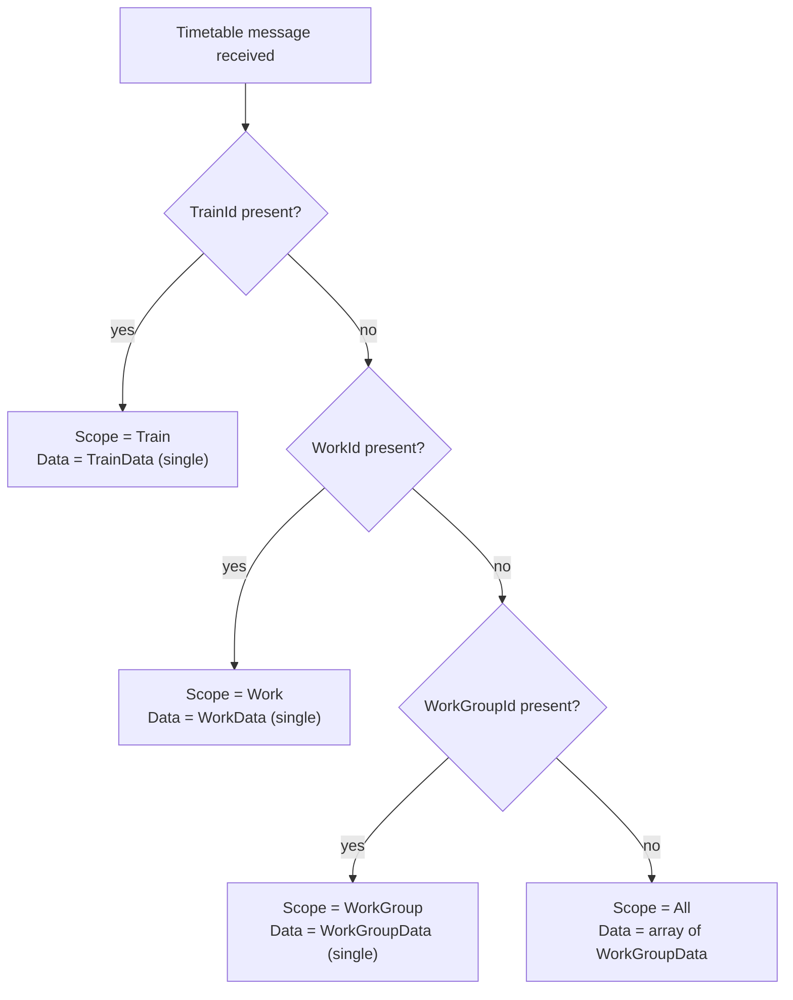
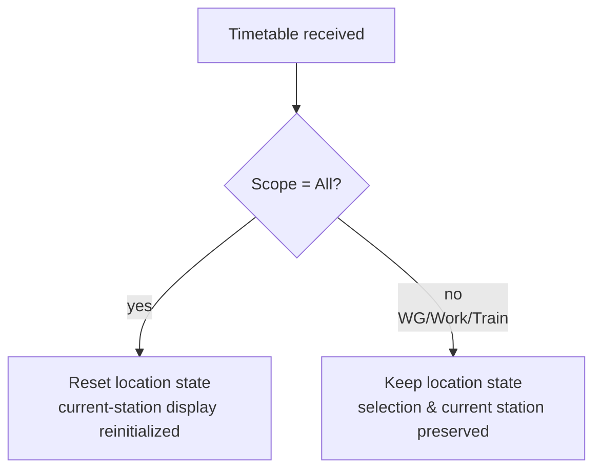

# Timetable Delivery Deep-Dive (English)

> [← Back to index](README.md) / Prerequisite: [server-to-client-messages.md](server-to-client-messages.md)
> 日本語: [../ja/timetable.md](../ja/timetable.md)

**WebSocket only.** Covers scope resolution, cache rebuild, and location
reset for timetable delivery via the `Timetable` message. For the basic
envelope spec see
[§2 of server-to-client-messages.md](server-to-client-messages.md#2-timetable).

The structure of the timetable body (the contents of `Data`) is out of
scope; see the
[TRViS JSON format](https://github.com/TetsuOtter/TRViS/wiki/JSON%E5%BD%A2%E5%BC%8F%E3%81%AE%E3%83%87%E3%83%BC%E3%82%BF%E3%83%99%E3%83%BC%E3%82%B9).

---

## 1. Scope resolution (most important)

There is **no field on the wire** that states the scope explicitly.
TRViS infers the scope from **which IDs are present** in the message
(the most specific ID wins).



| Scope | IDs to include | `Data` type (TRViS JSON format) |
|---|---|---|
| **All** | (none) | `WorkGroupData[]` (array) |
| **WorkGroup** | `WorkGroupId` | `WorkGroupData` (single object) |
| **Work** | `WorkGroupId` + `WorkId` | `WorkData` (single object) |
| **Train** | `WorkGroupId` + `WorkId` + `TrainId` | `TrainData` (single object) |

Resolution is "most specific ID wins":

- If `TrainId` is present, the scope is **Train** regardless of anything else.
- If no `TrainId` but `WorkId` is present, the scope is **Work**.
- If no `TrainId`/`WorkId` but `WorkGroupId` is present, **WorkGroup**.
- If none are present, **All**.

> Even for Work/Train scopes, including the parent IDs (`WorkGroupId` /
> `WorkId`) is recommended so the cache parent-child relationship is
> built correctly. Without parent IDs the descendant cache rebuild may
> not behave as expected.

## 2. Cache rebuild behavior (replacement, not delta)

Each scope delivery **completely rebuilds (replaces)** the cache of the
target and **its descendants** from the payload content. It is not a
delta update.

| Scope | Impact |
|---|---|
| **All** | Discard all caches and fully rebuild from the delivered `WorkGroupData[]`. |
| **WorkGroup** | Recreate the WorkGroup and its Works/Trains entirely from the payload. **Other WorkGroups are untouched.** |
| **Work** | Recreate the Work and its Trains entirely from the payload. **Other Works are untouched.** |
| **Train** | Recreate (or add) the Train. Also reflected in the train list under the same Work. |

Implications:

- If on a WorkGroup/Work scope the `Data` does **not include** the
  descendants (`Works` / `Trains`), **those descendants are rebuilt as
  empty**. To keep descendants, include them in the payload (partial
  delta sends are not possible).
- To update just one Train (e.g. real-time editing), use the Train scope
  so only that Train is replaced with no side effects.

### 2.1 Parent inheritance (Train scope caveat)

A standalone Train scope payload (`TrainData`) does not carry the parent
Work's name or effective date (`AffectDate`). The client inherits these
from the already-cached parent Work (referenced by `WorkId`).

- If the parent Work is not cached, the display may use a default
  fallback behavior. Before delivering a Train standalone, ensure the
  target Work is already cached (via the All / WorkGroup / Work scope).
- For this reason, including `WorkId` even on a Train scope is
  recommended.

## 3. Location reset

When a `Timetable` is received, whether TRViS resets the current
location (station index / running flag) depends on the scope.

| Scope | Location state | Reason |
|---|---|---|
| **All** | **Reset** | The whole structure changes, so the station index loses meaning. |
| WorkGroup | Keep | Supports real-time editing; prioritizes redraw of displayed data while keeping selection/location. |
| Work | Keep | Same as above. |
| Train | Keep | Same; the station index is kept even if the train being edited is updated. |

- **The All scope is a "heavy update."** Sending it frequently during
  operation resets the location each time, returning the current-station
  display to its initial state.
- Small updates during operation (track change, time fix of one train,
  etc.) should be sent with a narrowed Train / Work / WorkGroup scope so
  the user's current-location display is not broken.



## 4. Delivery pattern examples

### 4.1 Initial bulk delivery (All)

Deliver all data at once, e.g. right after connection:

```jsonc
{
  "MessageType": "Timetable",
  "Data": [
    { "Id": "wg-1", "Name": "...", "Works": [ /* ... */ ] }
    /* array of WorkGroupData */
  ]
}
```

→ Full cache rebuild + location reset.

### 4.2 Replace a single Work (Work)

Update a specific Work (including its Trains):

```jsonc
{
  "MessageType": "Timetable",
  "WorkGroupId": "wg-1",
  "WorkId": "w-1",
  "Data": { "Id": "w-1", "Name": "...", "Trains": [ /* ... */ ] }
}
```

→ Only `w-1` and its Trains rebuilt. Other Works, other WorkGroups, and
the location state are kept.

### 4.3 Real-time reflect one train (Train)

Fix just one train during operation (e.g. track change):

```jsonc
{
  "MessageType": "Timetable",
  "WorkGroupId": "wg-1",
  "WorkId": "w-1",
  "TrainId": "t-1",
  "Data": { "Id": "t-1", "TrainNumber": "T-001", "TimetableRows": [ /* ... */ ] }
}
```

→ Only `t-1` replaced. Current location/selection kept, suitable for
mid-operation reflection.

## 5. Server implementation checklist (timetable)

- [ ] Deliver understanding that the scope is decided by the included IDs
- [ ] Embed `Data` as **raw JSON** (an object/array, not a string)
- [ ] Match the `Data` type to the scope (All=array, otherwise=single)
- [ ] Include descendants when you want to keep them (no delta sends)
- [ ] For standalone Train delivery, order so the parent Work is cached,
      and include `WorkId` (and `WorkGroupId`)
- [ ] For small updates during operation, avoid All; use a narrowed scope
- [ ] Make the `Data` body conform to the TRViS JSON format
