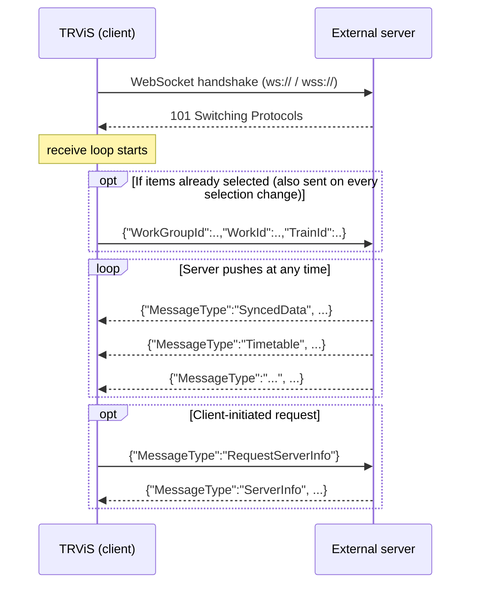
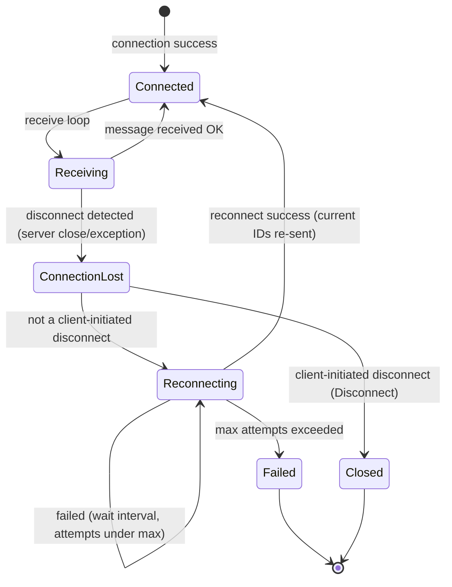

# WebSocket Protocol Detail (English)

> [← Back to index](README.md) / Prerequisite: [common-data-model.md](common-data-model.md)
> Related: [server-to-client-messages.md](server-to-client-messages.md) /
> [client-to-server-messages.md](client-to-server-messages.md) /
> [timetable.md](timetable.md)
> 日本語: [../ja/websocket.md](../ja/websocket.md)

The WebSocket transport is a **server-push (event-driven)** model. After
the connection is established the server may push messages at any time,
providing the full feature set including timetable delivery and remote
commands.

---

## 1. Connection

- Scheme is `ws://` or `wss://`. Passing any other scheme as WebSocket
  is rejected at connection-creation time.
- No subprotocol (`Sec-WebSocket-Protocol`) negotiation is needed.
- Once connected, the client starts a receive loop and waits for server
  pushes.
- A reconnect request against an already-open connection is ignored
  (no double connection).

## 2. Framing and encoding

- All messages are **WebSocket text frames**.
- The payload is a **UTF-8 encoded JSON object** (root is an object `{}`).
- One logical message = one JSON object. The server may fragment a
  WebSocket message; the client concatenates until `EndOfMessage` and
  parses it as a single item. The receiver's internal buffer unit
  (4096 bytes in the implementation) is not a protocol constraint; there
  is no upper bound on message length.
- Binary frames are not used.
- When the server sends a Close frame, the client responds with a normal
  closure and closes the connection (subsequent behavior: see
  [§5 Reconnection](#5-reconnection)).

## 3. Message discrimination

### 3.1 Server → client

Server messages **must** carry a **`MessageType` field (string)**.

- A message without `MessageType`, or with an unknown `MessageType`, is
  **ignored** (not an error).
- A message that cannot be parsed as JSON is also ignored.
- **Keys are case-sensitive.** Send the message envelope (top-level keys
  such as `MessageType`, `Location_m`, etc.) with the exact spelling and
  case documented here.
  (Exception: the JSON inside the `Data` field of `Timetable` — the
  timetable body — is deserialized with property-name case-insensitivity
  in the TRViS JSON format. The rule differs from the envelope.)

The full message spec is in
[server-to-client-messages.md](server-to-client-messages.md).

### 3.2 Client → server

Client messages fall into two families.

| Kind | Discriminator | Content |
|---|---|---|
| Request message | **has** `MessageType` | `RequestServerInfo` / `RequestDiagramInfo` |
| ID-update message | **no** `MessageType` | contains `WorkGroupId`/`WorkId`/`TrainId` (backward-compat) |

The server should interpret "JSON without a `MessageType` that contains
any of `WorkGroupId`/`WorkId`/`TrainId`" as an ID update. Detail in
[client-to-server-messages.md](client-to-server-messages.md).

## 4. Keep-alive

TRViS uses the standard WebSocket Ping/Pong (KeepAlive) mechanism.

| Item | Value |
|---|---|
| Ping interval | 10 seconds |
| Pong response timeout | 15 seconds |

- The server must be able to respond to WebSocket control frames
  (Ping/Pong) per the standard (most WebSocket libraries auto-respond).
- No application-layer heartbeat message is defined. Liveness monitoring
  is delegated to WebSocket Ping/Pong.

## 5. Reconnection

When the connection drops (not client-initiated), TRViS attempts
automatic reconnection.

| Item | Default | Note |
|---|---|---|
| Reconnect interval | 5000 ms | Waited before each attempt |
| Max reconnect attempts | 3 | Reconnection is abandoned past this |

These are constructor-argument defaults and may be changed by the TRViS
host implementation (interval positive, max attempts ≥ 0).

### Server-side notes on reconnection

- **Tolerate immediate reconnection right after a disconnect.** After
  detecting connection loss the client retries after the configured
  interval.
- On each detected "connection loss" a connection-closed-equivalent
  event is propagated downstream; a successful reconnect resumes the
  receive loop.
- **On a successful reconnect the client automatically re-sends the
  currently selected IDs (WorkGroup/Work/Train)** (same shape as the ID
  update message in
  [client-to-server-messages.md](client-to-server-messages.md)). The
  server should resume delivery to the new connection based on the
  received IDs. It is safest to assume no prior subscription state
  remains on the server after reconnect.
- If reconnection fails consecutively past the max attempts, TRViS gives
  up and treats it as a connection failure (automatic retries stop).
- A successful message receipt resets the internal consecutive-failure
  count. Even with intermittent disconnects, as long as a normal receipt
  occurs in between, the full attempt budget is available each time.

## 6. Disconnection (client-initiated)

When TRViS explicitly disconnects (app shutdown, settings change), it
closes with a Normal Closure and **does not reconnect**. On receiving a
client normal closure the server may discard the subscription state for
that connection.

## 7. WebSocket server implementation checklist

- [ ] Accept connections over `ws://` / `wss://`
- [ ] Attach `MessageType` (exact case) to every server→client message
- [ ] Send text frames, UTF-8, root-object JSON
- [ ] Treat received JSON without `MessageType` as an ID update
- [ ] Respond to `RequestServerInfo` / `RequestDiagramInfo` requests
- [ ] Respond to WebSocket Ping/Pong (control frames) per the standard
- [ ] Tolerate immediate reconnection right after a disconnect
- [ ] Handle the ID update re-sent by a reconnecting client and resume delivery
- [ ] Discard subscription state on a client-initiated normal closure
