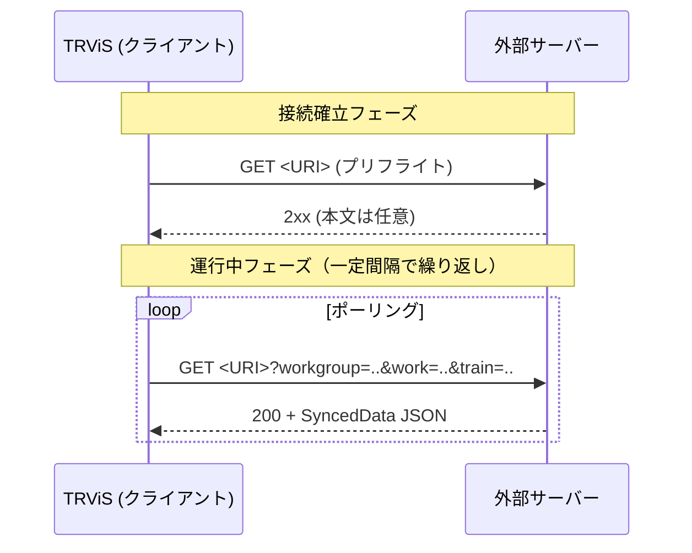
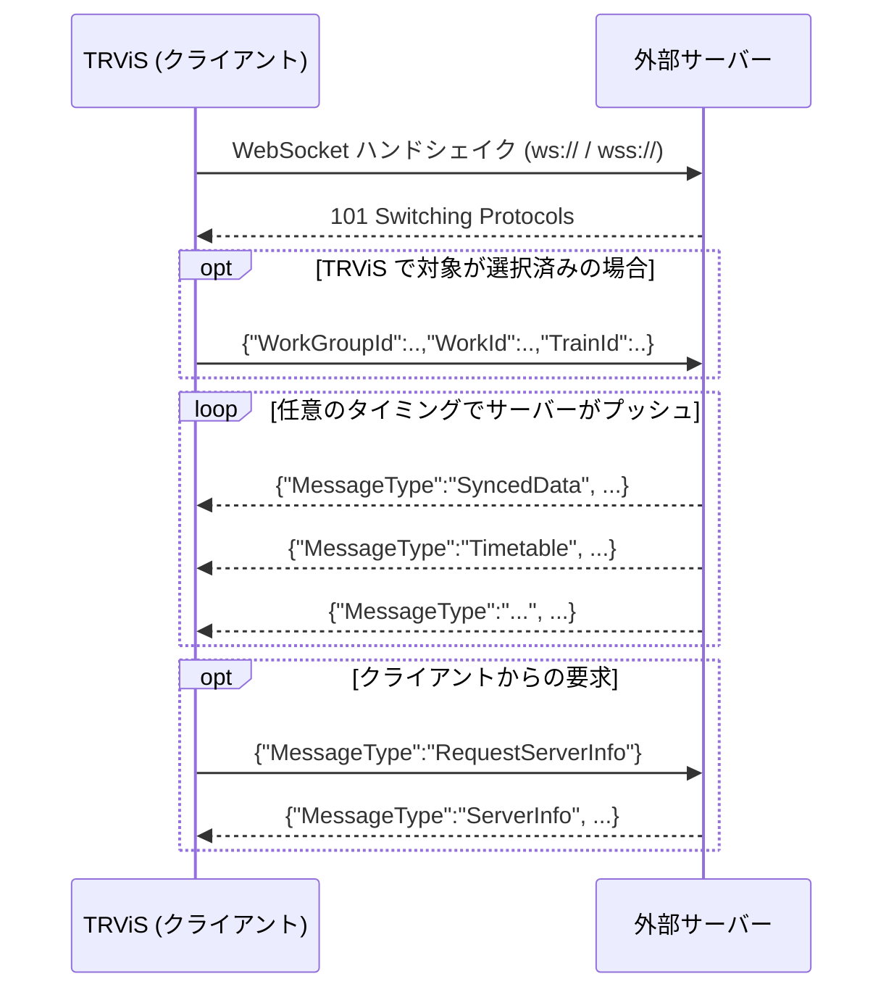
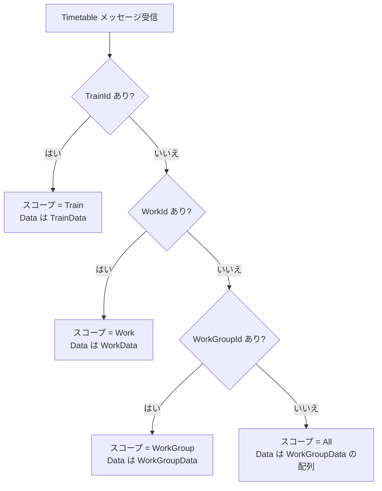
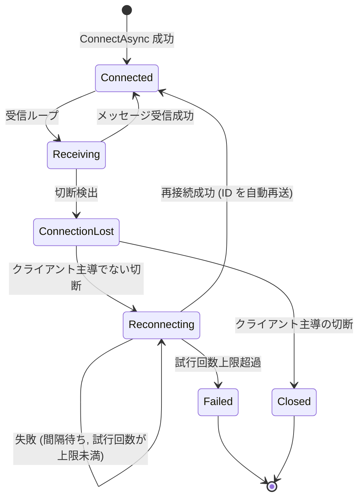
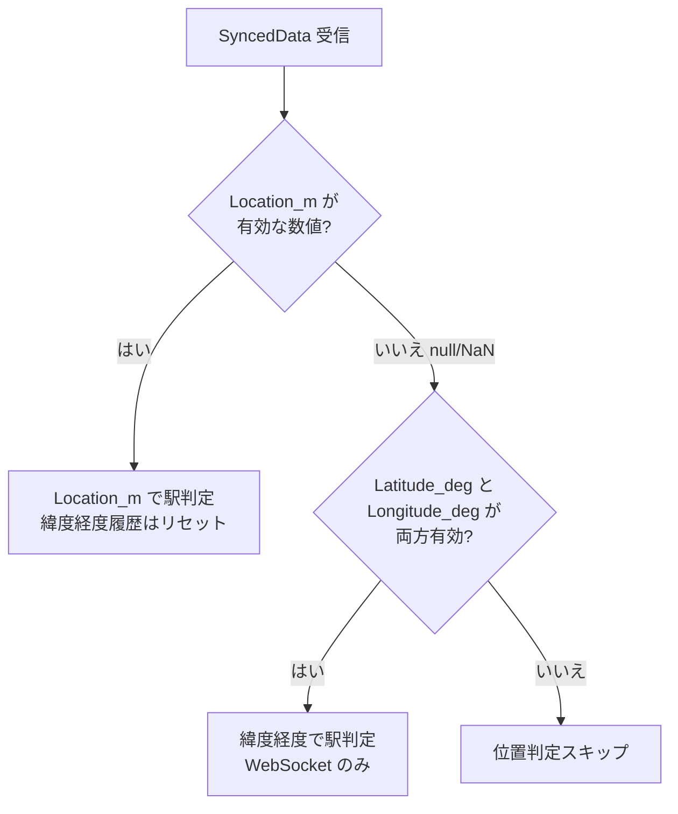

# NetworkSyncService 外部システム連携仕様（日本語）

> 対応プロトコルバージョン: **1.0**
> 対象: TRViS と連携する外部サーバーを実装する開発者

English version: [en.md](en.md)

---

## 1. 概要

`NetworkSyncService` は、TRViS（クライアント）が外部システム（サーバー）から
**運行同期データ・時刻表・各種リモートコマンド**を受け取るための仕組みです。
2 種類のトランスポートをサポートします。

| トランスポート | スキーム | 通信モデル | 主な用途 |
|---|---|---|---|
| **HTTP** | `http://` / `https://` | クライアントからのポーリング | 位置・時刻・発車可否のみの最小連携 |
| **WebSocket** | `ws://` / `wss://` | サーバープッシュ（イベント駆動） | 時刻表配信・リモート操作を含むフル連携 |

接続先 URI のスキームによって TRViS が自動的にトランスポートを選択します
（`ws`/`wss` なら WebSocket、それ以外は HTTP）。

### 1.1 機能対応表

HTTP は WebSocket の **厳密なサブセット** です。HTTP では同期データ
（位置・時刻・発車可否）しか扱えません。時刻表配信やリモートコマンドが
必要な場合は WebSocket を実装してください。

| 機能 | HTTP | WebSocket |
|---|:---:|:---:|
| 位置同期（`Location_m`） | ✅ | ✅ |
| 時刻同期（`Time_ms`） | ✅ | ✅ |
| 発車可否（`CanStart`） | ✅ | ✅ |
| 緯度経度フォールバック（`Latitude_deg`/`Longitude_deg`/`Accuracy_m`） | ❌ ※1 | ✅ |
| 時刻表配信（Timetable） | ❌ | ✅ |
| サーバー情報（ServerInfo） | ❌ | ✅ |
| ダイヤ情報（DiagramInfo） | ❌ | ✅ |
| 列車選択コマンド（SelectTrain） | ❌ | ✅ |
| 運行操作コマンド（OperationCommand） | ❌ | ✅ |
| ヘッダ色変更（HeaderColor） | ❌ | ✅ |
| 通告（Notification） | ❌ | ✅ |
| 時刻表示書式（TimeFormat） | ❌ | ✅ |
| クライアント→サーバーの ID 通知 | ✅ ※2 | ✅ |

- ※1: HTTP クライアントは応答 JSON に緯度経度が含まれていても **無視** します
  （`Location_m` / `Time_ms` / `CanStart` の 3 フィールドのみ解釈）。
- ※2: HTTP はクエリパラメータ、WebSocket は JSON メッセージで通知します（後述）。

### 1.2 セキュリティ（重要）

**このプロトコル自体には認証・認可の仕組みがありません。** ワイヤ上のメッセージは
匿名で、誰でも接続できます。実運用では以下を実装側で別途用意してください。

- TLS（`https://` / `wss://`）による通信路の暗号化
- リバースプロキシや WAF によるアクセス制御
- URI のクエリやパス、あるいは TLS クライアント証明書等を用いた認可
  （TRViS は接続先 URI をそのまま使用するため、URI にトークンを埋め込む運用が可能）

---

## 2. HTTP プロトコル

### 2.1 通信モデル



- **プリフライト**: 接続開始時に 1 度だけ `GET <URI>` を発行します。
  `2xx` 以外（接続不能含む）の場合、接続は失敗扱いになります。
  本文の内容は問われません。
- **ポーリング**: 接続確立後、TRViS が任意の間隔で同じ URI に
  `GET` を発行します。サーバーは都度、最新状態を JSON で返します。
  ポーリング間隔は TRViS 側のホスト実装が制御します（サーバーは関与しません）。

### 2.2 エンドポイントのパス

エンドポイントのパスは **実装依存** です。TRViS は設定された URI を
そのまま使用し、特定のパス（`/sync` 等）を要求しません。
クエリ文字列もそのまま引き継がれ、後述の ID パラメータが追記されます。

### 2.3 リクエスト（クライアント → サーバー）

- メソッド: `GET`
- クエリパラメータ（いずれも任意。TRViS 側で対象が選択されている場合のみ付与）:

| キー | 内容 |
|---|---|
| `workgroup` | 選択中の WorkGroup ID |
| `work` | 選択中の Work ID |
| `train` | 選択中の Train ID |

URI に元々付いていたクエリは保持され、上記キーが上書き／追記されます。

### 2.4 レスポンス（サーバー → クライアント）

- ステータス: `2xx`（それ以外は「データなし・発車不可」として扱われます）
- `Content-Type`: 任意（TRViS は本文を JSON としてパースします）
- 本文: SyncedData オブジェクト（[4. 共通データモデル](#4-共通データモデル)参照）

```jsonc
{
  "Location_m": 1234.5,   // null 可。null は「距離未確定」を意味する
  "Time_ms": 43200000,    // 0時0分0秒からの経過ミリ秒（= 12:00:00）
  "CanStart": true
}
```

> HTTP クライアントは `Latitude_deg` / `Longitude_deg` / `Accuracy_m` を
> 送っても無視します。緯度経度ベースの駅判定が必要な場合は WebSocket を
> 使用してください。

HTTP リクエストが失敗した場合（`2xx` 以外・接続不能・JSON パース失敗）、
TRViS は `Location_m = null（NaN）`、`Time_ms = 端末の現在時刻`、
`CanStart = false` として扱います。

---

## 3. WebSocket プロトコル

### 3.1 接続

- スキームは `ws://` または `wss://`。
- 接続確立後、サーバーはいつでもメッセージをプッシュできます。
- メッセージはすべて **UTF-8 のテキストフレーム**、本文は **JSON オブジェクト**。
- サブプロトコルの指定は不要です。



### 3.2 メッセージの判別

- **サーバー → クライアント** のメッセージは、必ず `MessageType` フィールドを
  持ちます。未知の `MessageType` や `MessageType` 欠落のメッセージは
  TRViS 側で無視されます。
- **クライアント → サーバー** のメッセージは 2 種類:
  1. `MessageType` を **持つ** 要求メッセージ（`RequestServerInfo` /
     `RequestDiagramInfo`）。
  2. `MessageType` を **持たない** ID 更新メッセージ（後方互換のための仕様）。
     `WorkGroupId` / `WorkId` / `TrainId` を含む JSON は ID 更新として
     扱ってください。

### 3.3 サーバー → クライアント メッセージ

#### 3.3.1 `SyncedData` — 運行同期データ

最も基本的なメッセージ。位置・時刻・発車可否をプッシュします。
WebSocket では受信のたびに即座に処理されます（イベント駆動）。

```jsonc
{
  "MessageType": "SyncedData",
  "Location_m": 1234.5,      // null 可。null のとき緯度経度フォールバックへ
  "Time_ms": 43200000,
  "CanStart": true,
  "Latitude_deg": 35.681236, // 任意
  "Longitude_deg": 139.767125,// 任意
  "Accuracy_m": 5.0          // 任意
}
```

#### 3.3.2 `Timetable` — 時刻表配信

時刻表データを配信します。`Data` フィールドに
[TRViS JSON 形式](https://github.com/TetsuOtter/TRViS/wiki/JSON%E5%BD%A2%E5%BC%8F%E3%81%AE%E3%83%87%E3%83%BC%E3%82%BF%E3%83%99%E3%83%BC%E3%82%B9)
の時刻表本体を **生 JSON（文字列ではなくオブジェクト／配列）** として埋め込みます。

```jsonc
{
  "MessageType": "Timetable",
  "WorkGroupId": "wg-1",   // 任意
  "WorkId": "w-1",         // 任意
  "TrainId": "t-1",        // 任意
  "Data": { /* または [...] : TRViS JSON 形式の時刻表 */ }
}
```

##### スコープの決定（重要）

ワイヤ上に「スコープ」を表すフィールドはありません。**どの ID が
含まれているか** によって TRViS がスコープを推論します
（最も詳細な ID が優先）。



| スコープ | 付与する ID | `Data` の型（TRViS JSON 形式） |
|---|---|---|
| All | （なし） | `WorkGroupData[]`（配列） |
| WorkGroup | `WorkGroupId` | `WorkGroupData`（単一） |
| Work | `WorkGroupId` + `WorkId` | `WorkData`（単一） |
| Train | `WorkGroupId` + `WorkId` + `TrainId` | `TrainData`（単一） |

- **All スコープ** は影響範囲が大きいため、受信時に TRViS の位置情報状態が
  リセットされます。WorkGroup / Work / Train スコープでは
  位置情報は維持されます（リアルタイム編集対応）。
- 各スコープは、その配下のキャッシュをペイロード内容で **完全に再構築**
  します（差分ではなく置換）。
- `Data` の中身（時刻表本体の構造）は本書の範囲外です。
  上記 TRViS JSON 形式の Wiki を参照してください。

#### 3.3.3 `ServerInfo` — サーバー情報

```jsonc
{
  "MessageType": "ServerInfo",
  "Name": "My Sync Server",   // サーバー名
  "Admin": "admin@example.com",// 管理者・連絡先
  "Version": "1.2.3",          // サーバー実装バージョン
  "ProtocolVersion": "1.0"     // 対応プロトコルバージョン
}
```

`ProtocolVersion` はプロトコル互換性を示す唯一のハンドシェイク的シグナルです。
現行プロトコルは **`"1.0"`** です。

#### 3.3.4 `DiagramInfo` — ダイヤ情報

WorkGroup の上位概念である「ダイヤ」の情報。

```jsonc
{
  "MessageType": "DiagramInfo",
  "DiagramId": "d-1",
  "Name": "平日ダイヤ",
  "Description": "2024年3月改正",        // 任意
  "WorkGroupIds": ["wg-1", "wg-2"]      // 任意。配列
}
```

#### 3.3.5 `SelectTrain` — 列車選択コマンド

TRViS に特定の列車を選択させます。`null` の階層は変更しません。

```jsonc
{
  "MessageType": "SelectTrain",
  "WorkGroupId": "wg-1",  // 任意
  "WorkId": "w-1",        // 任意
  "TrainId": "t-1"        // 任意
}
```

#### 3.3.6 `OperationCommand` — 運行操作コマンド

```jsonc
{
  "MessageType": "OperationCommand",
  "Action": "StartOperation"
}
```

`Action` の値（大文字小文字は区別しません）:

| 値 | 意味 |
|---|---|
| `StartOperation` | 運行開始（位置情報サービスを有効化し運行モードへ） |
| `EndOperation` | 運行終了 |
| `EnableLocationService` | 位置情報サービスを有効化 |
| `DisableLocationService` | 位置情報サービスを無効化 |

未知の `Action` は無視されます。

#### 3.3.7 `HeaderColor` — ヘッダ色変更

タイトルバーの色を変更します。

```jsonc
{
  "MessageType": "HeaderColor",
  "ResetToDefault": false,  // true なら端末既定色に戻す
  "Color_RGB": 16711680     // 0xRRGGBB 形式の整数（この例は赤 0xFF0000）
}
```

`ResetToDefault` が `true` のときは `Color_RGB` は無視されます。

#### 3.3.8 `Notification` — 通告

```jsonc
{
  "MessageType": "Notification",
  "Id": "n-001",                       // 任意
  "Title": "運転見合わせ",              // 任意
  "Body": "強風のため…",               // 任意
  "Priority": 1,                       // 任意。0=通常, 1=重要 等（サーバー任意）
  "IssuedAt": "2024-03-01T09:00:00+09:00" // 任意。ISO 8601
}
```

#### 3.3.9 `TimeFormat` — 時刻表示書式

タイトルバーの時刻表示書式を指定します。

```jsonc
{
  "MessageType": "TimeFormat",
  "Format": "HH:mm:ss"   // null / 省略時は端末既定にリセット
}
```

例: `"HH:mm:ss"` / `"HH:mm"`。

### 3.4 クライアント → サーバー メッセージ

#### 3.4.1 ID 更新メッセージ（`MessageType` なし）

TRViS で WorkGroup / Work / Train の選択が変わるたびに送信されます。
**後方互換のため `MessageType` を持ちません。** サーバーは
「`MessageType` を持たず `WorkGroupId`/`WorkId`/`TrainId` を含む JSON」を
ID 更新として解釈してください。選択されていない階層のキーは省略されます。

```jsonc
{
  "WorkGroupId": "wg-1",
  "WorkId": "w-1",
  "TrainId": "t-1"
}
```

サーバーはこの情報を使って、当該クライアントに適切なスコープの
時刻表や同期データを配信できます。再接続後にも自動的に再送されます。

#### 3.4.2 `RequestServerInfo` — サーバー情報要求

```json
{ "MessageType": "RequestServerInfo" }
```

サーバーは `ServerInfo` メッセージで応答してください。

#### 3.4.3 `RequestDiagramInfo` — ダイヤ情報要求

```jsonc
{
  "MessageType": "RequestDiagramInfo",
  "DiagramId": "d-1"   // 任意。省略時はカレントダイヤを要求
}
```

サーバーは該当する `DiagramInfo` メッセージで応答してください。

### 3.5 キープアライブと再接続

#### キープアライブ

TRViS は WebSocket の標準的な Ping/Pong（KeepAlive）を使用します。

| 項目 | 値 |
|---|---|
| Ping 送信間隔 | 10 秒 |
| Pong 応答タイムアウト | 15 秒 |

サーバーは WebSocket の制御フレーム（Ping/Pong）に標準どおり応答できる
実装である必要があります。

#### 再接続

接続が切断されると、TRViS は自動再接続を試みます。

| 項目 | 既定値 |
|---|---|
| 再接続間隔 | 5000 ms |
| 最大再接続試行回数 | 3 |

（既定値であり、TRViS のホスト実装で変更され得ます）



サーバー実装上の注意:

- 切断直後にクライアントが即座に再接続を試みることがあります。
  短時間での再接続を許容できる実装にしてください。
- 再接続成功時、クライアントは現在選択中の ID（[3.4.1](#341-id-更新メッセージmessagetype-なし)）を
  **自動的に再送** します。サーバーは再接続クライアントに対し、
  受け取った ID に基づくスコープで配信を再開できます。
- 最大試行回数を超えると TRViS は再接続を諦め、接続失敗として扱います。

---

## 4. 共通データモデル

### 4.1 SyncedData フィールド

| フィールド | 型 | 必須 | 説明 |
|---|---|:---:|---|
| `Location_m` | number \| null | 任意 | 始点からの距離 [m]。`null` は「距離未確定」。HTTP/WS 共通。 |
| `Time_ms` | integer | 任意 | **その日の 0時0分0秒からの経過ミリ秒**。`43200000` = 12:00:00。 |
| `CanStart` | boolean | 任意 | 発車可否。詳細は下記。 |
| `Latitude_deg` | number \| null | 任意 | 緯度 [度]。WebSocket のみ有効。 |
| `Longitude_deg` | number \| null | 任意 | 経度 [度]。WebSocket のみ有効。 |
| `Accuracy_m` | number \| null | 任意 | 緯度経度の精度 [m]。WebSocket のみ有効。 |

#### 欠落時のデフォルト値

各フィールドは省略可能で、欠落時は以下のように扱われます。

| フィールド | 欠落時のデフォルト |
|---|---|
| `Location_m` | `null`（= 距離未確定） |
| `Time_ms` | `0` |
| `CanStart` | **`true`**（発車不可は特殊な状態のため、既定は発車可） |

> `CanStart` のデフォルトが `true` である点に注意してください。
> 発車を禁止したい場合は明示的に `false` を送る必要があります。

### 4.2 `Location_m` と緯度経度フォールバック

TRViS は受信した位置情報から「現在駅 / 次駅へ走行中か」を判定します。



- `Location_m` が有効な数値ならそれを用いて駅を判定します。
- `Location_m` が `null`（クライアント内部では `NaN`）で、
  かつ緯度経度が両方そろっている場合は、緯度経度ベースの
  駅判定アルゴリズム（移動平均ベースのヒューリスティック）に
  フォールバックします（**WebSocket のみ**）。
- どちらも無い場合、位置に関する更新は行われません。

> **JSON での表現**: 「距離未確定」を表すときは JSON の `null` を
> 送ってください。`NaN` は不正な JSON であり使用できません。
> サーバーが `null` を送ると、TRViS 内部で `NaN` に変換されます。

### 4.3 `CanStart` の意味

`CanStart` はクライアントが発車操作を行ってよいかを表します。
TRViS 側ではこの値が「サービス利用可否」とも連動します
（`CanStart` が `false` の間は運行開始できません）。

### 4.4 `Time_ms` の意味

`Time_ms` は **UNIX エポックではなく、その日の午前 0 時からの経過
ミリ秒** です。例: `43_200_000` は 12:00:00 を表します。
TRViS は秒精度（`Time_ms / 1000`）に丸めて時刻同期に使用します。

---

## 5. 実装チェックリスト

### HTTP サーバーを実装する場合

- [ ] 任意のパスで `GET` を受け付け、`2xx` + SyncedData JSON を返す
- [ ] プリフライト（クエリなしの初回 `GET`）に `2xx` を返す
- [ ] `workgroup` / `work` / `train` クエリパラメータを解釈する（必要なら）
- [ ] `Location_m` 未確定時は JSON の `null` を返す（`NaN` を使わない）
- [ ] `Time_ms` を「その日の 0 時からの経過ミリ秒」で返す
- [ ] 発車を禁止したいときは明示的に `CanStart: false` を返す

### WebSocket サーバーを実装する場合

- [ ] `ws://` / `wss://` で接続を受け付ける
- [ ] サーバー → クライアントの全メッセージに `MessageType` を付与する
- [ ] `MessageType` を持たない受信メッセージを ID 更新として処理する
- [ ] `RequestServerInfo` / `RequestDiagramInfo` 要求に応答する
- [ ] 時刻表は付与する ID でスコープが決まることを理解して配信する
- [ ] WebSocket Ping/Pong（制御フレーム）に標準どおり応答する
- [ ] 切断直後の即時再接続を許容する
- [ ] 再接続クライアントが再送する ID 更新を処理して配信を再開する

---

## 付録: メッセージ一覧（早見表）

### サーバー → クライアント（WebSocket）

| `MessageType` | 用途 |
|---|---|
| `SyncedData` | 位置・時刻・発車可否の同期 |
| `Timetable` | 時刻表配信（スコープは ID で決定） |
| `ServerInfo` | サーバー情報 |
| `DiagramInfo` | ダイヤ情報 |
| `SelectTrain` | 列車選択指示 |
| `OperationCommand` | 運行操作指示 |
| `HeaderColor` | ヘッダ色変更 |
| `Notification` | 通告 |
| `TimeFormat` | 時刻表示書式指定 |

### クライアント → サーバー（WebSocket）

| メッセージ | 判別方法 | 用途 |
|---|---|---|
| ID 更新 | `MessageType` なし | 選択中の WorkGroup/Work/Train を通知 |
| `RequestServerInfo` | `MessageType` あり | サーバー情報を要求 |
| `RequestDiagramInfo` | `MessageType` あり | ダイヤ情報を要求 |

### クライアント → サーバー（HTTP）

| 手段 | 用途 |
|---|---|
| `workgroup`/`work`/`train` クエリ | 選択中の WorkGroup/Work/Train を通知 |
