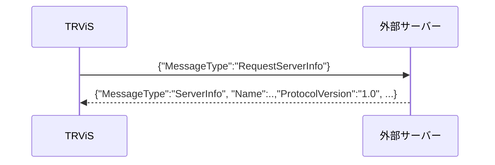
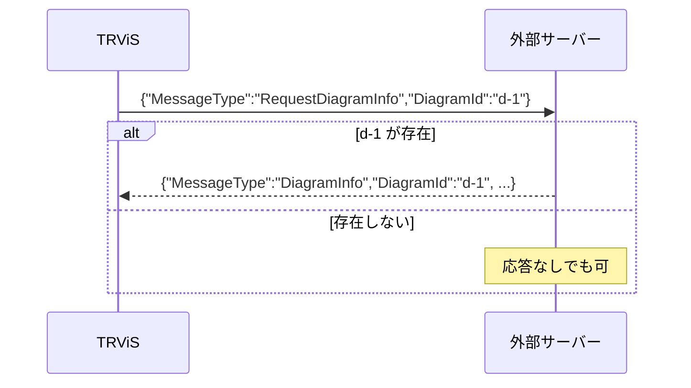

# クライアント → サーバー メッセージ仕様（日本語）

> [← 目次に戻る](README.md) ／ 前提: [websocket.md](websocket.md)
> English: [../en/client-to-server-messages.md](../en/client-to-server-messages.md)

**WebSocket のみ。** クライアント（TRViS）からサーバーへ送られる
メッセージの仕様です。HTTP では ID 通知のみがクエリパラメータで
行われます（[http.md](http.md) を参照）。

クライアント送信メッセージは 2 系統に大別されます。

| 種別 | 判別方法 | 節 |
|---|---|---|
| ID 更新メッセージ | `MessageType` を**持たない** | [§1](#1-id-更新メッセージ) |
| 要求メッセージ | `MessageType` を**持つ** | [§2](#2-requestserverinfo) / [§3](#3-requestdiagraminfo) |

---

## 1. ID 更新メッセージ

TRViS で WorkGroup / Work / Train の選択が変わるたびに送信されます。

```jsonc
{
  "WorkGroupId": "wg-1",   // 選択中のときのみ含まれる
  "WorkId": "w-1",         // 選択中のときのみ含まれる
  "TrainId": "t-1"         // 選択中のときのみ含まれる
}
```

### 1.1 判別（重要 — 後方互換仕様）

このメッセージは **`MessageType` フィールドを持ちません**。これは
後方互換のための仕様です。サーバーは次のルールで解釈してください。

> 受信 JSON に `MessageType` が**無く**、`WorkGroupId` /
> `WorkId` / `TrainId` の**いずれかを含む**場合、それを ID 更新
> として扱う。

`MessageType` を持つメッセージは要求メッセージ（§2, §3）として
処理し、ID 更新としては解釈しないでください。

### 1.2 含まれるフィールド

- 選択されていない階層のキーは **省略** されます（`null` を送るのでは
  なくキー自体が無い）。例えば WorkGroup と Work のみ選択中なら
  `{"WorkGroupId":"wg-1","WorkId":"w-1"}` のように `TrainId` は含まれません。
- 何も選択されていない場合は空オブジェクト `{}` 相当になり得ます。

| フィールド | 型 | 説明 |
|---|---|---|
| `WorkGroupId` | string | 選択中の WorkGroup ID |
| `WorkId` | string | 選択中の Work ID |
| `TrainId` | string | 選択中の Train ID |

### 1.3 送信タイミング

- WorkGroup / Work / Train の選択が変化したとき（各 ID の変更が
  独立に発火するため、3 つが順に設定される過程で複数回送られることが
  あります。サーバーは冪等に扱ってください）。
- **再接続成功直後**にも、その時点の選択中 ID が自動的に再送されます
  （[websocket.md の再接続](websocket.md#5-再接続) を参照）。
  再接続時はサーバー側に以前の購読状態が残っていない前提で、受け取った
  ID に基づきスコープ配信を再開する実装が安全です。

### 1.4 サーバーでの利用

サーバーはこの情報を使い、当該クライアントに適切なスコープの時刻表
（[timetable.md](timetable.md)）や同期データを配信できます。ID の
解釈・購読管理はサーバーの任意であり、ID 更新に対する応答メッセージは
規定されていません（必要に応じてサーバー判断で配信を開始してよい）。

---

## 2. RequestServerInfo

サーバー情報を要求します。

```json
{ "MessageType": "RequestServerInfo" }
```

- サーバーは
  [`ServerInfo`](server-to-client-messages.md#3-serverinfo)
  メッセージで応答してください（要求元クライアントへの返信で十分）。
- 追加フィールドはありません。



---

## 3. RequestDiagramInfo

ダイヤ情報を要求します。

```jsonc
{
  "MessageType": "RequestDiagramInfo",
  "DiagramId": "d-1"   // 任意。省略時は「カレントダイヤ」を要求
}
```

| フィールド | 型 | 説明 |
|---|---|---|
| `DiagramId` | string | 任意。取得したいダイヤの識別子。省略時はサーバーの「現在のダイヤ」。 |

- サーバーは該当する
  [`DiagramInfo`](server-to-client-messages.md#4-diagraminfo)
  メッセージで応答してください。
- 指定 `DiagramId` に対応するダイヤが存在しない場合、応答を返さない
  実装（リファレンスサーバーの挙動）でも構いません。クライアントは
  応答が来ないことを許容します。



---

## 付録: サーバー側ディスパッチの推奨実装

```text
受信 JSON を parse
├─ "MessageType" あり?
│   ├─ "RequestServerInfo"  → ServerInfo を返信
│   ├─ "RequestDiagramInfo" → (DiagramId 任意) DiagramInfo を返信
│   └─ それ以外             → 未知要求として無視 or 拡張で対応
└─ "MessageType" なし
    └─ WorkGroupId/WorkId/TrainId を読み取り購読状態を更新（ID 更新）
```
