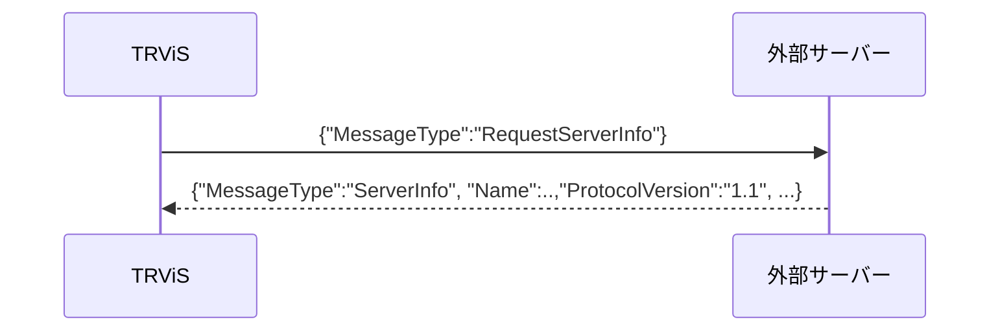
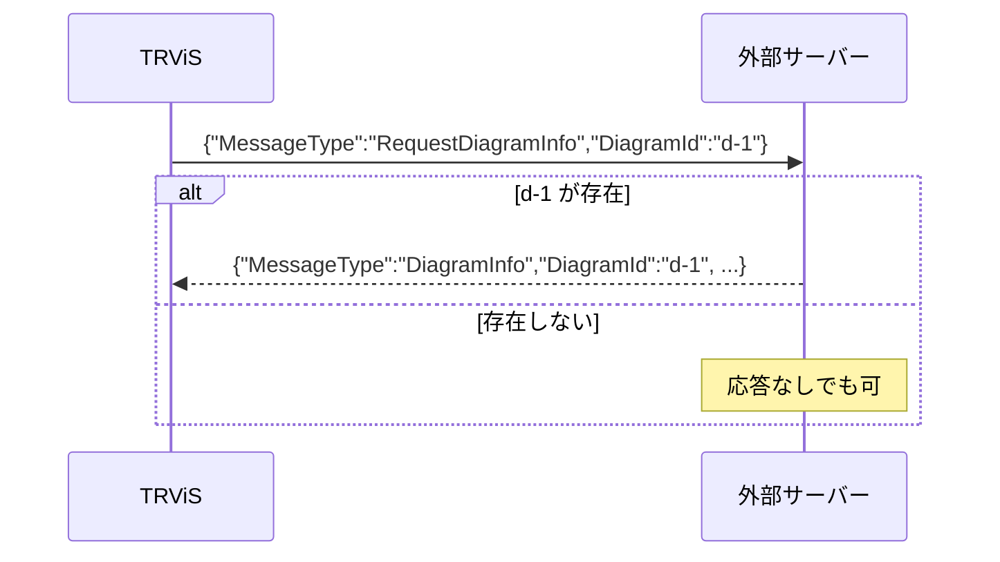
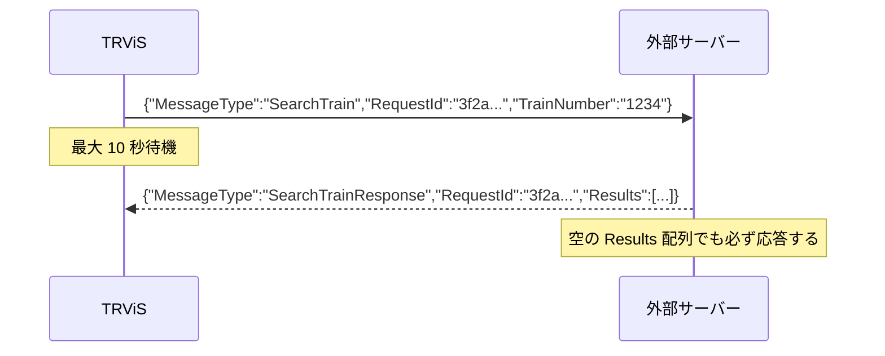
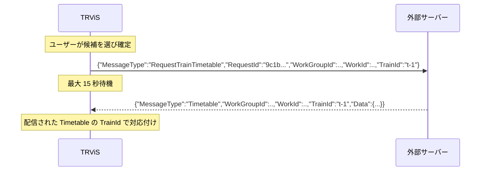

# クライアント → サーバー メッセージ仕様（日本語）

> [← 目次に戻る](README.md) ／ 前提: [websocket.md](websocket.md)
> English: [../en/client-to-server-messages.md](../en/client-to-server-messages.md)

**WebSocket のみ。** クライアント（TRViS）からサーバーへ送られる
メッセージの仕様です。HTTP では ID 通知のみがクエリパラメータで
行われます（[http.md](http.md) を参照）。

クライアント送信メッセージは 2 系統に大別されます。

| 種別 | 判別方法 | 節 |
|---|---|---|
| ID 更新メッセージ | `MessageType` を**持たない** | [§1](#1-id-更新メッセージ) |
| 要求メッセージ | `MessageType` を**持つ** | [§2](#2-requestserverinfo) / [§3](#3-requestdiagraminfo) / [§4](#4-searchtrain) / [§5](#5-requesttraintimetable) |

### 要求／応答の対応付け（`RequestId`）

プロトコル v1.0 では要求と応答の対応付けは定義されておらず、応答は
`MessageType` のみで判別していました。v1.1 の列車検索要求
（[`SearchTrain`](#4-searchtrain)、[`RequestTrainTimetable`](#5-requesttraintimetable)）
では明示的な **`RequestId`**（クライアント生成の文字列）を追加し、
送信した要求と応答を対応付けます。各要求での使い方は異なります。

- [`SearchTrain`](#4-searchtrain): サーバーは
  [`SearchTrainResponse`](server-to-client-messages.md#12-searchtrainresponse)
  で **同じ `RequestId` をエコー**しなければなりません。
- [`RequestTrainTimetable`](#5-requesttraintimetable): 応答は
  **通常の [`Timetable`](server-to-client-messages.md#2-timetable)**
  （新しい応答型はなく、`RequestId` のエコーもなし）で、クライアントは
  配信された Timetable の `TrainId` で対応付けます。ここでの `RequestId`
  は主にログ用途で存在します。

これらの要求は、`TrainSearch`
[機能](server-to-client-messages.md#3-serverinfo)を広告するサーバーに
対してのみ意味を持ちます。

---

## 1. ID 更新メッセージ

TRViS で WorkGroup / Work / Train の選択が変わるたびに送信されます。

```jsonc
{
  "WorkGroupId": "wg-1",   // 選択中のときのみ含まれる
  "WorkId": "w-1",         // 選択中のときのみ含まれる
  "TrainId": "t-1"         // 選択中のときのみ含まれる
}
```

### 1.1 判別（重要 — 後方互換仕様）

このメッセージは **`MessageType` フィールドを持ちません**。これは
後方互換のための仕様です。サーバーは次のルールで解釈してください。

> 受信 JSON に `MessageType` が**無く**、`WorkGroupId` /
> `WorkId` / `TrainId` の**いずれかを含む**場合、それを ID 更新
> として扱う。

`MessageType` を持つメッセージは要求メッセージ（§2, §3）として
処理し、ID 更新としては解釈しないでください。

### 1.2 含まれるフィールド

- 選択されていない階層のキーは **省略** されます（`null` を送るのでは
  なくキー自体が無い）。例えば WorkGroup と Work のみ選択中なら
  `{"WorkGroupId":"wg-1","WorkId":"w-1"}` のように `TrainId` は含まれません。
- 何も選択されていない場合は空オブジェクト `{}` 相当になり得ます。

| フィールド | 型 | 説明 |
|---|---|---|
| `WorkGroupId` | string | 選択中の WorkGroup ID |
| `WorkId` | string | 選択中の Work ID |
| `TrainId` | string | 選択中の Train ID |

### 1.3 送信タイミング

- WorkGroup / Work / Train の選択が変化したとき（各 ID の変更が
  独立に発火するため、3 つが順に設定される過程で複数回送られることが
  あります。サーバーは冪等に扱ってください）。
- **再接続成功直後**にも、その時点の選択中 ID が自動的に再送されます
  （[websocket.md の再接続](websocket.md#5-再接続) を参照）。
  再接続時はサーバー側に以前の購読状態が残っていない前提で、受け取った
  ID に基づきスコープ配信を再開する実装が安全です。

### 1.4 サーバーでの利用

サーバーはこの情報を使い、当該クライアントに適切なスコープの時刻表
（[timetable.md](timetable.md)）や同期データを配信できます。ID の
解釈・購読管理はサーバーの任意であり、ID 更新に対する応答メッセージは
規定されていません（必要に応じてサーバー判断で配信を開始してよい）。

---

## 2. RequestServerInfo

サーバー情報を要求します。

```json
{ "MessageType": "RequestServerInfo" }
```

- サーバーは
  [`ServerInfo`](server-to-client-messages.md#3-serverinfo)
  メッセージで応答してください（要求元クライアントへの返信で十分）。
- 追加フィールドはありません。


```mermaid
sequenceDiagram
    participant C as TRViS
    participant S as 外部サーバー
    C->>S: {"MessageType":"RequestServerInfo"}
    S-->>C: {"MessageType":"ServerInfo", "Name":..,"ProtocolVersion":"1.1", ...}
```

---

## 3. RequestDiagramInfo

ダイヤ情報を要求します。

```jsonc
{
  "MessageType": "RequestDiagramInfo",
  "DiagramId": "d-1"   // 任意。省略時は「カレントダイヤ」を要求
}
```

| フィールド | 型 | 説明 |
|---|---|---|
| `DiagramId` | string | 任意。取得したいダイヤの識別子。省略時はサーバーの「現在のダイヤ」。 |

- サーバーは該当する
  [`DiagramInfo`](server-to-client-messages.md#4-diagraminfo)
  メッセージで応答してください。
- 指定 `DiagramId` に対応するダイヤが存在しない場合、応答を返さない
  実装（リファレンスサーバーの挙動）でも構いません。クライアントは
  応答が来ないことを許容します。


```mermaid
sequenceDiagram
    participant C as TRViS
    participant S as 外部サーバー
    C->>S: {"MessageType":"RequestDiagramInfo","DiagramId":"d-1"}
    alt d-1 が存在
        S-->>C: {"MessageType":"DiagramInfo","DiagramId":"d-1", ...}
    else 存在しない
        Note over S: 応答なしでも可
    end
```

---

## 4. SearchTrain

列車番号による列車検索を要求します。列車検索フロー（v1.1）の第 1 段階
です。`TrainSearch`
[機能](server-to-client-messages.md#3-serverinfo)を広告するサーバーに
対してのみ意味を持ち、クライアントはその機能がある場合のみ検索 UI を
表示します。

```jsonc
{
  "MessageType": "SearchTrain",
  "RequestId": "3f2a...unique...",   // クライアント生成の対応付け ID（必須）
  "TrainNumber": "1234"              // 検索する列車番号
}
```

| フィールド | 型 | 説明 |
|---|---|---|
| `RequestId` | string | クライアント生成の対応付け ID。必須 — サーバーは応答でこれをエコーする。 |
| `TrainNumber` | string | 検索する列車番号。 |

- サーバーは同じ `RequestId` をエコーした
  [`SearchTrainResponse`](server-to-client-messages.md#12-searchtrainresponse)
  で **必ず**応答しなければなりません。
- 一致判定（完全一致か部分一致か）は **サーバー任意**です。
- 機能に対応するサーバーは、たとえ 0 件でも（空の `Results` 配列でも）
  **必ず応答**しなければなりません。そうすることでクライアントは
  「該当なし」と「無応答／応答失敗」を区別できます。
- サーバーが列車検索に **対応しない**（`TrainSearch` を広告しない）
  場合は単に応答しません。クライアントは **既定 10 秒**でタイムアウトし、
  エラーを報告します。


```mermaid
sequenceDiagram
    participant C as TRViS
    participant S as 外部サーバー
    C->>S: {"MessageType":"SearchTrain","RequestId":"3f2a...","TrainNumber":"1234"}
    Note over C: 最大 10 秒待機
    S-->>C: {"MessageType":"SearchTrainResponse","RequestId":"3f2a...","Results":[...]}
    Note over S: 空の Results 配列でも必ず応答する
```

---

## 5. RequestTrainTimetable

列車検索フローの第 2 段階。ユーザーが
[`SearchTrainResponse`](server-to-client-messages.md#12-searchtrainresponse)
の一覧から候補を選んで確定した後、クライアントはその列車の
**時刻表全体**を取得します。

```jsonc
{
  "MessageType": "RequestTrainTimetable",
  "RequestId": "9c1b...unique...",  // 対応付け ID（存在するが主にログ用途）
  "WorkGroupId": "wg-1",
  "WorkId": "w-1",
  "TrainId": "t-1"
}
```

| フィールド | 型 | 説明 |
|---|---|---|
| `RequestId` | string | 対応付け ID。存在するが主にログ用途（応答はこれで対応付けない — 下記参照）。 |
| `WorkGroupId` | string | 選択した候補の WorkGroup ID。 |
| `WorkId` | string | 選択した候補の Work ID。 |
| `TrainId` | string | 選択した候補の Train ID。 |

- サーバーは **Train スコープ**の通常の
  [`Timetable`](server-to-client-messages.md#2-timetable) メッセージ
  （すなわち `WorkGroupId` + `WorkId` + `TrainId` + `Data` を含み、`Data`
  は TRViS JSON 形式の `TrainData`）を送って応答します。これは
  [server-to-client §2](server-to-client-messages.md#2-timetable) および
  [timetable.md](timetable.md) に記載のとおりです。**新しい応答メッセージ
  型は導入されず**、既存の Timetable 配信・キャッシュのパイプラインを
  再利用します。
- クライアントは配信された `Timetable` の `TrainId` を照合して応答を
  対応付け、タイムアウト（**既定 15 秒**）を持ちます。該当する列車が
  なければサーバーは何も送らず、クライアントはタイムアウトします。
- [timetable.md の Train スコープにおける親継承のガイダンス](timetable.md#21-親情報の継承train-スコープの注意)
  は引き続き適用されます。キャッシュの親子関係が正しく構築されるよう
  `WorkGroupId` / `WorkId` を含めてください。


```mermaid
sequenceDiagram
    participant C as TRViS
    participant S as 外部サーバー
    Note over C: ユーザーが候補を選び確定
    C->>S: {"MessageType":"RequestTrainTimetable","RequestId":"9c1b...","WorkGroupId":..,"WorkId":..,"TrainId":"t-1"}
    Note over C: 最大 15 秒待機
    S-->>C: {"MessageType":"Timetable","WorkGroupId":..,"WorkId":..,"TrainId":"t-1","Data":{...}}
    Note over C: 配信された Timetable の TrainId で対応付け
```

---

## 付録: サーバー側ディスパッチの推奨実装

```text
受信 JSON を parse
├─ "MessageType" あり?
│   ├─ "RequestServerInfo"       → ServerInfo を返信（Features を広告, 例 ["TrainSearch"]）
│   ├─ "RequestDiagramInfo"      → (DiagramId 任意) DiagramInfo を返信
│   ├─ "SearchTrain"             → RequestId をエコーした SearchTrainResponse を返信（0 件でも必ず）
│   ├─ "RequestTrainTimetable"   → Train スコープの Timetable を返信（WorkGroupId+WorkId+TrainId+Data）
│   └─ それ以外                  → 未知要求として無視 or 拡張で対応
└─ "MessageType" なし
    └─ WorkGroupId/WorkId/TrainId を読み取り購読状態を更新（ID 更新）
```
