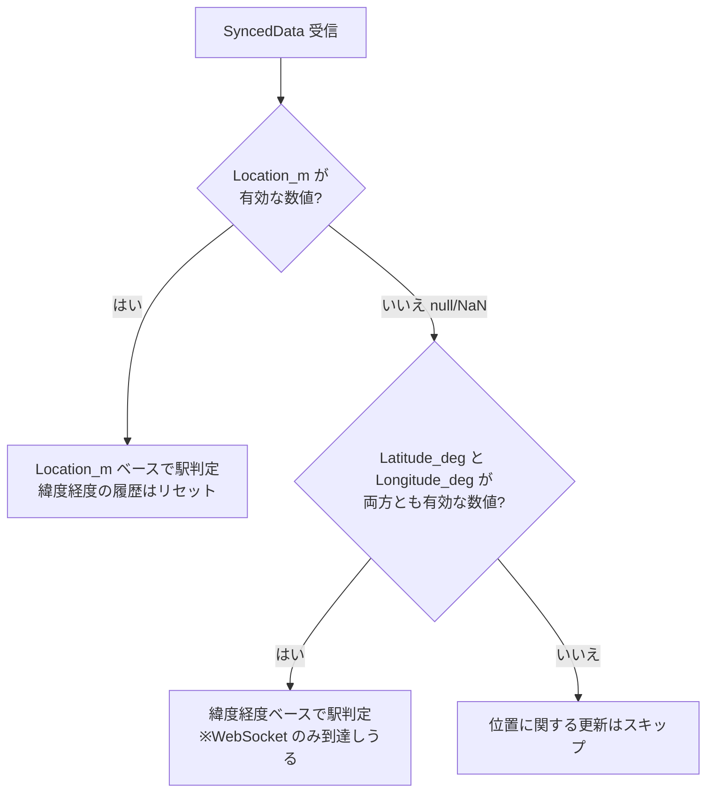
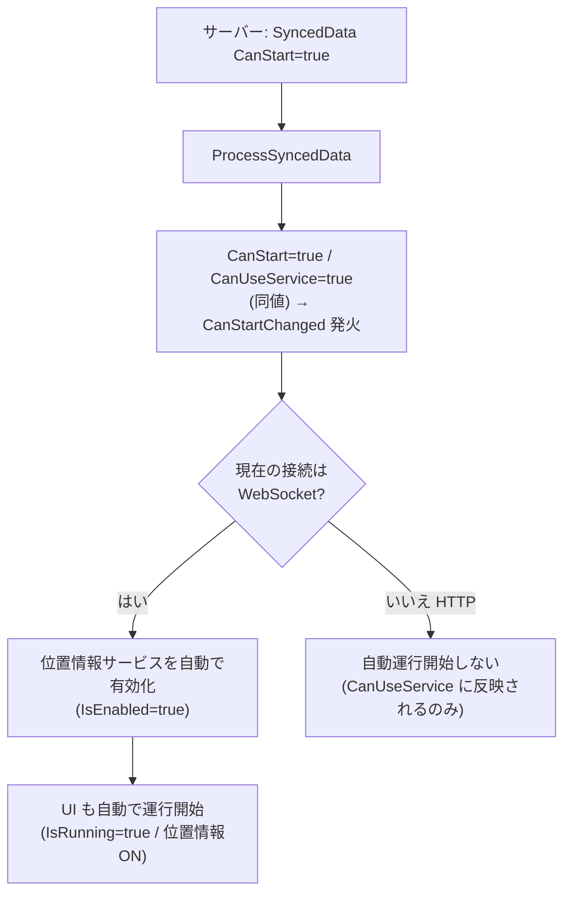

# 共通データモデル（日本語）

> [← 目次に戻る](README.md) ／ English: [../en/common-data-model.md](../en/common-data-model.md)

HTTP と WebSocket の双方で共通する中核データ構造です。
**他のどの文書よりも先にここを読んでください。**

---

## 1. SyncedData

運行同期の中核となるオブジェクト。位置・時刻・サービス利用可否
（＝自動運行開始の許可。[§4](#4-canstart-の意味) 参照）を表します。
HTTP ではポーリング応答の本文として、WebSocket では `SyncedData`
メッセージの本体として配信されます。

### 1.1 フィールド定義

| フィールド | JSON 型 | 必須 | トランスポート | 説明 |
|---|---|:---:|---|---|
| `Location_m` | number \| null | 任意 | HTTP / WS | 列車位置（始点からの距離）[m]。`null` は「距離未確定」を意味する。 |
| `Time_ms` | integer | 任意 | HTTP / WS | **その日の 00:00:00 からの経過ミリ秒**。UNIX エポックではない。 |
| `CanStart` | boolean | 任意 | HTTP / WS | 位置情報サービス利用可否／自動運行開始の許可（`CanUseService` と同値）。**WebSocket では `true` で自動運行開始**。[§4](#4-canstart-の意味) 参照。 |
| `Latitude_deg` | number \| null | 任意 | **WS のみ** | 緯度 [度]。 |
| `Longitude_deg` | number \| null | 任意 | **WS のみ** | 経度 [度]。 |
| `Accuracy_m` | number \| null | 任意 | **WS のみ** | 緯度経度の測位精度 [m]。 |

> HTTP クライアントは `Latitude_deg` / `Longitude_deg` / `Accuracy_m` を
> **パースしません**。これらを用いた駅判定が必要な場合は WebSocket を
> 使用してください。

### 1.2 欠落時・型不一致時のデフォルト

各フィールドは省略可能です。クライアントのパース挙動は以下の通りで、
**例外を投げず、フィールドが無い／型が違う場合は安全なデフォルトに
フォールバック**します。

| フィールド | キー欠落時 | `null` 指定時 | 数値/型が不正なとき |
|---|---|---|---|
| `Location_m` | `null`（=NaN, 距離未確定） | `null`（=NaN） | `null`（=NaN） |
| `Time_ms` | `0` | `0` | `0` |
| `CanStart` | **`true`** | **`true`** | **`true`** |
| `Latitude_deg` | `null` | `null` | `null`（number 型でなければ無効） |
| `Longitude_deg` | `null` | `null` | `null`（number 型でなければ無効） |
| `Accuracy_m` | `null` | `null` | `null`（number 型でなければ無効） |

> **重要 — `CanStart` の既定は `true`**
> 「利用不可」は特殊状態と見なされるため、`CanStart` を省略すると
> **利用可（`true`）** として扱われます。`CanStart` の意味は
> 「発車可否」ではなく「位置情報サービス利用可否／自動運行開始の許可」
> であり、**WebSocket では `true` で自動的に運行が開始**します
> （[§4](#4-canstart-の意味) 参照）。意図せず運行を開始させたくない
> 場合は明示的に `false` を送る必要があります。

> **重要 — `Latitude_deg` 等は JSON number 型必須**
> 文字列 `"35.0"` のような値は無効（`null` 扱い）です。必ず数値リテラル
> `35.0` で送ってください。

### 1.3 JSON での「距離未確定」の表現

「距離が確定していない」状態は **JSON の `null`** で表現します。

- `NaN` は不正な JSON であり、使用できません。
- サーバーが `Location_m: null` を送ると、TRViS 内部で `NaN` に変換され、
  「距離未確定」として扱われます。
- リファレンスサーバーも、内部状態が未確定（NaN）のときは JSON では
  `null` を出力します。

---

## 2. `Location_m` と緯度経度フォールバックによる駅判定

TRViS は受信した位置情報から「現在どの駅にいるか／次駅へ走行中か」を
判定し、画面表示を更新します。判定ロジックの分岐は次の通りです。

### 2.1 `Location_m` ベースの判定

`Location_m` が有効な数値のとき、駅ごとに設定された位置と検知半径
（時刻表データ由来）を用いて、現在駅または「次駅へ走行中」を判定します。
この経路では緯度経度の移動平均履歴はリセットされます。

### 2.2 緯度経度ベースのフォールバック（WebSocket のみ）

`Location_m` が `null`（内部的に `NaN`）で、かつ `Latitude_deg` と
`Longitude_deg` が両方とも有効な数値の場合、緯度経度ベースの駅判定
アルゴリズム（直近数点の距離移動平均を用いたヒューリスティック）に
フォールバックします。

- HTTP クライアントは緯度経度をパースしないため、この経路には**到達しません**。
- フォールバックは連続測位を前提とし、内部に距離履歴を保持します。
  単発の緯度経度では駅遷移を検出しないことがあります（移動平均が
  たまるまで判定を保留する設計のため）。
- `Accuracy_m` は付随情報として受信側イベントに伝達されますが、駅判定
  アルゴリズム自体の閾値には用いられません。

### 2.3 どちらも無い場合

`Location_m` が無効で緯度経度も揃っていない場合、位置に関する状態更新は
行われません（直前の駅状態が維持される）。`Time_ms` や `CanStart` の
処理はこの分岐に関係なく毎回行われます。

---

## 3. `Time_ms` の意味

`Time_ms` は **その日の午前 0 時（00:00:00）からの経過ミリ秒** です。
UNIX エポック秒／ミリ秒ではありません。

| 例（`Time_ms`） | 表す時刻 |
|---|---|
| `0` | 00:00:00 |
| `43200000` | 12:00:00 |
| `86399000` | 23:59:59 |

- クライアントは秒精度（`Time_ms / 1000` の整数部）に丸めて時刻同期に
  使用します。ミリ秒以下の精度は実質的に無視されます。
- 値が前回と変化したときのみ時刻変更が下流に通知されます（同値の
  連続配信は冪等）。
- 日付（年月日）の概念は持ちません。日跨ぎを表現する手段はプロトコルに
  なく、運用で扱う範囲（その日の時刻）に閉じます。

---

## 4. `CanStart` の意味

> **名称に関する注意**: `CanStart` は「発車してよいか（発車可否）」を
> 表すフィールドでは **ありません**。実際の意味は
> **「位置情報サービスを利用可能にしてよいか／自動で運行を開始して
> よいか」** です。`CanStart` は内部的に `CanUseService`
> （`ILocationService` の「サービス利用可否」フラグ）と **同じ値** に
> 設定されます。`CanStart` と `CanUseService` は同一の真偽値を持ちます。

`CanStart` は「クライアントが位置情報ベースの追従（運行モード）を
開始・利用してよいか」をサーバーが指示するフラグです。

- ユーザーの「運行開始」ボタン自体は `CanStart` に関係なく **いつでも
  押せます**。`CanStart` が制御するのは下記の **自動** 経路です。
- `CanStart` の値はそのまま `CanUseService` に反映され、値が
  `false`↔`true` で変化したときに対応する状態変更が下流へ通知されます。
- フィールド欠落時の既定は **`true`**（[§1.2](#12-欠落時型不一致時のデフォルト)）。

### 4.1 `CanStart` = `true` で自動的に運行開始する（WebSocket のみ）

**WebSocket 接続時に限り**、`CanStart` が `true` に変化すると、TRViS は
ユーザー操作なしで **自動的に位置情報サービスを有効化し、運行を開始**
します（画面上も「運行中」状態へ自動遷移）。これは実装上の業務ルール
です。

- **WebSocket**: `CanStart` が `false`→`true` になった瞬間、位置情報
  サービスが自動 ON になり、運行が自動的に開始されます。ユーザーが
  「運行開始」ボタンを押す必要はありません。サーバーはこの 1 フラグで
  クライアントを運行モードに入れられます。
- **HTTP**: 上記の自動運行開始は **行われません**（自動化は WebSocket
  接続時に限定されます）。HTTP では `CanStart` は `CanUseService` に
  反映されるだけで、運行開始はユーザーのボタン操作に委ねられます。

### 4.2 `CanStart` = `false` の挙動

- `CanUseService` が `false` になります（サービス利用不可の表示等に反映）。
- 自動有効化のハンドラは `true` のときだけ作用します。`true`→`false`
  に変化しても、この自動経路によって運行が **自動停止される設計には
  なっていません**（`false` は「自動開始しない／利用不可」を意味し、
  進行中の運行を強制終了するトリガーではありません）。運行の明示的な
  停止は `OperationCommand`（`EndOperation` 等）やユーザー操作で行います。

### 4.3 サーバー実装者への含意

- 「まだ運行を始めさせたくない」場合は、明示的に `CanStart: false` を
  送ってください（省略すると既定 `true` ＝ 利用可・自動開始許可）。
- **シリアライザの既定値省略に注意**: boolean の既定値（`false`）を
  出力しない JSON ライブラリを使うと、`CanStart=false` のつもりでも
  ワイヤ上はフィールドが欠落し、クライアント側で既定 `true` と解釈され、
  WebSocket クライアントが意図せず運行を開始します。`CanStart` は
  値に関わらず**常に明示出力**し、実際のバイト列で確認してください。
- WebSocket クライアントに対しては、`CanStart: true` を送った時点で
  そのクライアントは自動的に運行モードへ入る、という副作用を理解した
  上で送出してください（「データを見せるだけ」のつもりで `true` を
  送ると、意図せず運行が開始されます）。
- 運行を能動的に制御したい場合は、`CanStart` に加えて
  `OperationCommand`（`StartOperation` / `EndOperation` /
  `EnableLocationService` / `DisableLocationService`、
  [server-to-client-messages.md](server-to-client-messages.md#6-operationcommand)）
  の併用を検討してください。
