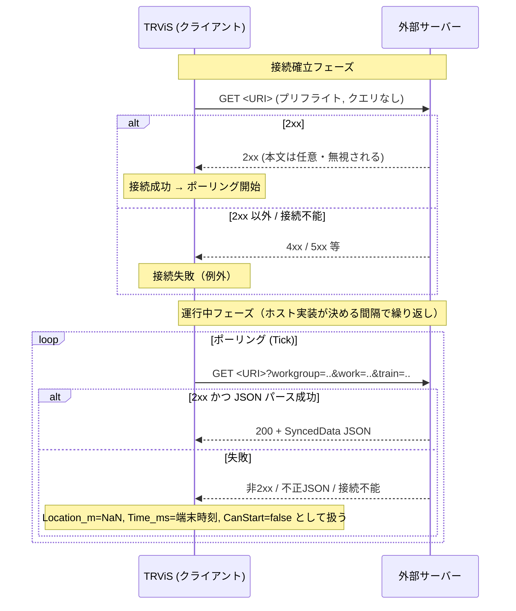

# HTTP プロトコル詳細（日本語）

> [← 目次に戻る](README.md) ／ 前提: [common-data-model.md](common-data-model.md)
> English: [../en/http.md](../en/http.md)

HTTP トランスポートは、TRViS が一定間隔で同じ URI に `GET` を発行し、
サーバーが最新の [`SyncedData`](common-data-model.md#1-synceddata) を
返す **クライアントポーリング型** です。HTTP では同期データのみを
扱えます（時刻表配信・リモートコマンドは WebSocket 専用）。

---

## 1. 通信モデル



## 2. プリフライト

接続生成時（`NetworkSyncServiceUtil` 経由）に **1 度だけ** `GET <URI>`
を発行します。

- メソッド: `GET`、このリクエストには ID クエリは付きません。
- サーバーが **`2xx` を返せば成功**。本文の内容は検査されず無視されます。
- `2xx` 以外、または接続不能の場合、接続生成は失敗（例外）となり、
  以降のポーリングは行われません。
- プリフライトは「このエンドポイントが到達可能か」の確認のみが目的です。
  将来的にバージョン情報の取得に拡張される可能性があります。

## 3. エンドポイントのパス

エンドポイントのパスは **完全に実装依存** です。

- TRViS は設定された URI を**そのまま**使用し、`/sync` のような特定の
  パスを要求しません。リファレンスサーバーは `/control` と `/health`
  を予約し、それ以外の全パスを同期エンドポイントとして扱います。
- URI に元々付いていたクエリ文字列は保持され、後述の ID パラメータが
  上書き／追記されます。したがって認証トークンを URI のパスやクエリに
  含める運用が可能です。

## 4. リクエスト（クライアント → サーバー）

- メソッド: `GET`
- ボディ: なし
- クエリパラメータ（いずれも任意。TRViS 側で対象が選択されている
  場合のみ付与され、選択が解除されると付かなくなります）:

| キー | 値 | 説明 |
|---|---|---|
| `workgroup` | 文字列 | 選択中の WorkGroup ID |
| `work` | 文字列 | 選択中の Work ID |
| `train` | 文字列 | 選択中の Train ID |

- URI に元から含まれていたクエリは維持されます。上記キーと同名の
  クエリが元 URI にある場合は上書きされます。
- 値は TRViS 側で選択された ID をそのまま使用します。サーバーはこれらを
  用いて、クライアントに適したデータ（特定 Work/Train の状態など）を
  返すことができます。クエリの解釈はサーバーの任意です（無視しても
  プロトコル上は問題ありません）。

リクエスト例:

```
GET /sync?workgroup=wg-1&work=w-1&train=t-1 HTTP/1.1
Host: example.com
```

## 5. レスポンス（サーバー → クライアント）

- ステータス: 成功時は `2xx`。
- `Content-Type`: 任意。TRViS は値に関わらず本文を JSON として
  パースします（`application/json` を推奨）。
- ボディ: [`SyncedData`](common-data-model.md#1-synceddata) オブジェクト。

最小例:

```json
{
  "Location_m": 1234.5,
  "Time_ms": 43200000,
  "CanStart": true
}
```

- `Location_m` が未確定のときは JSON の `null` を返します（`NaN`
  リテラルは不正）。
- HTTP では `Latitude_deg` / `Longitude_deg` / `Accuracy_m` を返しても
  クライアントは無視します（リファレンスサーバーは互換のため出力しますが、
  HTTP クライアントは解釈しません）。
- フィールドのデフォルト・型不一致時の挙動は
  [共通データモデル](common-data-model.md#12-欠落時型不一致時のデフォルト)を
  参照してください（特に `CanStart` 省略時は `true` 扱い）。

リファレンスサーバーが返す完全な形（HTTP 同期エンドポイント）:

```json
{
  "Location_m": 1234.5,
  "Time_ms": 43200000,
  "CanStart": true,
  "Latitude_deg": 35.681236,
  "Longitude_deg": 139.767125,
  "Accuracy_m": 5.0
}
```

## 6. 失敗時のクライアント挙動

ポーリング中のリクエストが次のいずれかに該当する場合、TRViS は
そのリクエストを「データなし」として扱い、以下の合成値を用います。

- HTTP ステータスが `2xx` 以外
- 接続不能・タイムアウト等のネットワーク例外
- 本文が JSON としてパースできない

| フィールド | 失敗時の値 |
|---|---|
| `Location_m` | `NaN`（距離未確定） |
| `Time_ms` | 端末のその時点の時刻（その日の 0 時からのミリ秒） |
| `CanStart` | `false` |

`CanStart=false` となるため、通信が途切れている間は
`CanUseService=false`（位置情報サービス利用不可）になります。これは
安全側のフォールバックです。なお `CanStart` の自動運行開始の挙動は
**WebSocket 接続時のみ**で、HTTP では `CanStart` が `true` でも自動的に
運行は開始されません（[common-data-model §4](common-data-model.md#4-canstart-の意味)）。

## 7. ポーリング間隔について

ポーリングの周期は **TRViS のホスト実装側が制御** します。サーバーは
ポーリング間隔を指定できず、また 1 回の応答は常に「その時点の最新状態」
だけを表します（差分・履歴の概念はありません）。サーバーは各 `GET` に
対してステートレスに最新状態を返すだけで構いません。

## 8. HTTP サーバー実装チェックリスト

- [ ] 任意のパスで `GET` を受け付け、`2xx` + `SyncedData` JSON を返す
- [ ] プリフライト（クエリなしの初回 `GET`）に `2xx` を返す
- [ ] `workgroup` / `work` / `train` クエリを解釈する（必要なら）
- [ ] `Location_m` 未確定時は JSON の `null` を返す（`NaN` を使わない）
- [ ] `Time_ms` を「その日の 0 時からの経過ミリ秒」で返す
- [ ] サービスを利用させたくないときは明示的に `CanStart: false` を返す（`CanStart` の意味は [common-data-model §4](common-data-model.md#4-canstart-の意味) 参照）
- [ ] 各 `GET` にステートレスかつ最新状態で応答する
