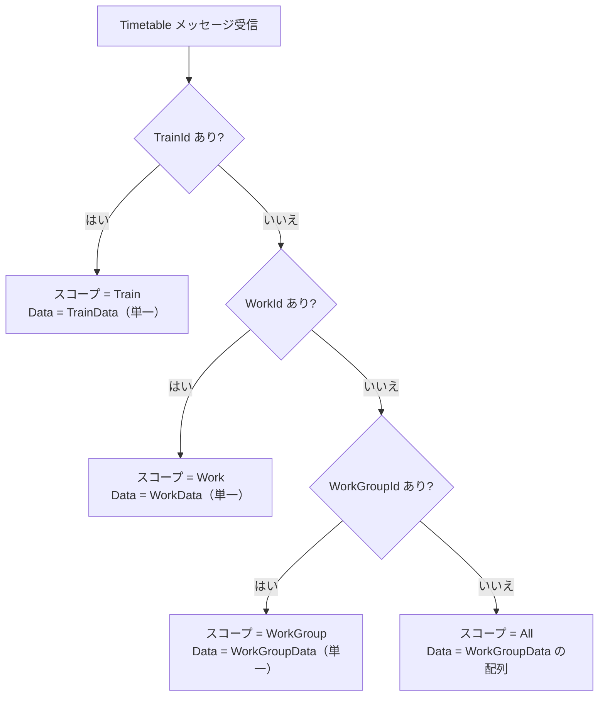
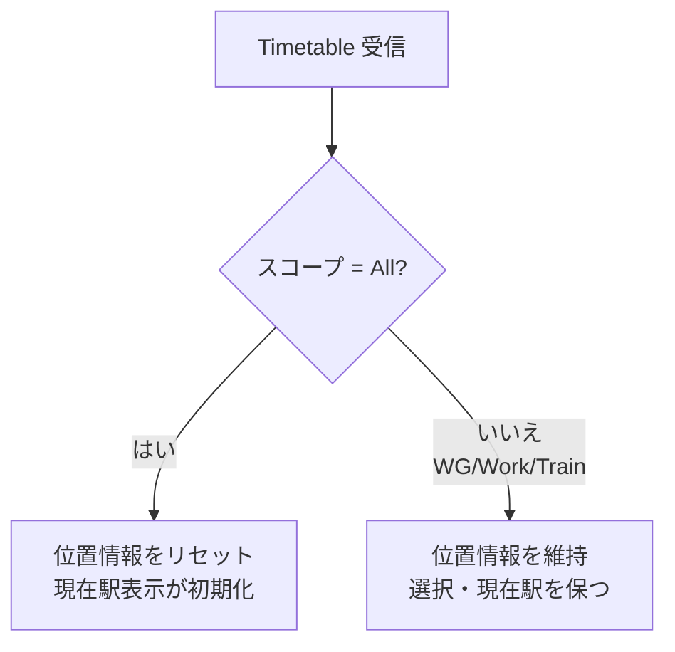

# 時刻表配信の詳細（日本語）

> [← 目次に戻る](README.md) ／ 前提: [server-to-client-messages.md](server-to-client-messages.md)
> English: [../en/timetable.md](../en/timetable.md)

**WebSocket 専用。** `Timetable` メッセージによる時刻表配信の、スコープ
決定・キャッシュ再構築・位置情報リセットの詳細を扱います。メッセージ
封筒の基本仕様は
[server-to-client-messages.md の §2](server-to-client-messages.md#2-timetable)
を参照してください。

時刻表本体（`Data` の中身）の構造は本書の範囲外です。
[TRViS JSON 形式](https://github.com/TetsuOtter/TRViS/wiki/JSON%E5%BD%A2%E5%BC%8F%E3%81%AE%E3%83%87%E3%83%BC%E3%82%BF%E3%83%99%E3%83%BC%E3%82%B9)
を参照してください。

---

## 1. スコープの決定（最重要）

ワイヤ上に「スコープ」を明示するフィールドは **ありません**。TRViS は
メッセージに **どの ID が含まれているか** からスコープを推論します
（最も詳細な ID が優先）。



| スコープ | 付与する ID | `Data` の型（TRViS JSON 形式） |
|---|---|---|
| **All** | （なし） | `WorkGroupData[]`（配列） |
| **WorkGroup** | `WorkGroupId` | `WorkGroupData`（単一オブジェクト） |
| **Work** | `WorkGroupId` + `WorkId` | `WorkData`（単一オブジェクト） |
| **Train** | `WorkGroupId` + `WorkId` + `TrainId` | `TrainData`（単一オブジェクト） |

判定は「最も詳細な ID」優先です。すなわち:

- `TrainId` があれば、他に何があろうと **Train** スコープ。
- `TrainId` が無く `WorkId` があれば **Work** スコープ。
- `TrainId`/`WorkId` が無く `WorkGroupId` があれば **WorkGroup** スコープ。
- いずれも無ければ **All** スコープ。

> Work/Train スコープでも、キャッシュの親子関係を正しく構築するため
> 上位 ID（`WorkGroupId` / `WorkId`）を併せて付与することを推奨します。
> 親 ID が無いと、配下キャッシュの再構築が期待通りにならない場合が
> あります。

## 2. キャッシュ再構築の挙動（差分でなく置換）

各スコープの配信は、対象とその **配下のキャッシュをペイロード内容で
完全に再構築（置換）** します。差分更新ではありません。

| スコープ | 影響範囲 |
|---|---|
| **All** | 全キャッシュを破棄し、配信された `WorkGroupData[]` で全再構築。 |
| **WorkGroup** | 当該 WorkGroup と配下の Work/Train を、ペイロードで完全に作り直す。**他の WorkGroup には触れない。** |
| **Work** | 当該 Work と配下の Train を、ペイロードで完全に作り直す。**他の Work には触れない。** |
| **Train** | 当該 Train を作り直す（または追加）。同じ Work 配下の Train 一覧にも反映。 |

実装上の含意:

- WorkGroup/Work スコープで `Data` に配下要素（`Works` / `Trains`）を
  **含めなかった場合、その配下は空に再構築**されます。配下を維持したい
  場合は配下も含めて送ってください（部分差分送信はできません）。
- Train を 1 件だけ更新したい（リアルタイム編集など）場合は Train
  スコープを使うと、その Train のみが置換され他に影響しません。

### 2.1 親情報の継承（Train スコープの注意）

Train スコープ単独のペイロード（`TrainData`）には、親 Work の名称や
施行日（`AffectDate`）が含まれません。クライアントは、すでにキャッシュ
済みの親 Work（`WorkId` で参照）からこれらを継承します。

- 親 Work が未キャッシュだと、表示が既定のフォールバック挙動になる
  ことがあります。Train を単独配信する前に、対象の Work が（All /
  WorkGroup / Work いずれかのスコープで）キャッシュ済みであることを
  推奨します。
- このため Train スコープでも `WorkId` を併せて付与することを推奨します。

## 3. 位置情報のリセット

`Timetable` 受信時、スコープによって TRViS の現在位置（駅 index・
走行中フラグ）をリセットするか否かが変わります。

| スコープ | 位置情報 | 理由 |
|---|---|---|
| **All** | **リセットする** | 全体構造が変わるため、駅 index の意味が失われる。 |
| WorkGroup | 維持 | リアルタイム編集対応。表示中データの再描画を優先し選択・位置を保つ。 |
| Work | 維持 | 同上。 |
| Train | 維持 | 同上。編集中の Train が更新されても駅 index を保持。 |

- **All スコープは「重い更新」** です。運行中に頻繁に送ると、その都度
  位置情報がリセットされ、現在駅表示が初期状態に戻ります。
- 運行中の小さな更新（番線変更・1 列車の時刻修正など）は、対象を
  絞った Train / Work / WorkGroup スコープで送ることで、ユーザーの
  現在位置表示を壊さずに反映できます。



## 4. 配信パターン例

### 4.1 初期一括配信（All）

接続直後などに全データをまとめて配信:

```jsonc
{
  "MessageType": "Timetable",
  "Data": [
    { "Id": "wg-1", "Name": "...", "Works": [ /* ... */ ] }
    /* WorkGroupData の配列 */
  ]
}
```

→ 全キャッシュ再構築・位置情報リセット。

### 4.2 単一 Work の差し替え（Work）

特定 Work（配下 Train 含む）を更新:

```jsonc
{
  "MessageType": "Timetable",
  "WorkGroupId": "wg-1",
  "WorkId": "w-1",
  "Data": { "Id": "w-1", "Name": "...", "Trains": [ /* ... */ ] }
}
```

→ `w-1` と配下 Train のみ再構築。他 Work・他 WorkGroup・位置情報は維持。

### 4.3 1 列車のリアルタイム反映（Train）

運行中に 1 列車だけ修正（例: 番線変更）:

```jsonc
{
  "MessageType": "Timetable",
  "WorkGroupId": "wg-1",
  "WorkId": "w-1",
  "TrainId": "t-1",
  "Data": { "Id": "t-1", "TrainNumber": "T-001", "TimetableRows": [ /* ... */ ] }
}
```

→ `t-1` のみ置換。現在位置・選択は維持されるため、運行中の反映に適する。

## 5. サーバー実装チェックリスト（時刻表）

- [ ] スコープは付与する ID から決まることを理解して配信する
- [ ] `Data` は **生 JSON**（文字列でなくオブジェクト/配列）で埋め込む
- [ ] スコープ別に `Data` の型を合わせる（All=配列, それ以外=単一）
- [ ] 配下を維持したいときは配下要素も含めて送る（差分送信不可）
- [ ] Train 単独配信時は親 Work がキャッシュ済みになるよう順序を考慮し、
      `WorkId`（および `WorkGroupId`）を併せて付与する
- [ ] 運行中の小更新は All を避け、対象を絞ったスコープで送る
- [ ] `Data` 本体は TRViS JSON 形式に準拠させる
