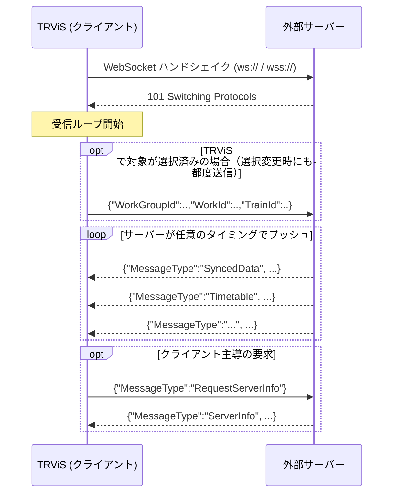
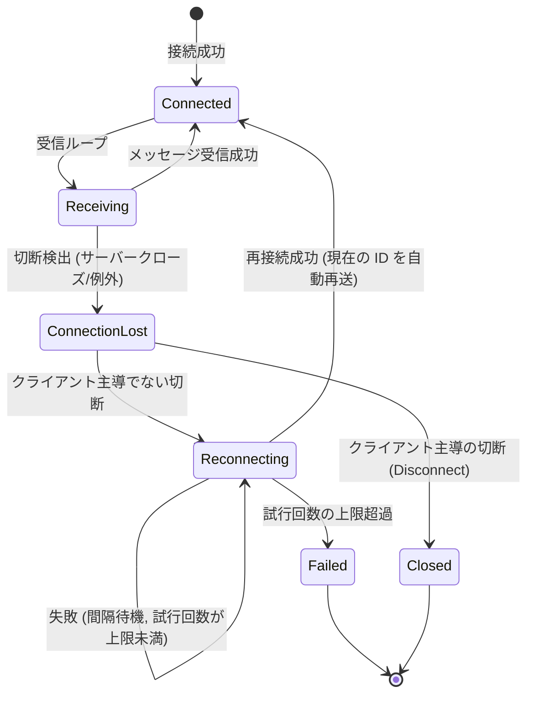

# WebSocket プロトコル詳細（日本語）

> [← 目次に戻る](README.md) ／ 前提: [common-data-model.md](common-data-model.md)
> 関連: [server-to-client-messages.md](server-to-client-messages.md) ／
> [client-to-server-messages.md](client-to-server-messages.md) ／
> [timetable.md](timetable.md)
> English: [../en/websocket.md](../en/websocket.md)

WebSocket トランスポートは **サーバープッシュ型（イベント駆動）** です。
接続確立後、サーバーは任意のタイミングでメッセージをプッシュでき、
時刻表配信やリモートコマンドを含むフル機能を提供します。

---

## 1. 接続

- スキームは `ws://` または `wss://`。それ以外のスキームを WebSocket
  として渡すと接続生成時に拒否されます。
- サブプロトコル（`Sec-WebSocket-Protocol`）の指定・ネゴシエーションは
  不要です。
- 接続が確立すると、クライアントは受信ループを開始し、サーバーからの
  プッシュを待ち受けます。
- すでに開いている接続に対して再接続要求が来た場合は無視されます
  （二重接続は行いません）。

## 2. フレーミングとエンコーディング

- メッセージはすべて **WebSocket テキストフレーム**。
- ペイロードは **UTF-8 でエンコードされた JSON オブジェクト**（ルートは
  オブジェクト `{}`）。
- 1 つの論理メッセージ = 1 つの JSON オブジェクト。サーバーは WebSocket
  フレームを分割（フラグメント）して送ってもよく、クライアントは
  `EndOfMessage` まで連結してから 1 件としてパースします。受信側の
  内部バッファ単位（実装上 4096 バイト）はプロトコル上の制約ではなく、
  メッセージ長に上限はありません。
- バイナリフレームは使用しません。
- サーバーが Close フレームを送ると、クライアントは正常クローズで応答し
  接続を閉じます（その後の挙動は [§5 再接続](#5-再接続) を参照）。

## 3. メッセージの判別

### 3.1 サーバー → クライアント

サーバーからのメッセージは必ず **`MessageType` フィールド（文字列）** を
持たなければなりません。

- `MessageType` を持たない、または未知の `MessageType` のメッセージは
  **無視**されます（エラーにはなりません）。
- JSON としてパースできないメッセージも無視されます。
- **キー名は大文字小文字を区別します。** メッセージ封筒（`MessageType`
  や `Location_m` 等のトップレベルキー）は、本ドキュメントに記載の
  正確な綴り・ケースで送ってください。
  （※例外として `Timetable` の `Data` 内＝時刻表本体の JSON は、
  TRViS JSON 形式デシリアライズ時にプロパティ名の大文字小文字が
  無視されます。封筒キーとは規則が異なります。）

全メッセージの仕様は
[server-to-client-messages.md](server-to-client-messages.md) を参照。

### 3.2 クライアント → サーバー

クライアントからのメッセージは 2 系統です。

| 種別 | 判別 | 内容 |
|---|---|---|
| 要求メッセージ | `MessageType` を**持つ** | `RequestServerInfo` / `RequestDiagramInfo` |
| ID 更新メッセージ | `MessageType` を**持たない** | `WorkGroupId`/`WorkId`/`TrainId` を含む（後方互換仕様） |

サーバーは「`MessageType` を持たず、`WorkGroupId`/`WorkId`/`TrainId` の
いずれかを含む JSON」を ID 更新として解釈してください。詳細は
[client-to-server-messages.md](client-to-server-messages.md)。

## 4. キープアライブ

TRViS は WebSocket 標準の Ping/Pong（KeepAlive）機構を使用します。

| 項目 | 値 |
|---|---|
| Ping 送信間隔 | 10 秒 |
| Pong 応答タイムアウト | 15 秒 |

- サーバーは WebSocket の制御フレーム（Ping/Pong）に標準どおり応答できる
  実装である必要があります（多くの WebSocket ライブラリは自動応答）。
- アプリケーション層のハートビートメッセージは規定されていません。
  接続生存監視は WebSocket の Ping/Pong に委ねられます。

## 5. 再接続

接続が（クライアント主導でなく）切断されると、TRViS は自動再接続を
試みます。

| 項目 | 既定値 | 備考 |
|---|---|---|
| 再接続間隔 | 5000 ms | 各試行前にこの時間だけ待機 |
| 最大再接続試行回数 | 3 | この回数を超えると再接続を諦める |

これらはコンストラクタ引数の既定値であり、TRViS のホスト実装により
変更され得ます（間隔は正の値、最大回数は 0 以上）。

### 再接続に関するサーバー実装上の注意

- **切断直後の即時再接続を許容**してください。クライアントは接続喪失を
  検出後、設定間隔をおいて再接続を試みます。
- 各「接続喪失」検出時に接続クローズ相当のイベントが下流に通知され、
  再接続成功で受信ループが再開されます。
- **再接続成功時、クライアントは現在選択中の ID（WorkGroup/Work/Train）を
  自動的に再送**します（[client-to-server-messages.md](client-to-server-messages.md)
  の ID 更新メッセージと同形式）。サーバーは新しい接続に対し、受け取った
  ID に基づくスコープで配信を再開してください。再接続直後はサーバー側に
  以前の購読状態が残っていない前提で実装するのが安全です。
- 連続して再接続に失敗し最大試行回数を超えると、TRViS は再接続を諦め、
  接続失敗として扱います（自動的な再試行は停止）。
- メッセージ受信に成功すると内部の連続失敗カウントはリセットされます。
  断続的な切断が起きても、間に正常受信があれば毎回上限まで使えます。

## 6. 切断（クライアント主導）

TRViS 側がアプリ終了や設定変更で明示的に切断する場合、正常クローズ
（Normal Closure）で接続を閉じ、**再接続は行いません**。サーバーは
クライアントからの正常クローズを受けたら、その接続に紐づく購読状態を
破棄してかまいません。

## 7. WebSocket サーバー実装チェックリスト

- [ ] `ws://` / `wss://` で接続を受け付ける
- [ ] サーバー→クライアントの全メッセージに `MessageType`（正確なケース）を付与
- [ ] テキストフレーム・UTF-8・ルートオブジェクトの JSON で送る
- [ ] `MessageType` を持たない受信 JSON を ID 更新として処理する
- [ ] `RequestServerInfo` / `RequestDiagramInfo` 要求に応答する
- [ ] WebSocket Ping/Pong（制御フレーム）に標準どおり応答する
- [ ] 切断直後の即時再接続を許容する
- [ ] 再接続クライアントが再送する ID 更新を処理し配信を再開する
- [ ] クライアント主導の正常クローズで購読状態を破棄する
